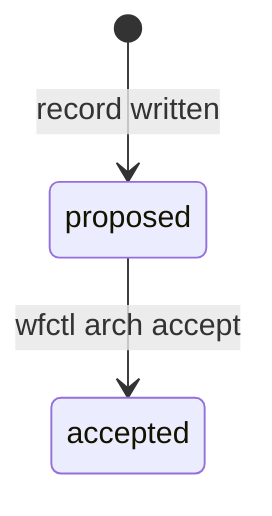

# Contract — the record file, as this feature changes it

**Feature**: `109-record-leads-with-drawing`

A record is a markdown file with a frontmatter block. This feature adds one
optional frontmatter key and promotes one body section from optional to
required. Nothing else about the format moves.

## Frontmatter

```markdown
---
status: proposed
diagram: state
supersedes: an-earlier-slug
---
```

| Key | Required | Values |
|---|---|---|
| `status` | to be projected | `proposed` `accepted` `superseded` `rejected` `retired` |
| `supersedes` | no | a slug |
| **`diagram`** | **to be accepted** | **`data-flow` `component` `state`** |

`diagram` is read by `_frontmatter`'s existing line scan: a top-level,
uncommented `key: value`, quotes stripped, last occurrence wins. An indented or
commented line declares nothing, and a `diagram:` line quoted in the body is
prose — both rules are `_key_value`'s and neither is new.

## `## Boundary`

Required to accept. Carries a fenced block; what is inside it is never
inspected.

````markdown
## Boundary


````

The heading keeps its name (clarification Q1, FR-009). Two accepted records
already carry drawings under it and their bodies can no longer be edited, so a
rename orphans real drawings where no check would look.

## What does not change

- An accepted record is never read by any check this feature adds, never
  modified, and never reported (FR-006, SC-002).
- `wfctl arch context` projects exactly what it projects today. No drawing, and
  no declared kind, reaches it (FR-011).
- A record with no drawing is still written, committed and read normally. The
  only thing it cannot do is be accepted.
