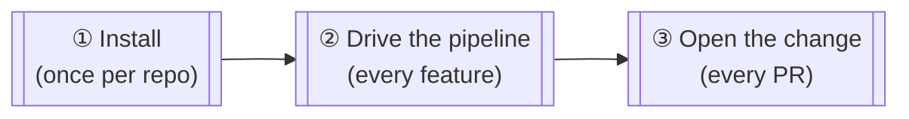
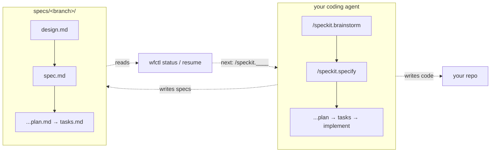
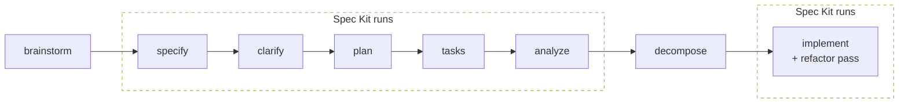

# wfctl

**wfctl makes agents think through the work, then independently governs what the durable evidence proves about that work.**

*The agent can produce evidence; it does not get to certify what that evidence proves.*

wfctl is a command-line interface (CLI) for developers who build software with
AI coding agents, such as Claude Code, Codex, Copilot, or Bob. It installs the
skills that carry the design method into your project, works alongside
[Spec Kit](https://github.com/github/spec-kit), and reads the state of each
feature from the files the work leaves in your repository.

[](LICENSE)
[](https://www.python.org/downloads/)

```text
wfctl design method
       │ shapes
       ▼
agent / workflow runner
       │ produces
       ▼
durable repository artifacts
       │ interpreted by
       ▼
     wfctl
       │
       ├── what is satisfied?
       ├── what remains?
       ├── what is not applicable?
       ├── what decisions constrain the work?
       └── what needs attention?
```

This is `wfctl status` on an open branch in this repository:

```
#473  473-steps-unreachable-by-model
will never merge, force-push, close an issue, or delete a branch
or worktree — those are yours, and no setting changes it
your agent decides which commands may run — wfctl can't see
its rules and says nothing about them
────────────────────────────────────
brainstorm   ▶  ← current
  architecture  ●
  design-doc    ▶  /speckit.brainstorm
specify      ○
clarify      ○
plan         ○
tasks        ○
analyze      ○
decompose    ○
implement    ○
────────────────────────────────────
artifacts written     ○  missing spec.md, plan.md, tasks.md
definition of done    ●  passed at 40eb0a2
architecture accepted ○  mirror-supersedes-the-wrapper (proposed)
next: /speckit.brainstorm
```

In that output, ● means done, ▶ means in progress, and ○ means pending.
Nothing on that screen came from the agent. wfctl reads each row off the
branch when you ask, from the spec files, the verdict that `wfctl verify`
recorded, and the architecture records in force.

## Why wfctl

wfctl does two things:

1. It gives the agent a design method, so the agent thinks the work through
   before it writes code.
2. It reads what the work left behind and decides, independently of the agent,
   what that evidence proves.

**The design method** makes the agent think before it codes, and clean up what
it built.

- Brainstorm, the four design levels and domain modeling run before Spec Kit, so the agent decides who owns what before a spec or any code exists.
- Decompose is the last step before implement. It splits the tasks into pull requests and tracker issues before any code is written.
- A refactor pass runs inside implement, after the code works and before `wfctl verify` runs.

**Evidence governance** means the agent does not decide when the work is done.

- wfctl tracks where each feature sits in the pipeline, and it reads each step's state from the artifacts on disk, not from what the agent reports.

  ```text
  brainstorm → specify → clarify → plan → tasks → analyze → decompose → implement
  ```

- Implement is gated on a definition of done that wfctl runs itself with `wfctl verify`, so "done" is a recorded verdict and not a claim.
- A step that does not apply is recorded with a reason, using `wfctl step none` or `wfctl arch none`, instead of being skipped silently.
- Architecture decisions are read as obligations on the work. `wfctl arch context` prints the ones in force.

wfctl also installs its slash commands alongside the skills. It records the
outward actions an agent takes, such as issue writes and pushes, but it does
not gate them. Your agent's own permission layer decides what may run, and
when it refuses an action,
`wfctl report-block` holds the step until the action is taken
([details](docs/reference.md#outward-actions-report-action-report-block)).

## Requirements

- Python 3.11+
- [uv](https://docs.astral.sh/uv/) (recommended) or pip
- Git

## Installation

```bash
# Recommended: uv tool (isolated, always up-to-date)
uv tool install git+https://github.com/aamarin/wfctl.git

# Upgrade an existing install
uv tool install --upgrade git+https://github.com/aamarin/wfctl.git

# Or pip
pip install git+https://github.com/aamarin/wfctl.git
```

Installs from the default branch, which always tracks the latest release. Append
`@<tag>` to either command if you need to pin a fixed version.

## Quick start

**1. Install wfctl** (see [Installation](#installation) for pip and pinning):

```bash
uv tool install git+https://github.com/aamarin/wfctl.git
```

**2. Install the skills into your project.** Once per repo:

```bash
cd your-project
wfctl install-skills --agent claude   # drop --agent if you are not on Claude Code
```

The first interactive run asks two questions — which issue tracker to wire up,
and where specs should live — and records both, so it never asks again.

**3. Drive the pipeline from inside your agent**, with slash commands:

```
/start-session                                        # session context + freshness check
/speckit.brainstorm  "add manual transaction entry"   # design, gated in four levels
/speckit.specify                                      # turn the design into a spec
/speckit.plan                                         # design the implementation
/speckit.tasks                                        # break into ordered tasks
/speckit.implement                                    # build it
/end-session                                          # summary + memory candidates
```

`wfctl status` shows your position; `wfctl resume` says what to run next —
the two commands you'll type by hand most.

## How it works



You install the skills once per repository (①), and everything after that runs
from inside your agent. Both halves of wfctl live in ②. The skills carry the
design method into each step, and wfctl judges each step by what it left on
disk.



The eight steps are fixed, and a repository can add its own passes under any
of them in its `wfctl.json`. Whether that step order should move to Spec Kit's
own workflow engine is still an open question, and nothing has been decided
yet.



The steps outside the dashed boxes are wfctl's design method, and so is the
refactor pass inside implement. Spec Kit runs the steps inside the boxes. wfctl
reads the evidence from all eight, whoever ran them.

Full pipeline model, every command, environment variables, the issue-tracker
and architecture-record machinery, and how `install-skills`/`install-config`
lay files into your repo: **[docs/reference.md](docs/reference.md)**.

## Commands (most used)

| Command | Description |
|---------|-------------|
| `status` | Show pipeline progress inferred from spec artifacts |
| `resume` | Re-infer step from filesystem, write `next-step.md`, print current state |
| `install-skills` | Copy the skills, commands and speckit runtime into the current project |
| `doctor` | Check the installed skills against the ones this wfctl ships |
| `issue` | Run the active issue tracker for a verb (`list`/`view`/`close`/`comment`/…) |
| `change` | List/view/check code changes (PRs, patchsets) via the tracker's `changes` backend |
| `arch context` | Print the in-force architectural contract |

Full command reference, including `report-action`/`report-block` and the `arch` lifecycle:
**[docs/reference.md#commands](docs/reference.md#commands)**. That table
summarizes each command; run `wfctl <command> --help` for its flags.

## Development

```bash
git clone https://github.com/aamarin/wfctl.git
cd wfctl
uv run pytest -q
```

Without uv: `pip install -e ".[dev]"` then `pytest`.

The skills, commands and speckit runtime `install-skills` writes are committed
here as package data under `wfctl/agents/` and `wfctl/specify/` — edit them in
place, then `wfctl install-skills` to try them in a repo. They carry no leading
dot on purpose: `.gitignore` ignores `.agents/` and `.specify/` unanchored, so a
dotted vendored copy would be silently untracked. The dotted directories at the
repo root are this repo's own install output, not the source.

See [AGENTS.md](AGENTS.md) for the fuller contributor context — session state,
worktrees, architectural constraints, and release mechanics.

## Contributing

Issues and PRs welcome — open an issue first for significant changes.

## License

MIT — see [LICENSE](LICENSE).
