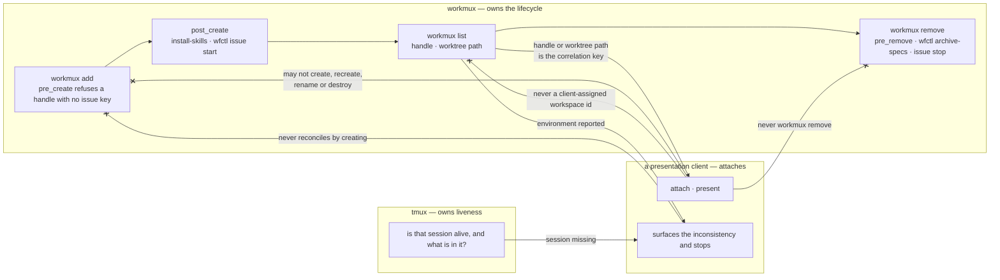

# A presentation client attaches to a workmux-owned runtime and never owns its lifecycle

## Context

A feature in this repository runs inside a stack of units that currently line up
one to one: a branch has a worktree, the worktree has a workmux environment, the
environment has a tmux session. That alignment is observed rather than proposed —
`.workmux.yaml:26` is `mode: session` here and pfms's `:24` is the same, and
`tmux list-sessions` shows `wfctl__419-misfiled-record-check`,
`wfctl__423-status-contract-version`, `wfctl__435-concern-routes-three-ways`,
`wfctl__436-client-attaches-never-owns` and `pfms__621-variance-report-screen`,
one per live worktree.

The alignment holds in one direction only. Every worktree has a session; not
every session has a worktree — `0-0` and `pfms__pfms-specs` are sessions nothing
in either repository created. So "this is a feature's runtime" is a claim about
provenance, not a shape a name can be read for.

What has no rule is who may *act* on those units. A presentation client can
attach to a feature's runtime and show a human what is happening in it. cmux is
the current candidate; `agent-dashboard` was the last one; workmux's own
`sidebar` and `dashboard` are a third. The direction has moved twice this month,
which is the reason this record names a role rather than a tool.

The failure is not picking the wrong tool once. It is that a client holding
lifecycle powers becomes a second environment manager by accretion, one
convenience at a time — and the conveniences arrive at the moments when refusing
them is most expensive.

wfctl is on the safe side of this today, and by accident rather than by
constraint. `wfctl/_workmux.py` is pure `str -> str`, imports nothing from
`wfctl.*`, and never calls `subprocess`; its own docstring says that constraint
"is the point, not decoration", but the reason it gives is testability. The
module cannot create, rename or destroy a session even if asked. That is a
property of how one file was written. It binds no other module, and it binds no
client at all.

## Direct baseline

Write nothing. Each tool does what its documentation says, and a human uses
judgment at the moment a question comes up. This costs nothing today, because
cmux is not installed on this machine and no client is attached to anything.

It fails the first time a session is missing after a reboot, and it fails
quietly. `cmux local-tmux` starts and manages its own tmux server, and it brings
the pane back in one command — the fastest fix available at the worst moment. A
session cmux created is one workmux did not, so `pre_remove` never runs against
it. `pre_remove` is what calls `wfctl archive-specs`, and that call is the only
thing standing between a gitignored `specs/` tree and `workmux remove`; the hook
carries no `|| true` for exactly this reason, and says so in its own comment.

The cost is therefore not a degraded experience. It is the silent loss of a
feature's design artifacts, weeks after the convenience was taken, with nothing
connecting the two events.

## Decision

A presentation client may attach to a workmux-owned runtime and present it. It
may not create, recreate, rename or destroy that runtime.

Where workmux reports an environment and tmux has no session, the client
surfaces the inconsistency and stops. It never reconciles by creating.

The client correlates its view to a feature by the workmux handle or the
worktree path. Never by a workspace id the client assigned itself.

## Owns truth

**workmux owns _"does this feature have a runtime environment, and what is its
session called?"_.** A client cannot compute it. The mapping from issue key to
worktree path to session name is fixed at `workmux add` and depends on
`window_prefix` and `mode`, which are per-repository configuration — a client
deriving it is guessing at a naming scheme, and the two sessions above that no
worktree owns are what that guess collides with.

**tmux owns _"is that session alive, and what is in it?"_.** workmux cannot
compute it. workmux records what it created; it does not observe what survived a
reboot, a `kill-server`, or a crash. This is the half that makes the recovery
protocol necessary rather than hypothetical: the two sources disagree in exactly
one direction, and that disagreement is a real state.

**wfctl owns _"what does the durable evidence prove about this feature?"_.**
Unchanged by this record, and named here only so that a row a client draws
visibly has three sources behind it rather than one.

The client owns nothing. It owns no correlation key in particular: the mapping is
derivable from `workmux list` plus the live session list on every read, and a
client that persists an id as identity has made its own state authoritative for
something that was always recomputable — the failure `session-state-is-re-derived`
already names, applied one layer out, to the runtime rather than to pipeline
state.

## Boundary

The three `--x` edges are the decision. The one leaving the recovery path is the
half most easily dropped: a client that reconciles by creating has taken the
create half of the lifecycle, and it arrived through a recovery path rather than
a create path, which is precisely why stating the invariant alone states the easy
half.

## Considered

- **`cmux local-tmux` for these workspaces.** Correct where cmux owns the
  environment, and that is what it is built for — this is fit, not fault. Here
  workmux owns it, so adopting `local-tmux` means two creators for one session
  and a `pre_remove` wired to neither.
- **Let the client recreate a missing session.** It is the fastest recovery and
  it is the one the invariant exists to refuse. Recreation is not recovery: the
  recreated session carries none of `post_create`'s work — no `install-skills`,
  no `wfctl issue start`, none of the configured windows and panes — so the pane
  comes back and the environment behind it does not.
- **Move the lifecycle into the client; workmux becomes a one-shot bootstrap.**
  Genuinely simpler for a human, and it is what a client that owns its own
  environments should do. It loses here because three repository-wide guarantees
  hang off workmux's hooks, and the client is a per-developer preference — moving
  them there moves a guarantee the repository makes into a tool the repository
  does not configure.
- **Persist a workspace id as the correlation key.** The ordinary thing for a
  client to do, and cheap. Rejected because a workspace is recreatable from
  `workmux list` plus the live session list, and persisting an id as identity is
  the one act that makes it not.
- **Record the invariant only, and leave recovery to judgment.** Half the length
  and it reads as sufficient. Rejected: the recovery path is where the invariant
  breaks, so a record that omits it has written down the part nobody was going to
  get wrong.

## Consequences

**A missing session costs a workmux round-trip.** The client reports the
inconsistency; the human repairs it through workmux. That is slower than one
command at the moment it is least welcome, and it is the price of the guarantee —
naming it here so a later reader weighing a convenience against this record can
see what was already weighed.

**The record binds a client that does not exist yet.** No client is attached
today, so nothing in this repository changes when it lands and no test can fail
against it. It is written now because the alignment it rests on is real now, and
because the first client to arrive will arrive with a recovery path already built.

**`wfctl/_workmux.py` is unchanged.** The record explains why that module is on
the safe side; it does not ask it to move. What changes is that the safety stops
being a property of one file's style and becomes a stated constraint on a role.

## Log

- 2026-09-20  proposed    — #436 level 2; a client holding lifecycle powers
  becomes a second environment manager by accretion, and `pre_remove` is what is
  lost first
