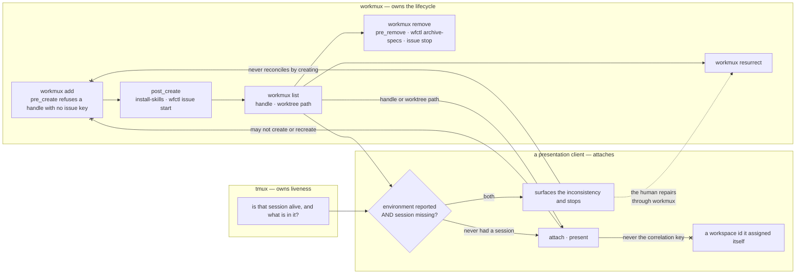

# A presentation client attaches to a workmux-owned runtime and never owns its lifecycle

## Context

A feature in this repository runs inside a stack of units that line up one to
one: a branch has a worktree, the worktree has a workmux environment, the
environment has a tmux session. That alignment is observed rather than proposed —
`.workmux.yaml:26` is `mode: session` here, and a second repository built on the
same layout declares it too, so `tmux list-sessions` shows
`wfctl__419-misfiled-record-check`, `wfctl__423-status-contract-version`,
`wfctl__435-concern-routes-three-ways` and
`wfctl__436-client-attaches-never-owns` beside that repository's feature sessions
under its own prefix, one per feature worktree.

It lines up for feature worktrees and for nothing else. A main checkout has no
session at all — `workmux list` reports `main` with `MUX -` — and `0-0` is a
session no worktree owns. So a name carrying `wfctl__` is not evidence that
workmux created the thing wearing it, and the absence of a session is not
evidence that a feature lost one. Provenance is a fact to be looked up, not a
shape to be read off a name.

What has no rule is who may *act* on those units. A presentation client can
attach to a feature's runtime and show a human what is happening in it. cmux is
the current candidate; `agent-dashboard` was the last one; workmux's own
`sidebar` and `dashboard` are a third. The direction has moved twice this month,
which is why this record names a role rather than a tool.

The failure is not picking the wrong tool once. It is that a client holding
lifecycle powers becomes a second environment manager by accretion, one
convenience at a time — and the conveniences arrive at the moments when refusing
them is most expensive.

wfctl already touches a runtime in exactly one place, and it already obeys all
three parts of the rule below. The session-restart hook correlates a repository
root to a workmux handle through `workmux list --json`, matched on `path` and not
on the directory's name (`_restart.py:282`); it drives the pane through
`workmux send` and nothing else, with no `tmux` subprocess anywhere in the
package (`_restart_send.py:64`); and where no pane is found it returns
`session restart skipped: no workmux pane for {repo_root}` rather than making one
(`_restart.py:265`, covered by `tests/test_restart_decide.py:206` and
`tests/test_restart_hook_cli.py:251`).

So the rule is not new behaviour. It is one implementation, written deliberately
and tested, that binds one hook and nothing else — no other module, and no
client. This record is what turns a property of that hook into a constraint on a
role.

## Direct baseline

Write nothing. Each tool does what its documentation says, and a human uses
judgment at the moment a question comes up. This costs nothing today, because
cmux is not installed on this machine and no client is attached to anything.

It fails the first time a session is missing after a reboot. workmux ships the
safe repair — `workmux resurrect`, "Restore worktree windows after a tmux or
computer crash" — so the fast fix and the correct fix are both one command, and
nothing at the prompt distinguishes them. `cmux local-tmux` starts and manages
its own tmux server (claimed by cmux's `docs/local-tmux.md` in
`manaflow-ai/cmux`; unverified here, because cmux is not installed). A session
it created is one workmux did not.

The cost of that is narrower than it first looks, and worth stating exactly. A
teardown still runs `pre_remove`, because `workmux remove` is keyed on the
worktree rather than on any session's provenance. The loss needs a second step:
the human tears the feature down through the client too, having adopted it for
recovery. Then `pre_remove` never fires, and with it neither `wfctl issue stop`
nor `wfctl archive-specs`. That second step needs a client that can remove a git
worktree, which no candidate is shown to do — cmux's own documentation scopes it
to the client surface — so this is a shape to watch for rather than a path open
today.

What that costs depends on where the repository keeps its specs. On the default
`<repo>/specs` it is the silent loss of the feature's design artifacts, which is
what `pre_remove` carries no `|| true` to prevent and says so in its own comment.
In this repository and in the second one above it is not: both declare a spec
root outside the worktree, and `archive-specs` prints `✓ spec dir is durable …
nothing there was at risk, nothing copied`. Here the hook's loss is the board
column alone. The
baseline's real defect is therefore not one guaranteed catastrophe but that the
severity is a per-repository configuration detail nobody consults at the moment
of the convenience.

## Decision

A presentation client may attach to a workmux-owned runtime and present it. It
may not own that runtime's lifecycle, in three parts:

- **The invariant.** It may not create, recreate, rename or destroy the runtime.
- **The recovery protocol.** Where workmux reports an environment that once had a
  session and tmux has none, the client surfaces the inconsistency and stops. It
  never reconciles by creating. A checkout that never had a session is not an
  inconsistency and is not surfaced, and `workmux list --json` is what separates
  the two: a main checkout reports `is_main: true` with `mode: window`, where a
  feature worktree whose session died reports `false` and `session`. Not
  `is_open` — the main checkout reports `false` there while its pane is
  reachable, which `_restart.py:285-287` says in as many words.
- **The correlation key.** The client correlates its view to a feature by the
  workmux handle or the worktree path. Never by a workspace id it assigned
  itself.

## Owns truth

**workmux owns _"does this feature have a runtime environment, and what is its
session called?"_.** A client cannot compute it. The mapping from issue key to
worktree path to session name is fixed at `workmux add` and depends on
`window_prefix` and `mode`, which are per-repository configuration. A client
deriving it is guessing at a naming scheme — and the prefix is worn by sessions
workmux did not place and missing from checkouts that are healthy, so the guess
fails in both directions.

**tmux owns _"is that session alive, and what is in it?"_.** workmux cannot
compute it. workmux records what it created; it does not observe what survived a
reboot, a `kill-server`, or a crash. This is the half that makes the recovery
protocol necessary rather than hypothetical: workmux can report an environment
whose session is gone, and that disagreement is a real state a client will meet.

**wfctl owns _"what does the durable evidence prove about this feature?"_.** The
client cannot compute it: the evidence is artifacts on disk and a per-branch
record outside the worktree, re-derived on every read, and a client that cached a
verdict would be asserting a fact it did not check. That much is
`wfctl-runs-the-verification` and `session-state-is-re-derived`, both accepted,
restated rather than extended. It is named here because a row a client draws
visibly has three sources behind it, and the client owns none of them.

The client owns no correlation key either. The mapping is derivable from
`workmux list` plus the live session list on every read, and a client that
persists an id as identity has made its own state authoritative for something
that was always recomputable — the failure `session-state-is-re-derived` already
names, applied to the runtime rather than to pipeline state.

## Boundary

The three `--x` edges are the decision. They land on `workmux add` because the
create half is the one a recovery path reaches; the invariant's other verbs land
elsewhere in the same band — destroy on `workmux remove`, rename on a verb this
drawing does not carry — and the refusal there is the same refusal. The one
leaving the recovery path is the half most easily dropped: a client that
reconciles by creating has taken the create half of the lifecycle, and it
arrived through a recovery path rather than a create path, which is precisely
why stating the invariant alone states the easy half. The gate above it is the other half of that — both facts are required, so a
checkout that never had a session is presented rather than reported.

## Considered

- **`cmux local-tmux` for these workspaces.** Correct where cmux owns the
  environment, and that is what it is built for — this is fit, not fault. Here
  workmux owns it, so adopting `local-tmux` means two creators for one session.
- **Let the client recreate a missing session.** It is the fastest recovery and
  it is the one the invariant exists to refuse. Recreation is not recovery: the
  recreated session carries none of `post_create`'s work — no `install-skills`,
  no `wfctl issue start`, none of the configured windows and panes — so the pane
  comes back and the environment behind it does not.
- **Let the client shell out to `workmux resurrect` on the human's behalf.** The
  one alternative that repairs correctly, and the closest call here. Rejected
  because it is the invariant's own case wearing the right tool: a client that
  runs `resurrect` has caused the runtime to be created, and workmux's binary
  doing the creating changes who typed the command rather than who decided. A
  client that guesses right nine times establishes the habit that makes the
  tenth unreviewable. Surfacing costs one command and keeps the judgment where
  the per-repository configuration is.
- **Move the lifecycle into the client; workmux becomes a one-shot bootstrap.**
  Genuinely simpler for a human, and what a client that owns its own environments
  should do. It loses because `pre_create`, `post_create` and `pre_remove` are
  the repository's only hooks into the lifecycle and would all have to be
  reimplemented, while the client is a per-developer preference — moving them
  there moves a guarantee the repository makes into a tool the repository does
  not configure.
- **Persist a workspace id as the correlation key.** The ordinary thing for a
  client to do, and cheap. Rejected because a workspace is recreatable from
  `workmux list` plus the live session list, and persisting an id as identity is
  the one act that makes it not.
- **Record the invariant only, and leave recovery to judgment.** Half the length
  and it reads as sufficient. Rejected: the recovery path is where the invariant
  breaks, so a record that omits it has written down the part nobody was going to
  get wrong.

## Consequences

**This is prose, and it is prose deliberately.** `a-rule-is-expressed-as-a-check`
(accepted) asks whether a violation is visible in an artifact the work already
produces. Two of these three are not: nothing this repository produces records
which tool created a live session, or what a client persisted as its own
identity. The third is — a session in `tmux list-sessions` that `workmux list`
does not claim is computable today, and `0-0` is one — but a check over it would
fire on every hand-made session on the machine, which is a finding about the
developer's terminal rather than about a client. So the rule stays prose
delivered where it binds, which is that record's own other side.

**A missing session costs a `workmux resurrect` the human runs.** The client
reports the inconsistency and the human repairs it. That is one command either
way, so the cost is not latency but the round trip — naming it here so a later
reader weighing a convenience against this record can see what was already
weighed.

**One hook already conforms; nothing else is bound.** `wfctl`'s session-restart
path is the implementation cited in `Context`, and it needs no change. Its tests
cover the surface-and-stop behaviour but assert nothing about this rule, so a
future module that shelled out to `tmux` directly would pass the suite. The
record is what a reviewer would have to reach for.

**The record binds a client that does not exist yet.** No client is attached
today, so nothing in this repository changes when this lands. It is written now
because the alignment it rests on is real now, and because the first client to
arrive will arrive with a recovery path already built.

## Log

- 2026-09-20  proposed    — #436 level 2; a client holding lifecycle powers
  becomes a second environment manager by accretion, and the recovery path is
  where the invariant breaks first
