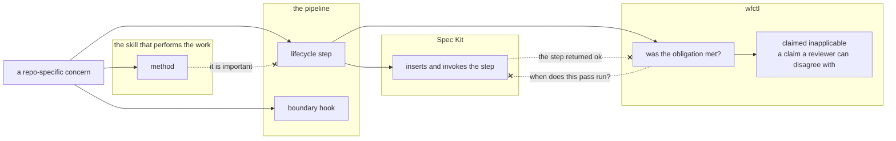

# A repo-specific concern earns a lifecycle step, a boundary hook, or a method

## Context

#339 landed the mechanism for a repository's own pass: `wfctl.json` declares it
under a built-in step, wfctl reads its evidence, and `wfctl check config`
reports what the declaration got wrong. What it did not land is the rule for
when a concern earns a pass at all.

`a-step-carries-sub-steps-one-level-deep` reads as though it carries that rule.
It says a pass earns a sub-step only when it leaves an artifact a reader can
point at, and excludes `architecture-design` on those grounds. The verdict is
right and the route to it is not. `architecture-design` is excluded because it
says how a pass is performed, not because of what it writes — and the same
sentence admits any discipline willing to emit a file. `clean-code` taught to
write `clean-code-review.md` passes it, and so does every other discipline that
can be made to leave a path behind.

That matters because the disciplines are each defensible one at a time.
`clean-code`, Python pattern selection, C++ design practice and Vue component
design are all real, all important, and a pipeline that grows a stage per
discipline is one nobody can run. The test that refuses the fourth one has to
ask what kind of concern it is. Asking what it writes cannot refuse any of them.

A second question rides with the first. Where the concern is a lifecycle step,
two separate things have to be true — it runs in the right place, and someone
can tell whether its obligation was met — and nothing says those have the same
owner. Spec Kit ships a workflow engine that sequences, wfctl derives state from
artifacts, and the arrangement where each learns the other's concept is the one
that has to be refused explicitly rather than avoided by nobody trying it.

## Direct baseline

Write nothing, and let the evidence-shape test in
`a-step-carries-sub-steps-one-level-deep` carry both questions. Zero records,
zero code, and it is the arrangement in force today.

It fails at the case it would be called for. A discipline arrives with a file to
its name, the test passes it, and the reason it should have been refused — that
it describes how work is done rather than when — is never asked. The failure is
silent and cumulative. Each admission is individually defensible, the pipeline
degrades one stage at a time, and the first reader who notices is looking at a
`wfctl status` with a dozen rows and no single decision to point at as the
mistake.

## Decision

A repo-specific concern routes to exactly one of three destinations, chosen by
what kind of concern it is:

- **A lifecycle step** — the activity has its own place in the development
  lifecycle, and something downstream is different because it happened.
- **A boundary hook** — the behaviour attaches to entry or exit from a stage
  that already exists. Prefer an upstream extension mechanism to minting a
  second wfctl stage for it.
- **A method** — it says how the work is performed. It belongs inside the skill
  that performs the work, and a method does not become a lifecycle step by
  being important.

The evidence-shape test runs second, and only on the first arm: given a
lifecycle step, does it leave an artifact a reader can point at?
`a-step-carries-sub-steps-one-level-deep` owns that test, and this record
changes nothing in it but its order.

Where the concern is a lifecycle step, Spec Kit inserts and invokes it and
wfctl judges whether the obligation was met.

The worked example is a UI design pass. It is a lifecycle step: `specify` reads
a design that the pass produced, so something downstream differs because it
ran. It leaves an artifact a reader can point at, so it earns a sub-step, and a
repository declares it with `evidence: "ui-design-contract.md"`. Vue component
design, which the same team cares about just as much, is a method — it changes
how the pass is performed and nothing downstream can tell it apart from taste.

Nothing evaluates this test at runtime. It is applied by whoever proposes the
concern, during `design-levels` level 2, and this record is the instrument they
apply. `wfctl check config` cannot stand in for it: by the time a declaration
exists, an arm has already been chosen.

## Owns truth

Spec Kit owns *"when does this pass run, and what invokes it?"*. wfctl cannot
compute it: dispatch order is a fact about a process, and a branch carries the
artifacts that exist, not the identity of the step that produced them or the
order anything was asked for. Re-derivation has nothing to read, because the
fact was never an artifact.

wfctl owns *"was this pass's obligation met, or claimed inapplicable?"*. Spec
Kit cannot compute it: its engine has no evidence concept at all —
`a-run-cursor-is-execution-state-not-evidence` establishes that by grep over
`src/specify_cli/workflows/` at `fcfc7e8`, which returns nothing for evidence,
predicate, not-applicable or re-derivation — and its `gate` step stores the
user's pick as a value carrying no reason, which is the half a reviewer needs.

This is `a-run-cursor-is-execution-state-not-evidence` one level down. That
record splits a *run*: the engine's cursor against wfctl's derivation. This one
splits a *pass*, and the second does not follow from the first. A tool can own
sequencing for a whole run and still be the right owner of a single pass's
verdict; saying it is not requires saying so.

## Boundary

Three dashed edges, three refusals. wfctl never accepts that a step returned as
evidence its obligation was met. A method never becomes a lifecycle step on the
strength of being important. And wfctl does not answer Spec Kit's question
either — drawing only the first two would read as a demotion rather than a
split.

## Considered

- **The direct baseline above** — the evidence-shape test carrying both
  questions. Cheapest by a wide margin and it leaves every record untouched, but
  it cannot refuse a discipline that writes a file, which is the case the test
  is wanted for.
- **Fold the three-way test into `a-step-carries-sub-steps-one-level-deep`** —
  a defensible filing choice, and it loses on what a reader does rather than on
  being wrong. One record would answer two questions, and the second one
  silently: a reader arriving with "should this be a stage?" finds a rule about
  artifacts, gets a plausible answer, and never learns the question they asked
  was a different one.
- **Two arms rather than three, with hooks folded into steps** — simpler, and
  it forces a concern that attaches to an existing stage's edge to mint a stage
  of its own. That is precisely the growth this record exists to stop. Whether
  Spec Kit's hook mechanism can carry the middle arm is #426 and #428's
  question, and collapsing the arm now would answer it by omission.
- **Put the ownership split in `a-run-cursor-is-execution-state-not-evidence`**
  — the same principle at a different granularity, so the pull to file it there
  is real. It loses twice: that record's subject is a run and this one's is a
  pass, and editing it would make a record answer a question asked after it was
  written.
- **Teach `wfctl.json` a richer predicate, so evidence shape can express more**
  — it would let the evidence test absorb the concern-kind question all over
  again, and `a-step-carries-sub-steps-one-level-deep` already states the limit
  and the remedy: change what the pass writes, do not teach `wfctl.json` to
  grep.

## Consequences

`a-step-carries-sub-steps-one-level-deep` is rewritten rather than superseded.
It is `proposed`, its decision stands unchanged, and what moves is the order of
the two tests and the reason `architecture-design` is excluded.

`evidence` stays sugar for a file-exists predicate. This record narrows what the
evidence test is asked to decide; it widens nothing about what a declaration can
express.

The middle arm names no mechanism, and no supervisory surface is named anywhere
in this record. #426 and #428 are where Spec Kit's hooks are evaluated, and this
record is what makes their result readable — a hook that works settles the
middle arm, and a hook that does not send the concern to one of the other two
rather than leaving it unplaced.

`level-3-owns-structural-heuristics.md` and
`brainstorm-is-one-step-with-addressable-levels.md` are both `proposed` and both
still state the disavowed test — "does the skill write anything," "leaves an
artifact a reader can point at" — as their own reason for excluding
`architecture-design`, the identical example this record uses to refute it.
Neither is touched by this change. That is known and pending reconciliation,
not an oversight this record failed to notice in itself.

The test has no check behind it, and that is the answer `a-rule-is-expressed-as-a-check`
gives rather than a gap in it. A violation is a concern filed under the wrong
arm, which is a judgment about what kind of thing it is; nothing in an artifact
the work produces distinguishes a stage that earned its place from one that did
not. So the rule stays prose, delivered where it binds — at `design-levels`
level 2, by the reader who is about to file something.

## Log

- 2026-09-20  proposed    — #435: #339 shipped the mechanism for a repository's
  own pass and no rule for when a concern earns one. The evidence-shape test
  reads as that rule, reaches the right verdict on `architecture-design` by the
  wrong route, and admits any discipline willing to write a file
