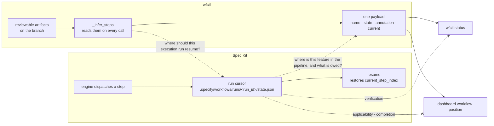

# A run cursor is execution state, not evidence that an obligation was met

## Context

Spec Kit ships a workflow engine that persists a run cursor, and wfctl derives
the same-sounding answer from artifacts on disk. Nothing says which one binds, so
the first repo to run `specify workflow run` beside `wfctl status` gets two
answers to "where is this feature?" and no rule for picking one.

Upstream is `1.0.9.dev0` and the engine is real: 12 step types with control flow,
expressions, catalogs and overlays (`workflows/engine.py:142`). `RunState.save`
writes `status`, `current_step_index`, `current_step_id` and `step_results` to
`.specify/workflows/runs/<run_id>/state.json` after each step
(`workflows/engine.py:748`, path at `:805`), and `resume` restores
`current_step_index` from it (`:861`). That is a checkpoint cursor, and
`session-state-is-re-derived` refuses exactly that shape in this repo's own
words: *"no session file is treated as authoritative for a value that can be
recomputed."*

What wfctl vendored under `wfctl/specify/` — three bash scripts and six
templates — predates all of it, so the collision is invisible from inside this
repo and arrives whole the moment the overlay spike installs upstream.

The two states diverge the moment anything happens outside the engine. A human
writes `ui-contract.md` by hand while the runner is stopped:

| | Spec Kit's cursor | wfctl's derivation |
|---|---|---|
| after the engine paused | `current_step: ui-design`, `status: paused` | `ui-design: pending` |
| after the human writes the file | `current_step: ui-design`, `status: paused` | `ui-design: done` |
| what it answers | where the engine stopped dispatching | what the branch has on disk |

Both rows on the right are correct. Both rows in the middle are correct. They
contradict each other only under the premise that they answer the same question,
and that premise is the thing this record removes.

## Direct baseline

Write nothing, and let each tool keep answering its own question. wfctl's
`_infer_steps` goes on reading spec artifacts, `specify workflow status` goes on
printing the cursor, and a reader consults whichever one is in front of them.
Zero code, zero record, and it is genuinely free today, because the vendored
fossil cannot run a workflow at all.

It fails at the moment the overlay spike succeeds. Two payloads then exist over
one question, and the choice between them is made ad hoc by each reader — an
agent that greps `state.json` because it is machine-readable, a dashboard that
reads whichever is fresher. A rule invented per reader is the arrangement
`pipeline-state-is-one-payload` already rejected one level down, and it would be
discovered in phase 6, after sequencing had moved.

## Decision

A Spec Kit run cursor records what the workflow engine executed, paused on, or
should resume, and is authoritative for continuation of that run. It is not
evidence that an obligation was satisfied, and is never the source of
`wfctl status`, dashboard workflow position, verification, applicability or
completion. wfctl derives those from reviewable artifacts on every read.

Two authorities over two questions. Neither is subordinate to the other.

## Owns truth

Spec Kit owns "where should this execution run resume?". wfctl cannot compute
it: which step the engine dispatched, what each one returned, and whether the run
was paused or failed are facts about a process, and the tree shows the same bytes
whether a step finished or was interrupted halfway through writing its output.
Re-derivation has nothing to read, because the fact was never an artifact.

wfctl owns "where is this feature in the pipeline, and what is owed?". Spec Kit
cannot compute it: the cursor advances when the engine dispatches a step, not
when a reviewer could check one, so every event outside the engine is invisible
to it — a human writing an artifact by hand, an agent interrupted mid-step, a
step that succeeded and had its artifact reverted in the next commit. A cursor
that cannot notice the file it is about is not a claim about the file.

The engine has no evidence concept to contest this with. Grepping the whole
`src/specify_cli/workflows/` package at `fcfc7e8`, case-insensitively, for
evidence, predicate, not-applicable or re-derivation returns nothing at all. The
`gate` step stores the user's pick as `output["choice"]`
(`workflows/steps/gate/__init__.py:183`) — a value in a JSON file, carrying no
reason and committed nowhere a reviewer would read it.

## Boundary

The four dashed edges are the decision. The three leaving the run cursor are what
wfctl refuses to read it for; the fourth is the half usually left undrawn — wfctl
does not answer Spec Kit's question either, and saying so is what keeps this a
split rather than a demotion.

## Considered

- **Declare the run cursor non-authoritative, full stop** — the framing this
  work started from, and wrong. `state.json` is exactly and correctly
  authoritative for resumption; that is the documented purpose of the mechanism.
  The blanket denial contradicts the upstream design for no gain and leaves the
  genuinely useful half of the cursor with no owner on paper, which is how a
  later reader concludes the question was never considered.
- **Have wfctl read the cursor as an attention signal** — "this run paused on
  `plan`" is real information, and reading it makes wfctl a consumer of the thing
  it has just declined to treat as feature truth. The argument for it is an
  argument about what the dashboard should surface, which is a different question
  and owes its own level-2 pass. Left out deliberately rather than answered
  cheaply here.
- **Prefer the cursor when present, fall back to artifacts** — a precedence rule
  is consulted only when the two disagree, and disagreement is precisely the case
  where the cursor is stale. It would be right in every case where it changes
  nothing.
- **One record covering position and evidence** — evidence is uncontested; the
  grep above returns zero hits. Folding it in would stage a negotiation that is
  not happening and make an absence look like a concession.
- **Order the migration in this record** — Spec Kit's runner is stronger than
  wfctl should build (fan-out/fan-in, conditionals, loops, gates, resume,
  overlays, catalogs), and the price is a second state model, overlay
  maintenance and a version dependency. That is a real trade, not an obvious
  replacement, and whether `_pipeline.py` retires is decided on spike evidence.
  This record draws the boundary; it does not order the move.

## Consequences

`skipped` is the first collision to land, because both sides already ship the
word. An unfilled `slot` step returns `StepStatus.SKIPPED` with
`output={"slot": <name>}` (`workflows/steps/slot/__init__.py:48`), meaning
*nothing filled this extension point, so execution may proceed*. wfctl's
`skipped` under `an-absent-artifact-is-claimed-not-inferred` means *this pass did
not apply, and here is a committed sentence a reviewer can disagree with*, written
by `wfctl step none <name> --reason "…"`. One word, two semantics — execution
versus review — and the overlay spike installs them side by side. Mapping one to
the other is what this record forbids; they are not the same state.

The spike becomes interpretable, which is why it waited. Under this boundary its
result is an integration question — can wfctl's passes be expressed as overlay
steps while evidence stays wfctl's — rather than a migration of feature truth.

`session-state-is-re-derived` extends unchanged: Spec Kit joins the category that
record already built for an agent's remembered position, as another execution
mechanism that is not a source of feature truth. `pipeline-state-is-one-payload`
supplies the other half — every view receives the same wfctl-derived payload, and
a view that reached past it to `state.json` would be deriving meaning
independently, which that record's dashed edges already forbid.

## Log

- 2026-09-19  proposed    — #420: Spec Kit `1.0.9.dev0` ships a persisted run
  cursor and wfctl's accepted records refuse that shape; the two answer different
  questions and nothing said so. Evidence re-verified against the upstream repo at
  `fcfc7e8` rather than carried from the handoff
