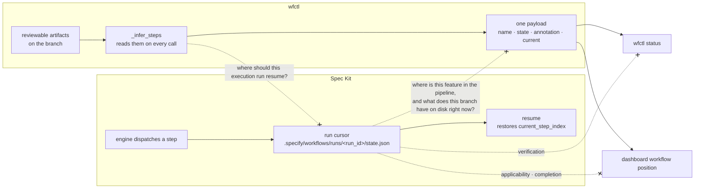

# A run cursor is execution state, not evidence that an obligation was met

## Context

Spec Kit ships a workflow engine that persists a run cursor, and wfctl derives
the same-sounding answer from artifacts on disk. Nothing says which one binds, so
the first repo to run `specify workflow run` beside `wfctl status` gets two
answers to "where is this feature?" and no rule for picking one.

Upstream is `1.0.9.dev0` and the engine is real: 12 step types including control
flow (`workflows/engine.py:142`), and overlays that reorder a workflow through
`insert_after`, `insert_before`, `replace` and `remove`
(`workflows/overlays/schema.py:16`). `RunState.save`
(`workflows/engine.py:740`) writes `status`, `current_step_index`,
`current_step_id` and `step_results` (`:761`) to
`.specify/workflows/runs/<run_id>/state.json` (path at `:805`) after each step,
and `RunState.load` restores `current_step_index` from it (`:861`) for `resume`.

That is a checkpoint cursor, and it lands next to an accepted record that
constrains exactly this: `session-state-is-re-derived` says *"no session file is
treated as authoritative for a value that can be recomputed."* Feature position
is such a value — wfctl recomputes it from the branch on every read. Where the
cursor collides with that record is there, and only there; the conditional in
the quoted rule is doing real work, and the rest of this record turns on it.

What wfctl vendored under `wfctl/specify/` — three bash scripts and five
templates — predates all of it, so the collision is invisible from inside this
repo and arrives whole the moment the overlay spike installs upstream.

The two states diverge the moment anything happens outside the engine. A human
writes `tasks.md` by hand while the runner is stopped:

| | Spec Kit's cursor | wfctl's derivation |
|---|---|---|
| the engine paused on the tasks step | `status: paused`, `current_step_id: tasks` | `tasks: pending` |
| the human writes `tasks.md` | `status: paused`, `current_step_id: tasks` | `tasks: done` |
| what it answers | where the engine stopped dispatching | what the branch has on disk |

Both columns are correct throughout. They contradict each other only under the
premise that they answer the same question, and that premise is the thing this
record removes.

## Direct baseline

Write nothing, and let each tool keep answering its own question. wfctl's
`_infer_steps` goes on reading spec artifacts, `specify workflow status` goes on
printing the cursor, and a reader consults whichever one is in front of them.
Zero code, zero record, and it is genuinely free today, because the vendored
fossil cannot run a workflow at all.

It fails at the moment the overlay spike succeeds — the planned trial of running
wfctl's pipeline as a Spec Kit workflow, deliberately not started until this
boundary is stated. Two payloads then exist over one question, and the choice
between them is made ad hoc by each reader: an agent that greps `state.json`
because it is machine-readable, a dashboard that reads whichever is fresher. A
rule invented per reader is the arrangement `pipeline-state-is-one-payload`
already rejected, and it would be discovered only once sequencing had moved.

## Decision

A Spec Kit run cursor records what the workflow engine executed, paused on, or
should resume, and is authoritative for continuation of that run. It is not
evidence that an obligation was satisfied, and is never the source of
`wfctl status`, dashboard workflow position, verification, applicability or
completion. wfctl derives those from reviewable artifacts on every read.

Two authorities over two questions. Neither is subordinate to the other.

## Owns truth

Spec Kit owns "where should this execution run resume?". wfctl cannot compute
it: which step the engine dispatched and what each one returned are facts about a
process, and the branch records none of them. A tree carries the artifacts that
exist, not the identity of the step that was running when the engine stopped —
so re-derivation has nothing to read, because the fact was never an artifact.

wfctl owns "where is this feature in the pipeline, and what does this branch
have on disk right now?". That question is not claimed here for the first time —
`session-state-is-re-derived` already assigns it, and the spelling above is that
record's, kept word for word so the two do not read as rival claims. What this
record adds is the answer for a mechanism that record predates: a Spec Kit run
cursor is not an answer to it. The cursor advances when the engine dispatches a
step, not when a reviewer could check one, so every event outside the engine is
invisible to it — a human writing an artifact by hand, an agent interrupted
mid-step, a step that succeeded and had its artifact reverted in the next commit.
A cursor that cannot notice the file it is about is not a claim about the file.

The engine has no evidence concept to contest this with. Grepping the whole
`src/specify_cli/workflows/` package at `fcfc7e8`, case-insensitively, for
evidence, predicate, not-applicable or re-derivation returns nothing at all. The
`gate` step stores the user's pick as `output["choice"]`
(`workflows/steps/gate/__init__.py:183`) — a value in a JSON file, carrying no
reason for the choice, which is the half a reviewer would need.

## Boundary

The four dashed edges are the decision. The three leaving the run cursor are what
wfctl refuses to read it for; the fourth is the half usually left undrawn — wfctl
does not answer Spec Kit's question either, and saying so is what keeps this a
split rather than a demotion.

## Considered

- **Declare the run cursor non-authoritative, full stop** — the framing this
  work started from, and wrong. `state.json` is exactly and correctly
  authoritative for resumption; that is the documented purpose of the mechanism.
  The blanket denial contradicts the upstream design for no gain and leaves the
  genuinely useful half of the cursor with no owner on paper, which is how a
  later reader concludes the question was never considered.
- **Have wfctl read the cursor as an attention signal** — "this run paused on
  `plan`" is real information, and reading it makes wfctl a consumer of the thing
  it has just declined to treat as feature truth. The argument for it is an
  argument about what the dashboard should surface, which is a different question
  and owes its own level-2 pass. Left out deliberately rather than answered
  cheaply here.
- **Prefer the cursor when present, fall back to artifacts** — a precedence rule
  is consulted only when the two disagree, and disagreement is precisely the case
  where the cursor is stale. It would be right in every case where it changes
  nothing.
- **One record covering both position and evidence** — evidence is uncontested;
  the grep above returns zero hits. Folding it in would stage a negotiation that
  is not happening and make an absence look like a concession.
- **Order the migration in this record** — Spec Kit's runner is stronger than
  wfctl should build (fan-out/fan-in, conditionals, loops, gates, resume,
  overlays), and the price is a second state model, overlay maintenance and a
  version dependency. That is a real trade, not an obvious replacement, and
  whether `_pipeline.py` retires is decided on spike evidence. This record draws
  the boundary; it does not order the move.

## Consequences

`skipped` is the first collision to land, and the trap is that the two meanings
look alike rather than unlike. An unfilled `slot` step returns
`StepStatus.SKIPPED` with `output={"slot": <name>}`
(`workflows/steps/slot/__init__.py:49`) — *no overlay filled this extension
point, so execution may proceed*.

wfctl's `skipped` is inferred too, and four readers produce it with no single
gloss between them. Two read a later artifact and mean *a later step ran without
this one*: `brainstorm` with a `spec.md` and no `design.md`
(`_evidence.py:985`), and `clarify` with a `plan.md` already written (`:1071`).
The other two mean something else — that the work has already shipped, so
blocking here would strand the pipeline with no route to `/end-session`: `tasks`
over an `implement-complete.md` sentinel with no task in the file (`:1110`), and
`decompose` with no `delivery.md` when the tasks it would group are closed
(`:1144`). None of the four carries a reason, deliberately; the comment above the
`clarify` arm says a `skipped` step is never the current step, so "a reason here
would reach no consumer", and the explanation goes in `display` instead.

What those four share is not a meaning but a subject: each is a fact about this
branch. The slot's `SKIPPED` is a fact about the workflow definition, and it
holds identically on every branch that workflow runs on. That is the difference a
migration would erase — and because neither side's `skipped` carries a
reviewer-facing justification, erasing it would look correct. A step the engine
never offered would arrive at a wfctl reader as a step wfctl walked past, and the
two are not the same claim.

Giving wfctl's side a committed reason landed with #339: `wfctl step none`
ships, and `an-absent-artifact-is-claimed-not-inferred` sits in this repo's arch
root as `proposed`, so the policy is stated and not yet in force. This record
does not depend on it either way — the boundary holds on what each `skipped`
is a fact *about*, which is true of the code as it ships.

The spike becomes interpretable, which is why it waited. Under this boundary its
result is an integration question — can wfctl's passes be expressed as overlay
steps while evidence stays wfctl's — rather than a migration of feature truth.

`pipeline-state-is-one-payload` supplies the other half of the reconciliation:
every view receives the same wfctl-derived payload, and a view that reached past
it to `state.json` would be deriving meaning independently, which that record's
dashed edges already forbid.

## Log

- 2026-09-19  proposed    — #420: Spec Kit `1.0.9.dev0` ships a persisted run
  cursor and an accepted record constrains that shape for recomputable values;
  the two answer different questions and nothing said so. Evidence re-verified
  against the upstream repo at `fcfc7e8` rather than carried from the handoff
