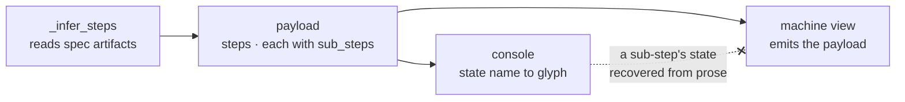

# A pipeline step carries sub-steps, one level deep

## Context

The pipeline is eight steps, hardcoded in `_STEPS`. A repository that runs a
design pass of its own can only write that pass's position in prose. pfms does:
`pfms-ui-design-workflow` is a committed, project-local skill whose SKILL.md says
to run it between brainstorming and `speckit.specify`. Nothing reads that
sentence. `wfctl status` shows the same eight rows it shows every repository,
`next_command` routes from `brainstorm` straight to `/speckit.specify`, and a
feature that walked past the UI design is indistinguishable from one that ran it.

The same gap already exists inside wfctl, which is the part that makes this a
boundary question rather than a feature request. `brainstorm` is not one pass. It
runs the four design levels, escalates ownership questions to
`architecture-decisions`, and ends with `idea-refine` writing `design.md`. Two of
those leave artifacts the brainstorm predicate already reads — a record under the
arch root, and `design.md` itself — and the predicate collapses both into a
single state with a reason string hung off it. A reader is told the step is
in progress and which one sentence is outstanding; nothing tells them how many
passes the step has, which have run, or which command produces the missing one.

So the pipeline's own structure is one level shallower than the work it tracks,
in wfctl as much as in pfms.

This record's subject is narrow, and the narrowing is worth stating because the
record was read wider than it is. It answers *how a pass is represented once it
is a pass*. Whether a repo-specific concern is a pass at all — rather than a
hook on an existing stage, or a method inside the skill that does the work — is
`a-repo-concern-earns-a-step-hook-or-method`'s question, and it runs first.

## Direct baseline

Leave `_STEPS` flat, and let a repository name one extra evidence path that the
parent step's predicate reads. `brainstorm` returns `in_progress` with
`ui-design: wireframe not written` as its reason, and the existing `remedy` field
carries `run /pfms-ui-design-workflow`. This is the mechanism `design_block`
already provides, aimed at a repo-supplied path instead of the arch root. No view
changes, no record is amended, and `pipeline-state-is-one-payload` is untouched.

It fails at the thing it was built for. Once the artifact exists, a repository
that configured the pass and a repository that never configured one both render
`brainstorm ●`. The pass has no state of its own, so it has no row to appear in,
nothing for `next_command` to point at, and no way to be reported as declared
inapplicable rather than never run. That is #307 — a pass that found something and
a pass that never ran are the same pull request — reproduced one level down
instead of fixed. The baseline buys its cheapness by keeping the thing invisible,
which is the defect.

## Decision

A step in the pipeline payload carries an ordered list of sub-steps. A sub-step
has the same shape a step has — a name, a command, a continuation, and a
**predicate** — and reports the same four state names. The nesting is exactly one
level: a sub-step carries no sub-steps of its own.

The predicate is the field that matters, and it is a callable for the reason
`Step.predicate` already is. A repository cannot ship one, so `evidence` in
`wfctl.json` is sugar that builds the file-exists predicate on its behalf:

```
built-in sub-step    any callable — clarify's reads a heading inside spec.md
declared sub-step    evidence: "design/ui-design-contract.md"
                       └─► the predicate "this file exists"
```

Configuration therefore expresses strictly less than a built-in predicate can,
and that is a stated limit rather than an oversight. A pass whose output is not a
file at a fixed path — `python-pattern-selection` may record a departure in a
commit message instead — is out of reach of `wfctl.json` by construction, and the
answer is to change what that pass writes, not to teach `wfctl.json` to grep.

A repository appends sub-steps to a named built-in step in `wfctl.json`, keyed by
that step's name:

```json
{
  "steps": {
    "brainstorm": [
      { "command": "/pfms-ui-design-workflow", "evidence": "design/ui-design-contract.md" }
    ]
  }
}
```

The key is the anchor, so no sub-step declares a position. wfctl's own passes are
sub-steps of the same shape, hardcoded in the step table and carrying no mark
distinguishing them from a repository's — `sub_steps`, never `custom_steps`, so
moving a built-in pass into configuration later changes where the list comes from
rather than what a sub-step is.

A pass earns a sub-step only when it leaves an artifact a reader can point at.
This is the second of two tests and never the first. What kind of concern the
thing is has already been answered by
`a-repo-concern-earns-a-step-hook-or-method`; what is left for this record is
whether an activity already established as a lifecycle pass has a state worth
carrying, or whether it is prose that belongs in a skill.

`architecture-design` fails the first test, not this one. It is how a sub-step is
performed — the method by which a level-2 answer is reached — and it would still
be a method if it wrote a file on every run. Reading its exclusion as a verdict
about evidence is what made this test look like the whole rule, and the reading
is wrong in a direction that matters: any discipline willing to emit a path would
pass it.

## Owns truth

wfctl owns "which passes does this step require, and what state is each one in?",
and owns it as data on the payload, one level deep.

The parent step's predicate cannot own it. A predicate returns one state and one
reason, so every pass inside the step collapses into a single string — and a
string has no state to route from, no state to count, and no state to declare
away. Two facts a consumer needs are unrecoverable from it: which pass is
outstanding, as something other than prose, and whether a pass exists at all on a
repository that never configured one.

## Boundary



The dashed edge is the decision. A sub-step's state is a field, never a sentence
a consumer has to parse back out of the parent's annotation.

## Considered

- The direct baseline above, an extra evidence path on the parent predicate —
  cheapest by a wide margin and it keeps every accepted record untouched, but the
  pass stays invisible, which is the defect rather than a cost of fixing it.
- A sub-step carrying an evidence *path* rather than a predicate — which is what
  this record said first, and it cannot express wfctl's own passes. `clarify`
  reads a heading inside another step's file, so under a path-only rule the
  built-ins would keep bespoke predicates while declared sub-steps got paths, and
  the two would be different kinds of thing wearing one name.
- A general tree, a step carrying sub-steps carrying sub-steps — every view
  learns recursion and every consumer learns depth, to express a nesting nobody
  has asked for. One level covers wfctl's own passes and pfms's, and a second
  level can be proposed by whoever finds they need it.
- Insert the repository's pass as a peer of `specify` in `_STEPS`, per #339's own
  sketch — needs an `after` anchor, which breaks when the built-in table is
  reordered, and makes a repository's pass a peer of steps whose predicates
  encode accepted behaviour. Keying by parent step makes the anchor free and
  keeps the repository's pass inside the step it belongs to.
- Path globs in `wfctl.json` deciding which branches the pass applies to —
  evaluated against a diff that does not exist yet. The pass sits between
  `brainstorm` and `specify`, so routing happens before any code is written, and
  every branch would read as not matching. #620 is the concrete case: a
  UI-driven decision whose code landed in `packages/types`, which a `client/**`
  rule would have called backend-only.
- Carry the concern-kind test here too, so one record answers both "is this a
  pass?" and "does it earn a row?" — the reading this record already attracted,
  and it loses on what it costs a reader rather than on being unworkable. Two
  tests with different subjects under one heading means the one that is not
  asked about gets answered silently.

## Consequences

Whether a concern is a lifecycle pass at all is settled before this record is
consulted, by `a-repo-concern-earns-a-step-hook-or-method`. The two tests run in
order — what kind of concern is this, then does it leave an artifact — and this
record owns only the second. A reader who arrives here asking the first question
is in the wrong file, which is the failure the two records exist to separate.

`pipeline-state-is-one-payload` is extended, not superseded. Its claim is that
inference produces one payload and every view is a transformation of it, with no
fact computed inside a view; all three survive a payload whose steps carry
sub-steps. What goes is the flatness, which that record described rather than
claimed.

`wfctl status` renders sub-steps indented under their parent. A sub-step in
`skipped` is hidden unless `--all` is passed — the default view is deliberately
lossy, which the record above permits precisely because nothing computes from a
view. `--json` always carries the full tree.

`next_command` can name a sub-step's command, so `speckit-orchestrate` learns
what a sub-step is before it can emit one. A repo-declared sub-step is
`review_required` by default, because wfctl does not ship the command; a
repository opts into `automatic` per sub-step once it has decided that is safe.

`doctor` is not touched. A declared sub-step whose command is not installed is a
finding about configuration the repository wrote for itself, and the drift
report's remit is state wfctl installed — so the finding lands in `wfctl check
config` instead, alongside every other rule this feature states about a
declaration. That is `a-rule-is-expressed-as-a-check` applied to this feature's
own rules, and it is what `spec.md`'s clarification Q2 settled.

A test in wfctl's own suite still cannot reach the case, because the command it
would check ships from the consuming repository. `check config` is run against a
repository rather than shipped as an assertion about one, which is why the
finding belongs there rather than in a suite.

Brainstorm's predicate reads its two artifacts in the opposite order to the
process that produces them: it checks `design.md` first and the arch record
second, while `design-levels` and the brainstorm skill both write the record
first and the document last. Ordering the sub-steps correctly means fixing that
read, not relabelling it.

Making `brainstorm`'s passes visible puts wfctl's own process inside a row named
after a spec-kit command, which is #395's question rather than this record's.
Sub-steps are additive and hold whatever the step table ends up holding, so
nothing here depends on how that is answered.

The code says "sub-step" and everything a reader sees says "pass". That is
deliberate rather than drift. `wfctl-counts-the-passes` already spends "pass" on
one iteration of the orchestrate loop, and three senses of the word in one arch
root is worse than two vocabularies with a line saying which is which. So
`SubStep`, `sub_steps` and this record's title carry the code's spelling, and
`spec.md`, `plan.md`, `tasks.md` and every user-facing string carry the reader's.
The one place they meet is a future rename of the orchestrate record's word,
which is that record's to make, not this one's.

## Log

- 2026-09-16  proposed    — #339's level-2 pass; the pipeline is one level
  shallower than the work it tracks, in wfctl as much as in the repository that
  reported it
- 2026-09-17  revised     — #408: the `doctor` consequence contradicted
  `spec.md`'s clarification Q2, which put the finding in `check config` on the
  ground that the drift report reports what wfctl installed, not what a
  repository configured for itself
- 2026-09-17  revised     — #408: the code's "sub-step" and the artifacts'
  "pass" are two vocabularies on purpose, because `wfctl-counts-the-passes`
  holds "pass" for an orchestrate iteration. Recorded so the divergence is not
  read as an oversight and renamed away
- 2026-09-20  revised     — #435: the evidence-shape test read as the whole rule
  for when a concern earns a pass, and reached the right verdict on
  `architecture-design` by the wrong route. Scoped to the second of two tests,
  with the first named; `ui-contract.md` respelled `ui-design-contract.md`
