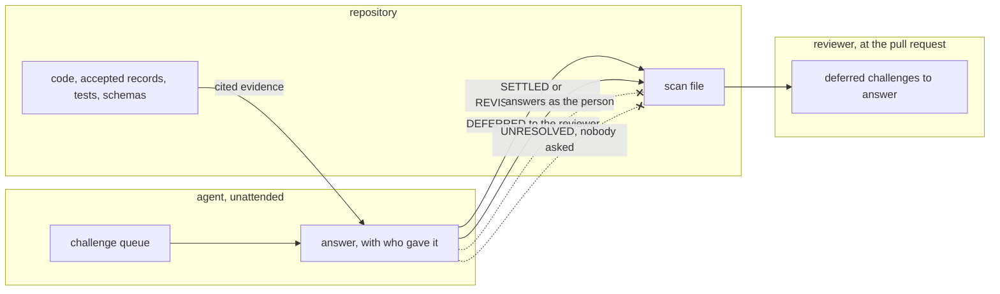

# An unattended defense settles what evidence proves and defers the rest to the reviewer

## Context

Plan defense is a pass under `plan` that interviews the person responsible for a
plan before it becomes tasks. It asks one material question at a time and
records a disposition per challenge: `SETTLED`, `REVISION_REQUIRED`, `DEFERRED`
or `UNRESOLVED`. Its value is that it tests a person's mental model of the plan,
which no other pass in wfctl does.

Under `auto_approve` nobody is at the prompt to answer. The mode is one switch
that reaches every pass (`approval-mode-is-stored-intent`, and FR-021b in #339),
and its intent is that an unattended run performs the whole workflow, makes its
own decisions, and records the trade-offs for a reviewer to read at the pull
request. Plan defense is the first pass whose subject is the person rather than
the artifact, so the mode has to say what it does here.

Both obvious answers are wrong. Skipping the pass under the mode throws away the
challenges an agent can settle honestly from the repository. Letting the agent
answer as the person would produces the plausible explanation the pass exists to
test, and the artifact would then carry it as if a person had given it.

#500 proposed a third answer: write every material challenge `UNRESOLVED` and
hold. That records questions nobody was asked as questions with no defensible
answer, which is a state that renders correctly and is untrue. It also turns
the one switch into "unattended until `plan`".

## Direct baseline

Leave the mode to the skill with no rule. The agent runs the interview against
itself under `auto_approve` and writes whatever dispositions it reaches, in the
same artifact shape an attended run uses. No field is added and no pass changes.

It fails on the one question a reviewer brings to the artifact. An agent's
`SETTLED` on "walk me through one request from entry point to durable state"
reads identically to a person's, so the reviewer cannot tell which challenges a
human defended and which an agent narrated. The artifact then certifies
understanding that nobody demonstrated.

## Decision

Under `auto_approve`, plan defense runs to completion and never stops the run to
wait for a person. The agent answers each challenge from evidence only, and every
answer records who gave it. The disposition follows from what the evidence can
carry:

1. A challenge that code, an accepted record, a test, or a schema settles is
   `SETTLED`, and the answer cites that evidence.
2. A challenge that shows the plan must change is `REVISION_REQUIRED`, and the
   agent returns to `plan`, revises, and defends again.
3. A challenge that only a person's explanation can settle is `DEFERRED`, with
   the reviewer as owner and review of the pull request as the trigger.

`UNRESOLVED` is never written by an unattended run, since it means a person was
asked and had no defensible answer. Comprehension challenges are always
deferred, because they ask for a person's mental model and evidence cannot stand
in for one. An attended run is unchanged: the person answers, and `UNRESOLVED`
holds the pipeline at `plan`.

## Owns truth

The reviewer owns "does the person accountable for this change understand it
well enough to defend it?".

The agent cannot compute it. An agent answering questions about its own plan is
the one party whose answer the question exists to test, and its self-report is
unfalsifiable for the reason `wfctl-runs-the-verification` gives about its own
completion claims. The only person reachable in an unattended run is the one who
reviews the pull request, so that is where the question goes.

The repository owns "is this claim true?" wherever a file can prove it. The agent
may cite that evidence and may not substitute an assertion for it, because an
assertion is what the pass is built to separate from evidence.

## Boundary

The two refused edges are the decision. An agent's answer never enters the scan
file as the person's, and an unattended run never records a challenge as
unanswerable when nobody was asked it.

## Considered

- **The direct baseline above**, where the agent self-answers with no rule. It
  costs nothing and loses on the reviewer's question, since an agent's
  comprehension answer and a person's become the same line.
- **Hold before the interview.** The pass would carry a continuation that
  `auto_approve` does not reach, and the run would stop with `attention: manual`
  and write nothing. It is honest and small, and it loses on fit: it makes every
  unattended run stop at `plan`, which contradicts the one switch this repo
  wants to perform the entire workflow.
- **Hold after writing every challenge `UNRESOLVED`**, as #500 proposed. It
  records a question nobody was asked as one with no defensible answer. It also
  routes badly, because a pass reading `in_progress` with a reason sends the
  loop to the parent's command, `/speckit.plan`, rather than back to the defense.
- **Claim the pass inapplicable under the mode**, with `wfctl step none`. It
  discards the challenges evidence can settle, and a claim is meant to say a
  pass does not apply to a change, which is untrue here.
- **Declare it a manual pass with no command.** No code changes, and `next`
  then prints `plan.plan-defense` instead of a command, so the person has to know
  the skill exists. It also stops attended runs where the person is at the
  prompt and the agent could conduct the interview.

## Consequences

Each challenge in the artifact carries who answered it. That is a field the
skill's artifact contract does not have today, and it is what lets a reviewer
tell a defended challenge from a narrated one.

The deferred challenges in the scan file are the reviewer's interview script.
A pull request produced unattended arrives with the questions its reviewer has
to be able to answer, rather than with a claim that they were answered.

The revise loop in point 2 has no natural end. Each round rewrites `plan.md`, so
the evidence changes and stall detection never fires. The bound is a stop
condition, in `unattended-run-stop-condition`.

The rule is prose delivered in the skill, not a check. Whether an unattended
answer was drawn from evidence or from assertion is a judgment about its
content, and `a-rule-is-expressed-as-a-check` leaves a rule like that as prose at
the moment it binds. The answered-by field is the part a reader can check.

## Log

- 2026-09-26  proposed    — #500 level 2: plan defense needs a person to answer,
  and the one switch means nobody is there
