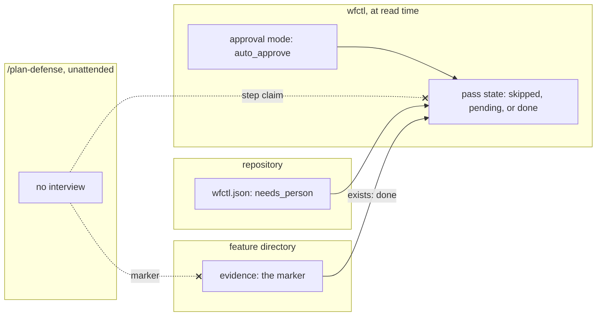

# A pass that needs a person reads skipped while nobody is expected, and nothing is written

## Context

`plan-defense-is-private` decides that plan defense runs only with a person
present, and that an unattended run passes it by. A repository places the pass
itself, by declaring it in `wfctl.json` under any step, so an unattended run
reaches it like any other declared pass: `auto_approve` turns the pass's
`review_required` default automatic (`_pipeline.py:752`), and orchestrate
invokes `/plan-defense` without stopping.

Nothing in wfctl today can pass it by without a file. A declared pass reads
`done` only when its evidence file exists (`_declared.py:202`), which for plan
defense is the marker the skill writes into the feature directory, and `skipped`
only when a person wrote a claim with `wfctl step none` (`_pipeline.py:400-403`).
If the skill writes nothing, the pass stays outstanding, orchestrate invokes it
again, and the run ends as `stalled`. So the first answer to this question was a
claim the skill wrote on itself, and that answer has two costs:

1. Every unattended run commits one claim file per declared pass, about a check
   that did not happen.
2. The claim outlives the condition it describes. Once a person is back, the
   claim still hides the pass, so the skill has to find it and delete it before
   an attended run means anything.

Both costs come from writing down a fact that wfctl already holds. Whether a
person is expected at the prompt is the approval mode, which wfctl stores and
reads on every report (`approval-mode-is-stored-intent`).

## Direct baseline

The skill writes the claim. Under `auto_approve`, `/plan-defense` runs
`wfctl step none <step>.<name> --reason "no person present; delete this claim
to run the check"`, and in attended mode it deletes a claim carrying that
reason before the interview starts. No field, no reader, and no state is new;
this is the decision `500-unattended-skip-is-a-claim` recorded.

## Decision

A declared pass may carry `"needs_person": true`. While `auto_approve` is on and
the pass's evidence is absent, wfctl reads that pass as `skipped`, with the
reason "needs a person; auto-approve is on", computed at read time like every
other state. Nothing is written, and once `auto_approve` is off the same pass
reads `pending` again.

The order of the checks is:

1. A claim wins, as it does today.
2. Evidence that exists reads `done`, so a person who runs the check during an
   unattended stretch still gets credit for it.
3. `needs_person` with `auto_approve` on reads `skipped`.
4. Otherwise the pass's reader decides, as it does today.

The sub-step payload carries `needs_person` beside `manual`, so a consumer can
tell this skip from a claimed one (`claimed` is set) and an inherited one
(neither is set) without parsing the annotation.

## Owns truth

The repository owns "does this pass need a person to answer it?". wfctl cannot
compute it, since a declared command is opaque to wfctl and nothing on disk says
what the command does. The skill cannot answer it in time either, since the
skill learns it only after orchestrate has invoked it, and invoking it again is
exactly the loop that ends as `stalled`.

wfctl owns "is this pass skipped right now?". The skill cannot compute it into a
file, because any file it writes records the mode at one moment and outlives it.
A claim written unattended still reads `skipped` after `auto_approve` is turned
off, which is the second cost in Context. wfctl reads the mode on every report,
so its answer changes when the mode does.

## Boundary

The refused edges are the decision. An unattended run writes no claim and no
marker, so no file exists that could disagree with the mode once it changes.

## Considered

- **The direct baseline above, a claim the skill writes.** It needs no change to
  wfctl, and it loses on fit: it commits a file for every unattended pass, and
  the attended path has to delete that file before the check can count.
- **Declare the pass `manual`.** wfctl already stops an unattended run on a
  manual pass. It loses because `plan-defense-is-private` says an unattended run
  passes the check by, and a manual pass would stop every unattended run there
  instead.
- **Infer the need from the command**, so wfctl skips `/plan-defense` without a
  flag. It saves one line of configuration, and it loses because it makes wfctl
  recognise one command by name, which a repository that wraps the skill in a
  command of its own would silently lose.
- **`optional: true`, which `an-absent-artifact-is-claimed-not-inferred`
  rejected.** That flag said a pass may be absent on every branch, which is the
  inference that record exists to prevent. `needs_person` says nothing about
  absence on any branch. It reads `skipped` only while the stored mode says no
  person is expected, and it returns to `pending` the moment that stops being
  true, so a branch where nobody ran the check under an attended session still
  reads as outstanding.

## Consequences

`skipped` gains a third producer. `an-absent-artifact-is-claimed-not-inferred`
names two, a claim and an inherited parent state, and says a pass skipped under
a parent that ran always carries a sentence. That property holds: this skip
carries its reason as the annotation, and `needs_person` in the payload tells it
apart from the other two.

`wfctl check config` gains two findings: `needs_person` that is not a boolean,
and `needs_person` on a `manual` pass. A manual pass already stops an unattended
run, and a pass cannot both stop the run and be skipped by it.

The four state names do not change, so the payload's contract under
`pipeline-state-is-one-payload` holds; the new key on a sub-step is additive.

Unattended runs leave nothing at the pull request to say the check was skipped.
That is acceptable for this pass in particular, whose result is private by
design, and a repository that wants the skip on record can still write a claim
by hand.

## Log

- 2026-09-27  proposed    — #500 level 2: an unattended skip written as a claim
  committed a file per run and outlived the mode it described
