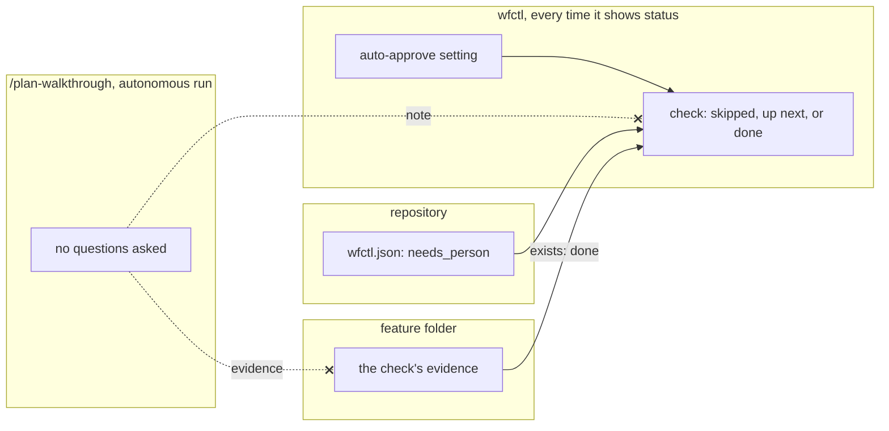

# An autonomous agent skips checks that need human intervention, and they stay unfinished until there's evidence

## Context

The `plan-walkthrough-is-private` record decides that a plan walkthrough only
runs with someone present. This means an autonomous run skips it. The plan
walkthrough is the first check that requires human interaction. It asks the plan
owner to explain the plan, so an autonomous agent answering its own questions
would produce invalid evidence.

Today an autonomous agent gets past a check in one of two ways. Either the
check's evidence exists in the feature folder, or someone has noted that the
check doesn't apply to this change. A check that needs human intervention has
no evidence while the agent runs alone, so the agent would have to write that
note itself. That causes two problems:

1. Every autonomous run leaves a note in the change, about a check nobody did.
2. The note outlives the run, and it wins over the evidence. When the plan owner
   comes back and finishes the walkthrough, the check still reads as skipped. It
   counts only after the note is deleted, and wfctl has no command that deletes
   one, so the plan owner finds the file and deletes it by hand.

Both problems come from writing down something wfctl already knows. When you run
`wfctl start --auto-approve`, wfctl saves that setting, and it checks the setting
every time it shows status. So wfctl can already tell whether an autonomous agent
is running (`approval-mode-is-stored-intent`).

In the code, a check a repository adds counts as done only when its evidence
file exists (`_declared.py:218`), and a note is read before that evidence
(`_pipeline.py:442`). `wfctl step none` writes the note to
`<arch-root>/step-claims/<branch>/<step>.<name>.md` (`cli.py:1757`), and
`wfctl step` has no other command, so nothing in wfctl removes one. Auto-approve
lets the agent run such a check without stopping (`_pipeline.py:814`).

## Direct baseline

This is the option this record rejects.

The skill writes the note itself. With auto-approve on, `/plan-walkthrough` runs
`wfctl step none <step>.<name> --reason "no person present; delete this claim
to run the check"`, and the autonomous agent moves on.

The note doesn't go away on its own, and a finished walkthrough can't override
it, because a note always wins. So when the plan owner runs the walkthrough
later, the skill has to find that note and delete it before asking the first
question. Nobody deletes it by hand, but the skill carries cleanup it would
otherwise never need.

Nothing new is added to wfctl. `autonomous-skip-is-a-claim` recorded this
approach.

## Decision

A repository marks a check in `wfctl.json` as needing human intervention, with
`"needs_person": true`. While auto-approve is on and the check has no evidence,
wfctl shows it as skipped, with the reason "needs a person; auto-approve is on".
wfctl doesn't save a file to mark the skip. It works the skip out again every
time it shows status. This means that once you turn auto-approve off, the same
check shows as up next again, with nothing to clean up.

wfctl asks these in order, and the first yes decides:

1. Purposely skipped? Someone's note wins, as it does today.
2. Already done? Evidence counts, even if auto-approve is on now.
3. Needs human intervention, and auto-approve is on? Then it's skipped.
4. Otherwise, the check reads the way it always has.

An autonomous run writes no note, so it leaves none for anyone to delete. A note
now exists only when a person writes one with `wfctl step none`, and it stays
until that person deletes it by hand.

`wfctl status --json` carries `needs_person` on each check, beside `manual`. This
means a tool reading it can tell this skip from a purposeful one (`claimed` is
set) and from one skipped because its whole step was (neither is set).

## Owns truth

The repository owns "does this check need human intervention?". wfctl can't
work that out, because it doesn't know what a repository's command does. The
skill can't answer it in time either. It only finds out once the agent has
started it, and if the skill does nothing, the agent starts it again until the
run stops as stalled.

wfctl owns "is this check skipped right now?". The skill can't record that in a
file, because a file records one moment and stays after the moment passes. A
note written during an autonomous run still says skipped after you turn
auto-approve off. wfctl checks the auto-approve setting every time it shows
status, so its answer changes when the setting does.

## Boundary

The crossed-out arrows are the decision. On an autonomous run the skill writes
no note and no evidence. This means nothing on disk can disagree with the
auto-approve setting once you change it.

## Considered

- **The baseline above, a note the skill writes.** It needs no change to wfctl.
  It loses because every autonomous run leaves a file behind, and the skill has
  to delete it before the check can count.
- **Mark the check `manual`.** wfctl already stops an autonomous run at a manual
  check. It loses because `plan-walkthrough-is-private` decides an autonomous
  run skips this check, not stops at it.
- **Recognise the command by name**, so wfctl skips `/plan-walkthrough` with no
  setting. It saves one line in `wfctl.json`. It loses because a repository that
  wraps the skill in its own command would lose the skip without noticing.
- **`optional: true`, which `an-absent-artifact-is-claimed-not-inferred`
  rejected.** That setting let a check be missing on any branch, which is what
  that record exists to prevent. `needs_person` only skips while auto-approve is
  on, and the check waits for the plan owner again the moment it's off.

## Consequences

A check can now show as skipped for three reasons: someone said so, its whole
step was skipped, or it needs human intervention and auto-approve is on. Each
still carries its reason, so the rule in `an-absent-artifact-is-claimed-not-inferred`
holds.

`wfctl check config` flags two new mistakes: `needs_person` that isn't true or
false, and `needs_person` on a manual check. A manual check already stops an
autonomous run, so it can't also be skipped by one.

The four states don't change, and the new field is an addition. This means tools
reading `wfctl status --json` keep working (`pipeline-state-is-one-payload`).

An autonomous run leaves nothing in the pull request saying the check was
skipped. That's fine for this check, whose answers are private on purpose. A
repository that wants the skip on record can still write a note by hand with
`wfctl step none`.

## Log

- 2026-09-27  proposed    — #500 level 2: an unattended skip written as a claim
  committed a file per run and outlived the mode it described
- 2026-09-27  renamed     — from `attended-pass-skips-unattended`, in plain language,
  and the check reads up next, not `pending`, once auto-approve is off
