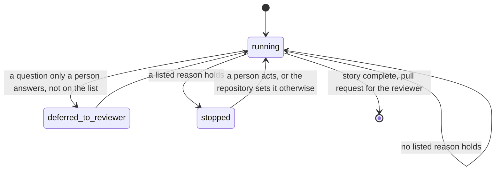

# An autonomous run goes as far as it can and stops only for a listed reason

## Context

The `approval-mode-is-stored-intent` record decides what auto-approve means: an
autonomous agent does the whole workflow on its own, makes its own calls, and
leaves the trade-offs for the reviewer at the pull request. What it has never
had is the other half, a written list of the times the run stops anyway because
it needs human intervention.

That list exists in the code but was never written down as one. The
`wfctl-owns-whether-a-worktree-wants-a-human` record names three reasons, each
added on its own:

1. Blocked: the host refused an action, such as a push, and only a person can
   take it.
2. Manual: the next check is one a person does by hand.
3. Stalled: a step was repeated and nothing changed.

A fourth reason added the same way would work. What it wouldn't do is tell a
reader, or a repository deciding how far to trust an autonomous run, what the
full set of stops is and which ones they can change.

## Direct baseline

This is the option this record rejects.

Leave the three as they are and write no rule about the list. The next one is
added as a fourth reason, with whatever setting its author picks.

That works for each reason on its own and leaves the bigger question unanswered.
A repository asking "when will an autonomous run stop and wait for me?" has to
read every record that added a reason, and the code, to find out.

## Decision

An autonomous run keeps going until one of a short, fixed list of reasons holds.
Then it stops and says which one. wfctl owns the list. Nothing else stops an
autonomous run, and a question only a person can answer that isn't on the list
goes to the reviewer at the pull request instead.

Each reason has a default, and the list says which ones a repository may change.
None can be changed today. When one can, a repository sets it in `wfctl.json`
under `stop_conditions`, keyed by the reason's name.

| The run stops when | Name | Default | Can a repository change it? |
|---|---|---|---|
| the host refused an action | `blocked` | stop | no, the host's permissions decide |
| the next check is done by hand | `manual` | stop | only by adding the check or not |
| a step repeated and nothing changed | `stalled` | stop | not yet |

Merging, force-pushing, closing an issue, and deleting a branch aren't on the
list, because wfctl never does them in any mode. They aren't stops a run
reaches; they're things a run never does.

A check that needs human intervention isn't on the list either. The run skips it
and keeps going (`autonomous-agent-skips-human-checks`).

## Owns truth

wfctl owns "does this autonomous run have to stop now, and why?".

The agent can't decide that, for two reasons. It's the one with a reason to keep
going, so a stop it calls on itself is a self-report, which
`wfctl-runs-the-verification` already rules out. And "stalled" is a count that
has to outlast the agent's memory. A run long enough to stall is one whose
conversation gets cleared partway, and the agent's count resets to zero right
when it matters (`wfctl-counts-the-passes`). wfctl reads the count from disk
every time.

The repository owns "how should this reason be handled here?", for the reasons
the list says it may change. wfctl can't decide that, because the answer is how
much autonomous work a repository is comfortable with, and a default only fits a
repository that hasn't said.

## Boundary

The arrow into `stopped` is the decision. wfctl takes it from its own reading of
the list, and nothing the agent says can move the run onto it or keep it off. The
arrow into `deferred_to_reviewer` is the other half: a question that needs a
person but isn't on the list doesn't stop the run.

## Considered

- **The baseline above**, each reason added on its own. It's the smallest change.
  It loses because the full set of stops can only be found by reading every
  record that added one.
- **The agent decides its own stops**, in the conversation that runs the
  workflow. That works while the conversation lasts, and loses the count once a
  run is long enough to need one (`wfctl-counts-the-passes`).
- **Let a repository change every reason now**, including a limit on repeats and
  a way to turn any check into a hard stop. That's where the list is heading, but
  no repository has asked for any of it. The list marks which reasons can be
  changed, so adding one is a new row, not a redesign.
- **Rename `attention` to `stop_condition` in `wfctl status --json`.** The names
  would match, but the field is part of a versioned output, so every tool reading
  it would break over a word. A stop is reported in `attention`, and this record
  is where that's said.

## Consequences

`wfctl-owns-whether-a-worktree-wants-a-human` is extended, not replaced. Its
three reasons are this list's three rows, and its order (blocked, then manual,
then stalled) still decides which one is shown when two hold. A fourth reason
takes a place in that order, and that changes the output's version.

`stop_conditions` isn't added to `wfctl.json` until some reason can be changed.
When it is, `wfctl check config` checks it the way it checks `steps`: an unknown
name, or a setting for a reason the list doesn't allow, is flagged instead of
silently ignored.

## Log

- 2026-09-26  proposed    — #500 level 2: plan defense adds a stop to unattended
  runs, and the stops had no list a repository could read or prescribe against
- 2026-09-27  rewritten   — #500 became an attended-only check and no longer
  adds a stop; the list stands on the three conditions that already exist
- 2026-09-27  renamed     — from `unattended-run-stop-condition`, in plain
  language
