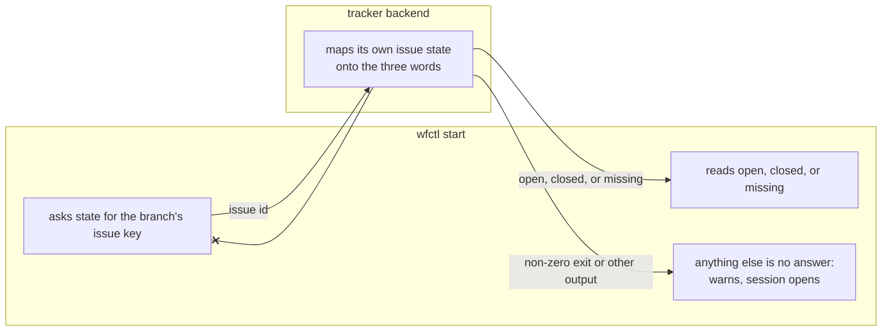

# The tracker backend maps its issue state onto three words wfctl defines

## Context

`wfctl start` refuses a linked worktree whose issue is not open
(`session-start-worktree-requires-open-issue`). So wfctl needs an
answer to "is this issue open?" from whichever tracker the repository uses, and
it needs to tell that answer apart from no answer at all, since the two lead to
opposite outcomes: a closed issue refuses, and a tracker that gives no answer
warns and lets the session open. No answer covers a machine with no network, an
expired token, and a rate limit alike, and wfctl does not tell them apart.

No verb answers it today. `view` prints whatever the backend's client prints
for a person. `fields` returns attributes as data, but its key names are the
backend's own and nothing in wfctl enumerates them. And `gh issue view` exits 1
both for an issue that does not exist and for a machine with no network, so no
exit code of an existing GitHub verb separates the two. It also reports a pull
request number as `OPEN`, since GitHub numbers issues and pull requests from
one sequence.

## Direct baseline

Add no verb. `wfctl start` checks only that the branch names an issue key, and
never asks whether the issue is open.

This cannot satisfy the agreed behavior. A worktree for an issue closed last
month, or for a number that was never an issue, opens a session as though it
were live work.

## Decision

A new tracker verb, `state`, takes an issue id and prints exactly one of three
words: `open`, `closed`, or `missing`. A non-zero exit, a timeout, or any other
output means the tracker did not answer. wfctl defines the three words and
what each one does; the backend decides which word its issue maps to.

## Owns truth

The backend owns "which of wfctl's three words describes this issue, in this
tracker's terms?".

wfctl cannot compute it. What counts as open is a property of the tracker, and
often of one project within it. GitHub has two states and numbers pull requests
beside issues. A Jira project defines its own workflow, where "Done", "Won't
Do", and "Released" can all mean closed. wfctl reads no tracker's vocabulary
and has no way to learn it, and the `fields` contract keeps it that way on
purpose.

wfctl owns "what does each answer do to a session?". The backend cannot
compute that, since it does not know whether it was asked from a linked
worktree, from the main checkout, or from a repository that exempts the check.

## Boundary

The `--x` edge is the refusal: the backend answers with a word and never
decides whether the session opens.

## Considered

- **Add a state key to `fields`, and read it by name.** It needs no new verb,
  and the GitHub `fields` command already calls `gh issue view --json`. It
  loses because `fields` is contracted so that wfctl never enumerates the
  backend's key names, and a key wfctl reads by name would be the first. It
  would also carry the backend's vocabulary (`OPEN`, `CLOSED`, or a Jira
  status) into wfctl, which is the mapping this record puts on the other side.
- **Read the exit code of `view`.** It is the cheapest option and needs nothing
  new from any backend. It cannot say closed at all, and for GitHub it cannot
  tell a missing issue from an unreachable tracker, since both exit 1. Those
  are the two answers that must lead to opposite outcomes.

## Consequences

A backend that declines `state` is not an error. `wfctl start` then checks
only that the branch names an issue key, which is what a tracker with no way to
answer can support.

The GitHub backend needs a small script rather than one argv. A single call
can report `open`, `closed`, and a pull request as `missing`, but a number that
was never created exits 1 exactly as a failed connection does. Only the error
text separates them (`HTTP 404` against `connection refused`), and reading it
takes a shell. The script prints `missing` on a 404, or a 410 for a deleted
issue, and exits non-zero on any other failure, so an error nobody anticipated lands on the warning rather than
the refusal. The script sits
beside `github-board.sh`, which exists for the same reason.

Adding a verb extends the verb contract that `/scaffold-tracker` and
`tracker-check` document. A tracker config installed before the verb existed
does not gain it on a bare `install-skills`, since a present tracker file is
never refreshed. It gains it on `wfctl install-skills --tracker github`.

## Log

- 2026-09-26  proposed    — `wfctl start` needs an open-or-closed answer from any tracker (#497)
- 2026-09-27  proposed    — Consequences names the 410 the script also reads as missing
