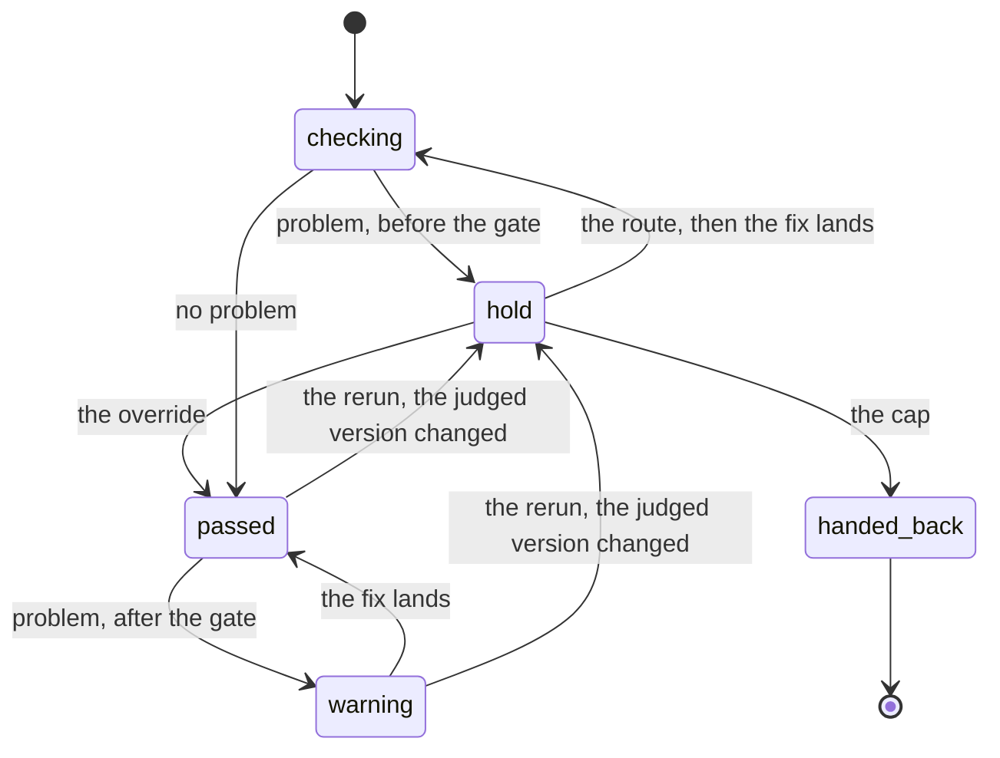

# A check holds its step before the gate and warns after it

**What does this record decide?**
When a check finds a problem, it sends you to the fix and checks again once the fix lands. If the problem turns up after the step has already passed, the check says so on every view that tells you what to run next, and it never sends you back.

## Context

A check exists to catch a mistake early. wfctl runs several of them, and each
one decides for itself what happens when it finds a problem after its step has
finished. Four checks give four answers today:

1. The plan review holds `plan` again when `plan.md` changes, wherever the
   pipeline has got to, `implement` included.
2. The delivery plan check reports `decompose` done with its problem on the row,
   once every task is closed.
3. The clarify check reports `clarify` skipped with "scan never ran" under it,
   once a plan exists.
4. The drawing check on an architecture record stops looking once `spec.md`
   exists, and says nothing.

The fourth is the gap that started this. A record whose drawing `wfctl arch
accept` would refuse is caught at the design step, and one that gets past it is
silent until someone runs `arch accept`, which may be much later or never.

The two that do say something are only partly heard. `wfctl next`, `wfctl
resume`, `next-step.md`, and `speckit-orchestrate` read the reason of the
current step and nothing else, and a finished step is never current. So a
problem written under a finished step shows in `wfctl status`, and an
unattended run never sees it.

Plan review is the one check that runs the whole loop. A review that leaves a
BLOCKER open holds the step and sends the user to revise the plan. An edit to
`plan.md` makes the review stale and sends the user back to `/plan-review`. A
person can accept the plan as it is with `wfctl step sign-off`. Under
auto-approve, wfctl stops after 3 reviews or sign-offs. Nothing says which of
those parts the next check needs, so each check that needs any of them would
invent its own version, which is the drift the gate contract exists to stop.

## Direct baseline

Leave each check to decide for itself, and give the drawing check a line under
the finished step in `Assessment.display`, the way clarify's skipped arm does.
It needs no rule and no field.

It does not produce a warning anyone acting on the pipeline sees. The line
reaches `wfctl status` and none of the four views that route. The payload cannot
tell it apart from `implement`'s task tally either, which also sits in `display`
on a finished step and is not a problem. The next check then copies whichever of
the three shapes its author read last.

## Decision

Every check follows one rework loop. Before its gate, a problem holds the step
and routes the user to the fix. After its gate, the same problem is a warning:
the step keeps the state that lets the pipeline advance, and carries the problem
as its `reason` and, where the reason alone does not say how, the fix as its
`remedy`. A warning never holds a step and
never changes where the pipeline routes, and every view that routes the pipeline
shows it.

A check's gate is the point past which it stops holding its step. Each check
names its own: `decompose` stops holding once every task is closed, and the
drawing check once `spec.md` exists.

The loop has six parts. Every check carries the first three, and the other three
only when the check has what they need:

1. The hold. A problem found before the gate reads `in_progress` with its
   reason.
2. The route. A held step names what fixes it, through the step's own command or
   a `remedy`.
3. The warning. A problem found after the gate reads `done` or `skipped`, with
   its reason, and with a remedy when the reason does not already say what to
   run. A check keeps reading its evidence after the gate,
   since a check that goes quiet once its step is done has defeated its purpose.
4. The rerun. A check that records which version of an artifact it judged, as
   plan review records a hash of `plan.md`, can tell when that artifact changed
   after the gate. The edit un-passes the gate, so the check holds again wherever
   the pipeline is. A check that reads its artifact fresh on every report has no
   version to compare, and it treats its gate as passed once the pipeline has
   moved past it.
5. The override. A person accepts the artifact as it is, as `wfctl step
   sign-off` does for a plan. A check needs one only when a person can
   reasonably disagree with its grade. A warning never needs one, since it holds
   nothing.
6. The cap. wfctl stops auto-approve after a fixed number of passes, as
   `REVIEW_CAP` does after 3 plan reviews or sign-offs. A check needs one only
   when an agent writes the evidence it reads and could keep writing it. A check
   that reads fresh on every report has nothing an agent can repeat, and the
   stall counter in `wfctl-counts-the-passes` already stops a loop that changes
   nothing.

This is the gate contract's answer for a problem found after a gate, and it is
not a new gate. `promised-evidence-blocks-on-silence` says what a gate does when
its evidence is missing. This record says what a check does when its evidence is
present and wrong after the gate has passed.

"Rework loop" stays the name. It says what the user does, which is rework the
artifact and run the check again, and it collides with no term wfctl already
uses.

## Owns truth

The check owns "is anything wrong with this step's artifact, right now?". No
view can compute it, since `pipeline-state-is-one-payload` has every view render
the payload and compute nothing. The orchestrating agent cannot either, without
reimplementing the check.

The check also owns "has my gate passed?". The pipeline walk knows the order of
the steps, but it does not know which version of an artifact a check judged. A
check that records one is the only place that answer exists, and a check that
records none answers from the pipeline's position.

The step's state owns "may the pipeline advance past this step?", and a warning
never changes it. `readiness-is-not-a-step-state` already keeps that question
apart from every other one, and this record leans on the split. A warning cannot
be allowed to hold the step, because holding after the gate sends the user back
to a step the pipeline has moved past, in the middle of plan or implementation,
over something a later gate such as `arch accept` refuses anyway.

## Boundary

`handed_back` is auto-approve turned off, so a person takes the next step. The
drawing has no edge from `warning` to `hold` except the rerun, and that missing
edge is the decision: a warning on its own never holds a step.

## Considered

- Leave each check to decide, per **Direct baseline**. It is the smallest
  change, and it leaves the warning visible only in `wfctl status` and
  indistinguishable from a tally. The next check still has three shapes to copy.
- Hold the step after the gate too. It is the conservative reading, and it sends
  the user back to a step the pipeline has moved past, in the middle of plan or
  implementation, over a problem a later gate catches anyway. Plan review does
  hold after the gate, and it does so through the rerun, since an edited plan is
  a plan that never passed.
- Say nothing after the gate. This is what the drawing check does today, and it
  is the gap: a bad drawing that gets past the design step is silent until
  someone runs `arch accept`.
- Carry the warning in a new field on the step, beside `reason`. It is equally
  explicit, and it keeps `reason` meaning "why this step is held". It loses on
  fit. `decompose` already puts a reason on a finished step, the payload already
  carries it, and every reader of a step's reason reads the current step's only,
  so a finished step's reason is misread by nothing today. A second field would
  duplicate a slot that already works.

## Consequences

The four views that route gain a way to show a warning: `wfctl next`, `wfctl
resume`, `next-step.md`, and `speckit-orchestrate`. How the payload collects a
warning that sits on a pass rather than a step is a level-3 choice, recorded in
`design/532-payload-warnings-list.md`.

`decompose` already follows the loop. Its warning starts reaching the routing
views with no change to the check.

Two existing checks do not follow it yet, and changing them is later work, since
this record changes no check:

1. Clarify's skipped arm puts "scan never ran" in `display` with no remedy, so
   it stays visible only in `wfctl status`.
2. Plan review reads `skipped` and says nothing when `tasks.md` exists and no
   review was ever written.

The drawing check is the first check to adopt the loop, in its own change.

The fitness function is a test in wfctl's suite: a finished step or pass that
carries a reason appears as a warning in `next-step.md` and in `wfctl status
--json`, and leaves `current` and `next_command` exactly as they were without
it.

## Log

- 2026-09-29  proposed    — #532. Each check decided for itself what to do with
  a problem found after its step had passed, and the drawing check said nothing.
  Written under auto-approve, so the approval moves to the pull request.
