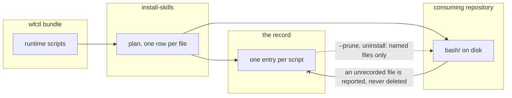

# wfctl deletes a runtime script only when its record names that file

## Context

wfctl installs the Spec Kit runtime scripts into a consuming repository, and it
should be able to remove a script it stops shipping. It can't today. The scripts
live under `.specify/scripts/bash/`, so the installer records the whole `bash`
directory as one entry, while it records each template under
`.specify/templates/` as its own entry. When a script is dropped upstream, no
entry names it. Nothing reports it, `--prune` has nothing to remove, and the file
stays on disk while `doctor` reports the repository as clean.

A directory entry also claims less on the way in than on the way out. On install,
wfctl merges the bundle into the directory and never removes a file from it. On
`uninstall-skills` and `--prune`, wfctl deletes the whole directory, including any
file the repository put in `bash/` itself.

The disk can't tell us which files are wfctl's. A script wfctl shipped and later
dropped has the same bytes as a script a developer wrote and put beside it.

## Direct baseline

Leave the record as it is. `.specify/scripts/bash` stays one directory entry, the
copy keeps merging into it, and a dropped script stays on disk until someone
deletes it by hand. That is what happened when two scripts were removed earlier.

This baseline can't meet the agreed behavior, which is that the next install
reports a script dropped upstream and `--prune` removes it. No entry names the
file, so nothing can report or remove it.

## Decision

The runtime scripts are recorded one file per entry, the same way the templates
already are, and wfctl deletes a script only when its record names that file.

No code retires the old directory entry. A repository installed before this
change is redone by hand once: uninstall every layer, agent layers first, then
install again. The uninstall removes the old entry, and the new install records
each script.

## Owns truth

The record owns whether wfctl wrote a file and still ships it.

The disk can't answer that. A file wfctl dropped and a file a developer added look
identical in `bash/`, so any rule that deletes by reading the directory either
deletes the developer's file or keeps wfctl's. Only the install saw which files it
wrote, and the record is where it wrote that down.

The rule applies in both directions. Once the scripts are recorded per file, an
uninstall removes those files and leaves a developer's own script in `bash/`. The
old directory entry deleted it.

## Boundary

A solid edge is a write during the install. A dotted edge is a later run reading
the record. The crossed edge is the refusal, since a file on disk is never a
reason to delete it.

## Considered

1. **Mirror every recorded directory on each install.** The install would remove
   any file below a recorded directory that the bundle no longer holds. This also
   fixes the skill folders, which have the same bug. It loses because it deletes
   by reading the directory, so a developer's file in `bash/` or in a skill folder
   is removed on every install and not only at uninstall. `_check_abandoned_entries`
   exists to prevent that, since wfctl shouldn't remove a path it can't show it
   wrote.
2. **Record every directory's files individually, skill folders included.** This
   is the same decision applied everywhere, and it is sound. It loses on scope.
   No skill folder has lost a single file yet, because every deletion under
   `wfctl/agents/skills/` so far removed a whole skill. Changing how 42 skills are
   recorded belongs with the install revamp, not with a two-script bug.
3. **Retire the old directory entry in the install.** The comparison between
   installs would skip an old entry when the same install wrote files below it,
   and a file below a recorded directory would count as on record, so the upgrade
   takes no backup. It is sound, and it was the decision until the plan review. It
   loses on cost: two path comparisons and a special case in the backup step, kept
   permanently, to spare a manual redo in the few repositories wfctl is installed
   in.
4. **Migrate the old record in full.** The old directory entry would be translated
   into per-file entries when the record is read, with its backup carried down to
   each file, and `doctor` would warn about a repository that hasn't reinstalled.
   It is sound, and it loses on cost. wfctl is installed in a few repositories,
   each one reinstall away from the new record, so the migration smooths over an
   upgrade window of one install.

## Consequences

wfctl has one user today, and Andre accepts costs 1 to 5 while that stays true.
A second user reopens each of them.

1. A repository that isn't redone loses the three scripts at its next
   `install-skills --prune`, which `/start-session` runs unattended. The install
   no longer plans the old directory entry, so it reports that entry as dropped,
   and the prune deletes the directory right after the same install wrote the
   scripts into it. `doctor` doesn't notice, since it doesn't check that recorded
   files exist. The next install puts the scripts back and records them per file.
2. A repository that isn't redone and installs over the old record backs up
   wfctl's own three scripts, since the record doesn't name them, and records a
   backup on each new entry. Every later uninstall then restores those stale
   copies, and a redo after that backs them up again. Redoing the repository
   before its first install avoids this. A repository already in this state
   deletes the backups of the three scripts under
   `.wf-skills-backup/.specify/scripts/bash/` before the redo, and only those
   three. Any other file there is a script the repository had before wfctl, and
   the uninstall restores it as before.
3. The same pruning install deletes the whole scripts folder, so it also deletes a
   developer's own script in that folder, unattended. The rule that wfctl deletes
   only what its record names holds once a repository is redone, and not before.
4. The redo uninstalls the base layer, which deletes the tracker files, and the
   next install fills them from the bundle. Any edit a project made under
   `.agents/trackers/` is replaced, so a project that edited them copies them
   aside before the redo.
5. An older wfctl that installs with `--prune` over the new record deletes the
   three scripts, since it plans the folder and reports each recorded script as
   dropped. Running the current wfctl again puts the scripts back.
6. Until a repository is redone, `doctor` reports its skills as current and lists
   the three scripts as not on record. It doesn't say a redo is needed.
7. The disk scan reads its directories from the same table as the target, so it
   moves down with it. A developer's own script in `bash/` is then reported and
   left alone.
8. A test asserts that every runtime source holds only files. If someone adds a
   nested directory there, the directory entry comes back, and that test fails.
9. The skill folders keep the same bug until the install revamp takes them on.

## Log

- 2026-10-07  proposed    — Level-2 gate. Andre chose recording the scripts per
  file over a general mirror, and moved the skill folders to the install revamp.
  He also chose dropping the old directory entry over a full migration of it,
  since wfctl is installed in a few repositories.
- 2026-10-08  amended     — The plan review found that the upgrade's one-time
  backup made a later uninstall restore wfctl's own earlier copies of the
  scripts. Andre chose not to restore them, so a file below a recorded folder now
  counts as on record and is never backed up.
- 2026-10-08  amended     — Andre chose the one-line fix with a manual redo
  over retiring the old entry in code, since he can uninstall and reinstall each
  of his repositories by hand. The guard and the on-record helper are dropped.
- 2026-10-09  amended     — The fourth plan review found three costs of a
  repository not being redone, or of the redo itself: stale backups of the
  scripts, a developer's own script deleted by the prune, and tracker edits
  replaced. Andre accepted all three while he is the only user of wfctl.
