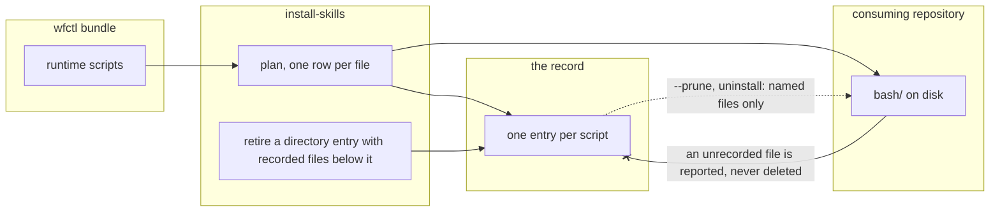

# wfctl deletes a runtime script only when its record names that file

## Context

wfctl installs the speckit runtime scripts into a consuming repository, and it
needs a way to remove one it stops shipping. Today it has none. The scripts sit
one level down, under `.specify/scripts/bash/`, so the installer records the
whole `bash` directory as a single entry while it records each template under
`.specify/templates/` as its own entry. When a script is dropped upstream, no
entry names it, so nothing reports it and `--prune` has nothing to remove. It
stays on disk for good while `doctor` reports clean.

A directory entry also claims two different things. On the way in, the install
merges the bundle into the directory and never removes a file from it. On the
way out, `uninstall-skills` and `--prune` delete the directory whole, so a file
the repository put in `bash/` itself goes with it. wfctl claims less when it
writes than when it deletes, and the dropped script is what that mismatch looks
like from the inside.

The disk cannot settle which files are wfctl's. A script wfctl shipped and later
dropped is the same bytes on disk as one a developer wrote and put beside it.

## Direct baseline

Leave the record as it is. `.specify/scripts/bash` stays one directory entry,
the copy keeps merging into it, and a dropped script stays on disk until someone
notices and deletes it by hand. That is what happened when #292 removed two
scripts.

It cannot meet the behavior agreed for #293, where a script dropped upstream is
reported by the next install and removed by `--prune`. Nothing in the baseline
names that file, so nothing can report or remove it.

## Decision

The runtime scripts are recorded one file per entry, the same way the templates
already are, and wfctl deletes a script only when its record names that file. A
manifest that still records `.specify/scripts/bash` as a directory has that
entry retired the first time an install records the files below it. Retiring
drops the entry from the record and deletes nothing.

## Owns truth

The record owns **"did wfctl write this file, and does it still ship it?"**

The disk cannot answer it. A file wfctl dropped and a file a developer added are
identical in `bash/`, so any rule that deletes by looking at the directory either
deletes the developer's file or keeps wfctl's. Only the install saw which files
it wrote, and the record is where it wrote that down.

The rule cuts both ways. Once the scripts are recorded per file, an uninstall
removes those files and leaves a developer's own script in `bash/` where it was.
The directory entry used to take it.

## Boundary

A solid edge is a write during the install. A dotted edge is a later run reading
the record. The crossed edge is the refusal: what is on disk never becomes a
reason to delete.

## Considered

- **Mirror every recorded directory on each install.** The install would remove
  any file below a recorded directory that the bundle no longer holds. This fixes
  the skill folders as well, which share the latent bug. It loses because it
  deletes by looking at the directory, so a developer's file in `bash/` or inside
  a skill folder is removed on every install rather than only at uninstall. That
  is the outcome `_check_abandoned_entries` exists to refuse: a path wfctl cannot
  show it wrote is not wfctl's to remove.
- **Record every directory's files individually, skill folders included.** This
  is the decision applied everywhere, and it is sound. It loses on scope. The
  skill folders have not lost a file yet, since every deletion under
  `wfctl/agents/skills/` so far removed a whole skill, and changing how 42 skills
  are recorded belongs with the install revamp rather than with a two-script bug.
- **Point the target one level deeper with no migration.** This is the one-line
  fix #293 rejects. An old manifest's `bash` entry stops being planned and is
  reported as dropped upstream, and the `--prune` that `doctor` then prints
  deletes the three scripts ten shipped skills run by path. A simulation of it
  went further than the issue recorded: the prune runs after the copy, so the
  same install that wrote the new scripts deletes them again.

## Consequences

- An upgraded wfctl changes the record without changing the bundle hash, so a
  repository that does not reinstall is told its skills are current while it
  still holds the directory entry. `doctor` needs a check that names a recorded
  directory wfctl now records file by file, and that check cannot come from the
  hash.
- Retiring the entry has to carry its backup forward to the files below it.
  Otherwise the install treats its own scripts as a developer's and backs them
  up.
- The disk scan moves down with the target, since it reads its directories from
  the same table. A leftover from before the upgrade, or a developer's own
  script, is then reported in `bash/` and left alone.
- A test asserts that every runtime source holds only files. A nested directory
  added there later would bring the directory entry back, and the test is what
  fails when it does.
- The skill folders keep the latent bug until the install revamp, #565, takes
  them on.

## Log

- 2026-10-07  proposed    — #293's level-2 gate. Andre chose recording the
  scripts per file over a general mirror, and moved the skill folders to the
  install revamp (#565).
