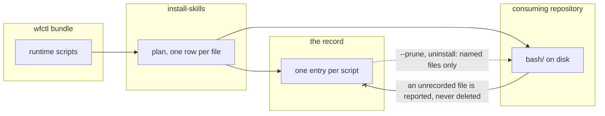

# wfctl deletes a runtime script only when its record names that file

## Context

wfctl installs the speckit runtime scripts into a consuming repository, and it
needs a way to remove one it stops shipping. Today it has none. The scripts sit
one level down, under `.specify/scripts/bash/`, so the installer records the
whole `bash` directory as a single entry while it records each template under
`.specify/templates/` as its own entry. When a script is dropped upstream, no
entry names it, so nothing reports it and `--prune` has nothing to remove. It
stays on disk for good while `doctor` reports clean.

A directory entry also claims two different things. On the way in, the install
merges the bundle into the directory and never removes a file from it. On the
way out, `uninstall-skills` and `--prune` delete the directory whole, so a file
the repository put in `bash/` itself goes with it. wfctl claims less when it
writes than when it deletes, and the dropped script is what that mismatch looks
like from the inside.

The disk cannot settle which files are wfctl's. A script wfctl shipped and later
dropped is the same bytes on disk as one a developer wrote and put beside it.

## Direct baseline

Leave the record as it is. `.specify/scripts/bash` stays one directory entry,
the copy keeps merging into it, and a dropped script stays on disk until someone
notices and deletes it by hand. That is what happened when #292 removed two
scripts.

It cannot meet the behavior agreed for #293, where a script dropped upstream is
reported by the next install and removed by `--prune`. Nothing in the baseline
names that file, so nothing can report or remove it.

## Decision

The runtime scripts are recorded one file per entry, the same way the templates
already are, and wfctl deletes a script only when its record names that file.
No code retires the old directory entry. A repository installed before this
change is redone by hand once: uninstall every layer, agent layers first, then
install again. The uninstall removes the old entry and the fresh install records
each script.

## Owns truth

The record owns **"did wfctl write this file, and does it still ship it?"**

The disk cannot answer it. A file wfctl dropped and a file a developer added are
identical in `bash/`, so any rule that deletes by looking at the directory either
deletes the developer's file or keeps wfctl's. Only the install saw which files
it wrote, and the record is where it wrote that down.

The rule cuts both ways. Once the scripts are recorded per file, an uninstall
removes those files and leaves a developer's own script in `bash/` where it was.
The directory entry used to take it.

## Boundary

A solid edge is a write during the install. A dotted edge is a later run reading
the record. The crossed edge is the refusal: what is on disk never becomes a
reason to delete.

## Considered

- **Mirror every recorded directory on each install.** The install would remove
  any file below a recorded directory that the bundle no longer holds. This fixes
  the skill folders as well, which share the latent bug. It loses because it
  deletes by looking at the directory, so a developer's file in `bash/` or inside
  a skill folder is removed on every install rather than only at uninstall. That
  is the outcome `_check_abandoned_entries` exists to refuse: a path wfctl cannot
  show it wrote is not wfctl's to remove.
- **Record every directory's files individually, skill folders included.** This
  is the decision applied everywhere, and it is sound. It loses on scope. The
  skill folders have not lost a file yet, since every deletion under
  `wfctl/agents/skills/` so far removed a whole skill, and changing how 42 skills
  are recorded belongs with the install revamp rather than with a two-script bug.
- **Retire the old directory entry in the install.** The orphan diff would skip
  a prior entry when the same install wrote files below it, and a file below a
  recorded directory would count as on record, so the upgrade takes no backup.
  It is sound, and it was the decision until the plan review. It loses on cost:
  two path comparisons and a special case in the backup step, kept forever, to
  spare a manual redo in the handful of repositories wfctl is installed in.
- **A full migration of the old record.** The old directory entry would be
  translated into per-file entries when the record is read, carrying its backup
  down to each file, and `doctor` would warn about a repository that has not
  reinstalled yet. It is sound, and it loses on cost. wfctl is installed in a
  handful of repositories today, all of them a reinstall away from the new
  record, so the upgrade window it smooths over lasts one install.

## Consequences

- A repository that is not redone loses the three scripts at its next
  `install-skills --prune`, which `/start-session` runs unattended. The old
  directory entry is no longer planned, so the install reports it as dropped,
  and the prune deletes the directory after the same install wrote the scripts
  into it. `doctor` does not notice, since it does not check that recorded files
  exist. Another install puts the scripts back and records them per file. This
  is accepted while Andre is the only user of wfctl.
- A repository that is not redone and installs over the old record backs up
  wfctl's own three scripts, since the record does not name them, and records a
  backup on each new entry. Every later uninstall then restores those stale
  copies, and a redo after that backs them up again. This is accepted while
  Andre is the only user of wfctl, since a redo before the first install avoids
  it. A repository already caught in it deletes
  `.wf-skills-backup/.specify/scripts/bash/` before the redo, since the backups
  are wfctl's own earlier copies.
- The same pruning install deletes the whole scripts folder, so a developer's
  own script in it is deleted too, unattended. The rule that wfctl deletes only
  what its record names holds once a repository is redone, not before. This is
  accepted while Andre is the only user of wfctl.
- The redo uninstalls the base layer, which deletes the tracker files, and the
  next install fills them from the bundle. A project's edits under
  `.agents/trackers/` are replaced, so a project that edited them copies them
  aside before the redo. This is accepted while Andre is the only user of wfctl.
- Until a repository is redone, `doctor` reports its skills as current and
  lists the three scripts as not on record. It does not say a redo is needed.
- An older wfctl that installs with `--prune` over the new record deletes the
  three scripts, since it plans the folder and reports each recorded script as
  dropped. This is accepted while Andre is the only user of wfctl, since running
  the current wfctl again puts the scripts back. A second user reopens it.
- The disk scan moves down with the target, since it reads its directories from
  the same table. A developer's own script in `bash/` is then reported and left
  alone.
- A test asserts that every runtime source holds only files. A nested directory
  added there later would bring the directory entry back, and the test is what
  fails when it does.
- The skill folders keep the latent bug until the install revamp, #565, takes
  them on.

## Log

- 2026-10-07  proposed    — #293's level-2 gate. Andre chose recording the
  scripts per file over a general mirror, and moved the skill folders to the
  install revamp (#565). He also chose dropping the old directory entry over a
  full migration of it, since wfctl is installed in a handful of repositories.
- 2026-10-08  amended     — The plan review found that the upgrade's one-time
  backup made a later uninstall restore wfctl's own earlier copies of the
  scripts. Andre chose not restoring them, so a file below a recorded folder now
  counts as on record and is never backed up.
- 2026-10-08  amended     — Andre chose the one-line fix with a manual redo
  over retiring the old entry in code, since he can uninstall and reinstall
  each of his repositories by hand. The guard and the on-record helper are
  dropped.
- 2026-10-09  amended     — The fourth plan review found three costs of a
  repository not redone, or of the redo itself: stale backups of the scripts, a
  developer's own script deleted by the prune, and tracker edits replaced. Andre
  accepted all three while he is the only user of wfctl.
