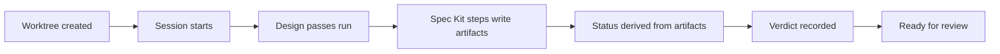
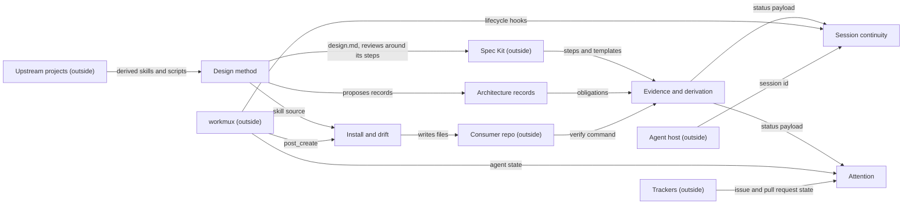

# wfctl domain model

State: proposed
Person who knows the domain: Andre Marin
Last checked against the code: 2026-09-29, 63345fe
Records this model draws on: `a-rule-is-expressed-as-a-check`, `install-modes`, `knowledge-placement`, `layer-model`, `level-4-owns-pattern-selection`, `no-hardcoded-agent`, `pipeline-state-is-one-payload`, `required-sections-are-wfctls`, `session-identity-comes-from-the-caller`, `session-state-is-re-derived`, `supervisory-screen-owns-grouping`, `vendor-upstream-skills`, `wfctl-runs-the-verification`

## Domain vision statement

The vision statement and the classification of each capability live in
[vision.md](vision.md), and this page does not restate them. This page draws the
bounded contexts those capabilities fall into, so that an architecture record
has something durable to say it governs.

## Decision frame

Business outcome: an agent starting work on wfctl sees the architecture records
that apply to the change in front of it, and a record can say what it governs.

Decision this round supports: which bounded contexts wfctl has, and how a record
declares the context or boundary it governs.

In scope: wfctl's own contexts, the parties outside them, a context map, and a
placement for each of the 13 accepted records.

Out of scope: the 41 proposed records, which are held on purpose, the 31 level-3
records under `design/`, the record format, the `arch context` command, and the
`software-design-decisions` skill. Each of those changes in a follow-up once
this model is reviewed.

Constraints: contexts are found around language, rules, ownership, and rate of
change, and not around modules. Andre rejected a module list as a scope because
it works around the model instead of drawing it.

## Evidence

| Row | Claim | Label | Source | Contradicts |
| --- | --- | --- | --- | --- |
| E1 | A feature is a piece of work or functionality, usually tied to an issue. An issue can be split into sub-issues, so the two are not one-to-one. | stated | Andre, 2026-09-29 | |
| E2 | `wfctl doctor` reports issue 11 claimed by two spec directories, and issues 17 and 24 each claimed by one directory and by a row in another feature's Issue Grouping Map. | observed | `wfctl doctor`, 2026-09-29 | |
| E3 | When the restart hook clears the pane, "the session" means the agent conversation. | stated | Andre, 2026-09-29 | |
| E4 | Work is done when the agreed completion criteria are met, the tests are written and passing, and it is ready for review. A workflow step being done is a separate meaning. An issue is closed when its pull request merges or it is superseded, and that is not called done. | stated | Andre, 2026-09-29 | |
| E5 | Printing all 13 accepted records at the start of a session is noise. Andre wants the records for the boundaries the branch touches, and a branch can touch several. | stated | Andre, 2026-09-29 | |
| E6 | The design method skills wrap Spec Kit. The brainstorm runs before its steps and a review runs before the spec is finalized, so the spec that reaches implementation is more detailed. Spec Kit itself is essentially unchanged, and what surrounds it keeps changing. | stated | Andre, 2026-09-29 | |
| E7 | Session continuity depends on workmux lifecycle hooks, both for creating a branch and for removing worktrees and stale specs. | stated | Andre, 2026-09-29 | |
| E8 | workmux may grow a sidebar that could replace wfctl's dashboard. Nothing about it is drawn yet. | stated | Andre, 2026-09-29 | |
| E9 | The workmux `post_create` hook is what runs `wfctl install-skills` in a new worktree. | observed | `.workmux.yaml`, `post_create` | |
| E10 | 8 of the 13 accepted records sit on an edge to a party outside wfctl, 2 sit between two of wfctl's own contexts, 1 sits inside one context, and 2 bind the whole repository. | inferred | the placement table on this page | |
| E11 | Pattern selection is meant to be language agnostic: it recognizes common problems that software development has already documented a pattern for. The Python catalog is one reference for it, and not the intent. | stated | Andre, 2026-09-29 | `level-4-owns-pattern-selection` and the `python-pattern-selection` skill both name Python; #416 tracks that every other language gets no catalog |
| E12 | The C++ design book is Iglberger's *C++ Software Design*, and it is cited by the level-3 record template, not by the level-4 skill. The level-4 skill cites Ayeva and Kasampalis, *Mastering Python Design Patterns*. | observed | `software-design-decisions/design-record-template.md`, `python-pattern-selection/SKILL.md` | |
| E13 | The large modules carry long comments explaining what the code does, which is a code smell. The code should be restructured so it reads on its own and the interacting pieces are modular, since today it is maintainable only by an agent. | stated | Andre, 2026-09-29 | |
| E14 | `cli.py` is 7,420 of wfctl's 17,804 lines, and the next largest are `_evidence.py` at 1,514, `_pipeline.py` at 1,120, and `_arch.py` at 983. | observed | `wc -l wfctl/*.py` at 63345fe | |
| E15 | Andre asked whether automated checks on the architecture, such as fitness functions that catch violations or drift, are a gap the six contexts miss. | stated | Andre, 2026-09-29 | |
| E16 | The references already cite fitness functions from *Building Evolutionary Architectures*, and name `a-rule-is-expressed-as-a-check` as that claim stated for wfctl. No record in wfctl declares a fitness function that guards it. | observed | `docs/references/README.md`, "Keeping an architecture true while it changes" | |
| E17 | The six bounded contexts hold, and none is missing that Andre can name. | stated | Andre, 2026-09-29 | |

## Scenarios

| Row | Actor intent | Command | Rules | Outcome and events | Alternatives and failures | Evidence rows |
| --- | --- | --- | --- | --- | --- | --- |
| S1 | An agent starts work on the restart hook and needs the decisions that bind it. | start a session | The branch names an issue. The records shown are those for the boundaries the branch touches. | The session starts, and the applicable records are shown. | Today all 13 print whatever the branch touches, so the agent has to judge relevance itself. | E5 |
| S2 | A developer wants a new branch that is ready to work in. | create a worktree, then start a session | The worktree is created through workmux. Its `post_create` hook installs the skills. The branch name carries the issue. | The worktree exists with skills installed, and the session starts. | With no agent named in the environment, the worktree gets `.agents/` and no `.claude/`, and the hook still exits 0. | E7, E9 |
| S3 | An agent finishes a spec and wants the step to count. | write the artifact, then verify | A step is done because its artifact is on disk in the expected shape. The agent never certifies its own completion. | The step reads done, and a verification verdict is recorded against the tree it ran on. | A truncated write leaves a file that exists but is too thin to be a spec. | E4 |

### Behavior

Question answered: where does a piece of work pick up its meaning as it moves from a branch to a verdict?

What it shows: three different parties act along one line, workmux at the start, Spec Kit in the middle, and the consumer repo at the verdict. wfctl owns the derivation between them.

## Ubiquitous Language

| Term | Context | Meaning | Example | Synonyms and forbidden meanings | Evidence |
| --- | --- | --- | --- | --- | --- |
| Feature | Evidence and derivation | A unit of work. The issue, the branch, and the spec directory are three handles on it. | 541 is an issue, `541-bounded-contexts` is its branch, and its spec directory is named the same way. | Not the issue alone, since one feature can group several issues. | E1, E2 |
| Session | Session continuity | An agent conversation. wfctl records the id its caller supplies. | The restart hook clears the pane and a new session picks up the handoff. | Not the tmux pane, and not the workmux worktree. | E3 |
| Done (work) | Evidence and derivation | The agreed criteria are met, the tests pass, and the work is ready for review. | A branch with its checks green and a pull request open. | Not closed. | E4 |
| Done (step) | Evidence and derivation | A workflow step has its evidence on disk in the expected shape. | `specify` reads done once `spec.md` carries its required sections. | Not verified. | E4 |
| Closed | outside wfctl, at the tracker | The pull request merged, or the issue was superseded. Only a person decides it. | Issue 541 closes when its pull request merges. | Not done. | E4 |
| Verdict | Evidence and derivation | The recorded result of running the repo's verification command, with the tree it ran against. | A green run against a named commit. | Not an agent's statement that it finished. | `wfctl-runs-the-verification` |
| Step | Evidence and derivation | One stage of the pipeline, in one of four states: done, in progress, pending, or skipped. | `plan` is in progress. | Not a glyph; the glyph belongs to the renderer. | `pipeline-state-is-one-payload` |
| Handoff | Session continuity | The prose a session leaves for the next one, which is the one thing that cannot be derived. | The Next Session TODO in the session summary. | Not session state that can be recomputed. | `session-state-is-re-derived` |
| Record | Architecture records | One durable architecture decision, with a status of proposed, accepted, superseded, rejected, or retired. | `install-modes`. | Not a design write-up, which belongs to one feature. | `knowledge-placement` |
| Pattern | Design method | A documented answer to a common problem, recognized at level 4 once the boundary above it is settled. It is language agnostic, and a catalog for one language is a reference for it. | Reaching for a callable where a Strategy hierarchy was about to be written. | Not "Python pattern"; the Python catalog is one reference. | E11, E12 |
| Fitness function | Architecture records | A check that guards one record by assessing, objectively, whether the code still keeps to it. It is to a record what a unit test is to a function (Ford, Parsons, Kua, and Sadalage, *Building Evolutionary Architectures*, ch. 2). | An import contract that fails when session code imports an evidence module's internals. | Not the verify command, which checks the change and not a record. | `a-rule-is-expressed-as-a-check`, `docs/references/README.md` |
| Drift | Install and drift | The installed skills differ from the bundle the running wfctl ships. | `doctor` reporting a skill behind. | Not architectural drift, where code moves away from a record; that is a fitness function failing. The one word is doing two jobs. | `doctor`, E15 |
| Attention | Attention | A worktree needs a person, and the reason why. | A pipeline blocked on a manual step. | Not activity; a busy agent is not asking for anything. | `supervisory-screen-owns-grouping` |

## Subdomains

none — the classification is the table in [vision.md](vision.md), one row per capability, and this page does not restate it.

## Bounded Contexts

| Context | Purpose | Owned language and facts | Includes | Excludes | Owner |
| --- | --- | --- | --- | --- | --- |
| Evidence and derivation | Answer what the durable artifacts prove happened. | Feature, step, done, verdict, the status payload | Status and gate derivation, `verify` and its verdict | Running the steps themselves, and deciding that a change is finished | wfctl |
| Architecture records | Hold decisions as obligations that later work is measured against. | Record, status, what a record governs | The records, `arch context`, `arch none`, placement | Deciding whether a record is accepted, which is a person's call | wfctl |
| Design method | Make the spec that reaches implementation more detailed and better thought through. | Design level, domain model, refactor pass | The skills for brainstorm, the four design levels, domain modeling, decompose, and the refactor pass | The Spec Kit steps, which it wraps and does not fork | wfctl |
| Install and drift | Put wfctl's skills and config into a project and report when they drift. | Layer, mirror, seed, manifest, drift | `install-skills`, `doctor`, the manifest | What the skills say, which belongs to the design method | wfctl |
| Session continuity | Carry work across sessions, which is the one part that cannot be derived. | Session, handoff, restart | `/start-session`, `/end-session`, the restart hook | Where the pipeline stands, which it reads from evidence and derivation | wfctl |
| Attention | Say which worktree needs a person, and why. | Attention group, silent agent | The supervisory grouping and the dashboard that shows it | Deciding anything; it shows what the others derive | wfctl |

Parties outside wfctl, each with its own language: workmux, which owns worktree lifecycle; the trackers (GitHub, Jira, Gerrit); Spec Kit; the agent host; the consumer repository; and the upstream projects that skills are derived from.

### Context Map

Question answered: where do meaning, authority and translation change?

| Relationship | Upstream | Downstream | Team relationship | Translation owner | Mechanism | Consistency and failure |
| --- | --- | --- | --- | --- | --- | --- |
| R1 | Spec Kit | Evidence and derivation | Conformist; another project, and wfctl has no say in its steps | wfctl, through pinned section names checked against the template it ships (`required-sections-are-wfctls`) | files in the spec directory | A renamed upstream heading fails a test in wfctl's own suite. |
| R2 | Design method | Spec Kit | wfctl layers on top and does not fork (`vendor-upstream-skills`) | wfctl | `design.md` in before the steps, reviews around them | An edit inside a derived skill is reverted by the next upstream pull. |
| R3 | Design method | Architecture records | Same owner; skills propose, a person accepts | wfctl | a proposed record written to the arch root | The branch that wrote a proposed record is held until a person rules on it. |
| R4 | Architecture records | Evidence and derivation | Same owner | wfctl | `arch context` projects the accepted records into every session, and the "architecture accepted" fact reads the records this branch touched | A branch is held only on its own records, and a record counts as ruled on once it is accepted, superseded, rejected, or retired. |
| R5 | Design method | Install and drift | Same owner | wfctl | skill source under `wfctl/agents/` shipped as package data | A skill fixed in source reaches a repo only when `install-skills` runs there. |
| R6 | Evidence and derivation | Session continuity | Same owner; the payload is the published language | wfctl | one status payload (`pipeline-state-is-one-payload`) | Session state is re-derived on every read (`session-state-is-re-derived`). |
| R7 | Evidence and derivation | Attention | Same owner | wfctl | the same status payload | The screen shows what is derived and decides nothing. |
| R8 | workmux | Session continuity | Conformist | wfctl | lifecycle hooks for creating branches and removing worktrees | A worktree made with bare `git worktree add` skips the hooks and registers no tmux session, and nothing announces it. |
| R9 | workmux | Install and drift | Conformist | wfctl | the `post_create` hook running `install-skills` | The hook exits 0 even when it installs less than intended. |
| R10 | workmux | Attention | Conformist | wfctl | agent state reported through hooks | An interrupted agent fires no hook, so it can read as working for days. |
| R11 | Agent host | Session continuity | Conformist | wfctl records the id as given | an opaque session id (`session-identity-comes-from-the-caller`) | A conversation that presents a different id is refused. With no host wiring at all, the holder reads `unknown` and the gates behave as they did before the id existed. |
| R12 | Consumer repo | Evidence and derivation | Customer-supplier; the repo supplies the command, and wfctl owns the verdict | wfctl | a declared verification command | With no declared command, wfctl reports it unverified. |
| R13 | Install and drift | Consumer repo | wfctl owns a whole file, or one entry in a file the repo owns (`install-modes`) | wfctl | the manifest and three install modes | Overwriting a repo's own file loses its work, so what was overwritten is backed up. |
| R14 | Trackers | Attention | Conformist | wfctl | the tracker verbs | The screen has no facts about a pull request until the tracker answers. |
| R15 | Upstream projects | Design method | Conformist; wfctl layers its changes over what it takes and does not fork (`vendor-upstream-skills`) | wfctl | derived skills, and the shell scripts and templates the Spec Kit runtime is built from, each attributed | An edit made inside a derived file is reverted by the next upstream pull, with no conflict to notice. |

## Invariants and Aggregates

none — this round ran at Strategic depth, so tactical design was not run.

## Where the accepted records land

Andre reviewed the six contexts on 2026-09-29 and confirmed they hold. Each placement below is the model's reading of the record, and no record was changed to fit it.

| Record | Governs | Why |
| --- | --- | --- |
| `pipeline-state-is-one-payload` | Evidence and derivation, toward Session continuity and Attention | Every view reads the one payload. |
| `session-state-is-re-derived` | Session continuity and Evidence and derivation | Session reads what evidence owns and keeps only the handoff. |
| `level-4-owns-pattern-selection` | inside Design method, between level 3 and level 4 | It decides which stage of the method owns pattern selection, and three skills have to honor it. `architecture-design` excludes "local pattern selection" by name, `software-design-decisions` leaves out a choice with no credible alternative, and `python-pattern-selection` is the skill it created. That is a rule several parts of one context share, so it earns its record without crossing a context boundary. |
| `install-modes` | Install and drift and the consumer repo | Who owns a file, wfctl or the repo. |
| `layer-model` | Install and drift and the consumer repo | Source against generated output. |
| `no-hardcoded-agent` | Install and drift and workmux | Committed hook config is shared across developers. |
| `required-sections-are-wfctls` | Evidence and derivation and Spec Kit | wfctl pins section names that upstream could rename. |
| `wfctl-runs-the-verification` | Evidence and derivation and the consumer repo | The repo declares the command and wfctl records the verdict. |
| `session-identity-comes-from-the-caller` | Session continuity and the agent host | The host supplies the id. |
| `supervisory-screen-owns-grouping` | Attention, workmux, and the trackers | wfctl groups, and the others supply facts. |
| `vendor-upstream-skills` | Design method and the upstream projects | Attribution and layering, not forking. |
| `a-rule-is-expressed-as-a-check` | the whole repository | It binds every rule wfctl ships, whichever context the rule belongs to, and the record calls itself a repo-wide claim. |
| `knowledge-placement` | the whole repository | It says where anyone writing in this repository puts a fact, and no context in wfctl reads or enforces it. The code cites it only to explain where a comment sits. |

Proposed records are held on purpose and are not placed here.

## Implementation feedback

| Scenario or invariant | Code, test or spike | What it means for the model | Status |
| --- | --- | --- | --- |
| S2 | `.workmux.yaml` runs `install-skills` from `post_create`, and passes `--agent` only when `WFCTL_AGENT` is set. | R9 is real, and the silent no-agent case lives on that edge. | consistent |
| E1 | `wfctl doctor` reports features that claim the same issue. | The code has already met the one-to-many case between a feature and its issues, and patches it with a grouping map. The language says a feature is a unit of work and the issue is only a handle. | open |
| E10 | The placement table above. | Most records govern an edge to an outside party, so a scope that could name only wfctl's own contexts would leave 8 of 13 with nothing to name. | open |

## Recommendation: how a record declares what it governs

This is a recommendation and not a change. Each item is filed as follow-up work once Andre has reviewed the contexts.

1. A record gains a `governs` field listing every context or outside party it binds. One name is a record inside one context, two or more is a boundary, and `repository` is the whole repository. An outside party can be named, since 8 of the 13 accepted records need one, and a record can bind more than two parties, as `supervisory-screen-owns-grouping` and `pipeline-state-is-one-payload` do. The names come from the Bounded Contexts table and the list of parties outside wfctl on this page, and a name on neither is a finding from `wfctl check`, in line with `a-rule-is-expressed-as-a-check`.
2. A branch declares the contexts it touches, in the same place it already says whether a boundary moves. `arch context` prints the records whose `governs` names one of them first, and reduces the rest to a count. With no declaration it prints everything, as it does today. Mapping changed paths to contexts was considered and not recommended while the modules cut across contexts, because it is a module list under another name. Once item 6 gives each context its own package, the package a change touches names its context, and the declaration can be derived instead of written.
3. The level-3 bar changes from "credible alternatives were weighed" to "the choice is one that a second module has to honor". A choice that only one module needs to know about has its reasoning in that module's docstring, and it does not get a record. A level-3 record names the context it sits in.
4. A level-2 record governs a boundary, or one context when several parts inside it have to honor the rule. `level-4-owns-pattern-selection` is the example among the 13: it governs the design method alone, and the three skills named in its placement are bound by it. A record that can name neither is reported as a finding, and it is not silently rescoped.
5. A record can also govern the whole repository, when it binds anyone writing in it rather than any one context. `knowledge-placement` and `a-rule-is-expressed-as-a-check` are the two examples. `arch context` prints a repository-wide record in every session.
6. Each context gets its own package in the code, and the relationships in the Context Map become import contracts that a check enforces. Today `arch context` prints a record and the brainstorm gate asks that a boundary be decided, but nothing checks that the code keeps to the boundary afterward. With one package per context, a module in one context that imports another context's internals is visible in the code, so by `a-rule-is-expressed-as-a-check` it becomes a check. That restructure is also the answer to E13 and E14, since much of what the long comments explain is how the pieces depend on each other, and a package boundary would make that explicit.
7. A record can name the fitness function that guards it, and wfctl runs it the way it runs the verification command and reads its verdict as evidence. That adds no context: the record declares the check, which is Architecture records, and running it and recording the verdict is Evidence and derivation, so it is a new mechanism on R4. The import contracts in item 6 are the first fitness functions wfctl's own code would carry.

Follow-up issues not filed yet: the record format, `arch context`, and the `software-design-decisions` skill. The pipeline question of whether a context map is a prerequisite is #543, and the restructure in item 6 is #544.

## Decisions

none — this round accepted no record. The 13 accepted records are placed above and are not restated.

## Open questions

| Row | Question or conflict | Why it matters | Who can answer | Next evidence |
| --- | --- | --- | --- | --- |
| O1 | Does a workmux sidebar replace the dashboard, and does Attention then shrink or leave? | It changes what wfctl owns in the Attention context. | Andre | The sidebar drawn, or tried. |
| O2 | Where does a branch declare the contexts it touches? | `arch context` cannot use `governs` without it. | Andre | A design pass on the follow-up. |
| O3 | Which handle claims a spec directory when one feature groups several issues? | The doctor notices in E2 show the code and the language disagreeing. | Andre | The language settled, then a check. |
| O4 | The record and the skill say "Python pattern selection", while the intent is language agnostic. | The term is doing two jobs, and an agent working in another language gets no pattern guidance. | Andre | #416, which already tracks the gap. |
| O5 | Should "drift" be renamed in one of its two meanings? | Once fitness functions report architectural drift, `doctor`'s drift and a failing fitness function would share a word and mean different things. | Andre | A fitness function shipped under item 7. |

## What reopens this model

- workmux ships a sidebar that replaces wfctl's dashboard.
- Spec Kit changes its steps or template headings, which would move R1 away from a stable upstream.
- A capability a branch touches has no context on this page.
- A record fits no boundary on the map.
- `resume`, or any other command, keeps a position it did not derive, which would move it out of the evidence context.
