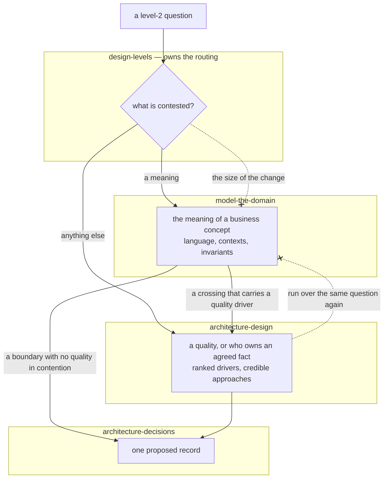

# Level 2 routes by what is contested: a meaning to `model-the-domain`, everything else to `architecture-design`

## Context

Level 2 has had exactly one method. `design-levels` says "Use
`.agents/skills/architecture-design` for one iteration", and nothing else at
that level runs a design loop.

#464 adds a second one. `model-the-domain` is a Domain-Driven Design method —
knowledge crunching over concrete scenarios, a Ubiquitous Language, Bounded
Contexts and a Context Map, then invariants and the Aggregates that protect
them. It ends where `architecture-design` ends: a proposed record under
`wfctl arch-root`, written with `architecture-decisions`.

Both skills are description-triggered, and their descriptions overlap.
`architecture-design` fires on "ownership rule" and "data boundary"; this one
fires on "Bounded Contexts" and "Aggregates", and on "an invariant with no
home". A prompt asking who owns a piece of state matches both. An agent holding both
descriptions, with nothing stating which one a question belongs to, runs two
design loops over one question or picks one arbitrarily.
`level-3-owns-structural-heuristics` was written to prevent that failure one
level down, and it is the same failure here.

Where the skill sits in the pipeline is settled separately, by
`a-repo-concern-earns-a-step-hook-or-method`. It is a method. It says how a
level-2 pass is performed, and knowledge crunching and driver ranking end at the
same kind of artifact, so nothing downstream can tell which route produced a
record. That record warns that the other test — does it leave a file — "admits
any discipline willing to write a file", and this skill ships a modeling
template, so the artifact test is the one not to reach for. This record decides
only what that placement leaves open: how an agent at level 2 chooses between
two methods.

## Direct baseline

Ship no second method. Fold the DDD vocabulary into `architecture-design` as a
reference, so level 2 keeps one method with a second entry point, and route
nothing.

The baseline does not fail because the vocabulary is unwelcome there. It fails
because `architecture-design` cannot run on the input this method exists for.
Its step 2 needs drivers specific enough to disprove, and each one names an
*affected part*. When one term is doing two jobs — an empty *filter window*
and an empty *workspace* rendered as one state, `design-levels`' own level-2
example — there is no agreed part to name yet. The driver loop has nothing to
rank until the concept has been split. A reference that said "first, settle
what the words mean" would be a step that runs before the method's own step 1,
filed inside the method — a second method with no entry of its own.

## Decision

`design-levels` routes a level-2 question by what is contested, not by how
large the change is:

- **The meaning of a business concept** — one term meaning two things, an
  invariant with no home, a rule nobody can say who enforces because nobody
  can say what it constrains — goes to `model-the-domain`.
- **Anything else at level 2** goes to `architecture-design`: a quality under
  stated conditions — availability, latency, deployability, a compatibility
  promise — and the ownership of a fact whose meaning is already agreed.
  "Does the client or the server compute *is this workspace empty?*" is that
  second kind once *empty* has been split, and it is the question
  `architecture-design`'s own description already claims as an "ownership
  rule".

The test is whether the parts can be named. Ownership belongs to
`model-the-domain` only while nobody can say which concept is being owned; once
they can, it is a boundary like any other, and the driver loop has a part to
rank.

The two methods chain rather than compete. `model-the-domain` runs first when
both apply, because it finds the contexts and names the parts. It hands a
crossing that carries a quality driver to `architecture-design`, and hands a
boundary with no quality in contention straight to `architecture-decisions`.
Each question goes through exactly one loop, and the record at the end is
written once.

## Owns truth

`design-levels` owns *"which level-2 method does this question go to?"*.
Neither method can compute it. Each skill's description is written against its
own triggers, so an agent holding both sees two matches and neither description
has a tie-break for the other. The router has to sit above both, and
`design-levels` already owns the gate where the choice is made.

`model-the-domain` owns *"what does this term mean, and in which context?"*.
`architecture-design` cannot compute it: each of its drivers names an affected
part, and a term doing two jobs is not one part yet.

## Boundary

Two refusals. `architecture-design` never hands a question back into a second
loop over the same meaning — once the contexts are named, the ranking is its
own. And the size of the change never picks the method: `design-levels` tests
whether a boundary moves, not how big the change is, and routing a "full" DDD
engagement by scale would reinstate the test that sentence refuses.

## Considered

- **The direct baseline — one method, DDD as a reference inside it.** It is
  cheaper and keeps level 2 at one loop. It loses on the input rather than on
  cost: the driver loop cannot rank a part nobody has agreed a name for.
- **Route by engagement depth** — the candidate skill's own table, where
  Strategic and Full go to DDD and everything else goes to the driver loop.
  This is the most natural reading of the skill as written. It loses because
  depth is the size of the change, and `design-levels` already refuses size as
  the test at level 2.
- **One new skill that replaces both.** It would end the overlap by
  construction, at the cost of rewriting a method that is already routed,
  mirrored and cross-reference-tested. Nothing here has shown the two cannot be
  ordered, and that is the only finding that would earn it — see Consequences.
- **A lifecycle sub-step under `brainstorm`.** `a-repo-concern-earns-a-step-hook-or-method`
  refuses it: nothing downstream reads the modeling document today. That changes
  if `specify` starts reading the model's language the way it reads the UI
  design contract. Then something downstream *is* different, and the concern
  moves to the lifecycle-step arm.
- **A stage after `/speckit.implement`**, which was #464's first plan.
  `speckit.plan` Phase 1 names the fields in `data-model.md` and `contracts/`,
  and the Ubiquitous Language is what names them. A model built after the code
  exists describes whatever got built, which `design-levels` lists as a red
  flag. Implementation evidence is still welcome. The skill's step 8 feeds it
  back, and it lands in *The descent is not one-directional*. The difference is
  between reopening level 2 and following it.

## Consequences

This record is falsified if the two methods cannot be ordered in practice —
if a real question keeps needing the driver loop *before* the language is
settled, or both loops keep producing the same record. Then the answer is one
method with two entry points, and this record is superseded rather than
patched.

`model-the-domain` spans two levels, and they land in different places. An
invariant whose owner crosses a context boundary is a level-2 decision and gets
a record. The internal shape of an Aggregate inside one context is level 3. It
goes to `software-design-decisions` when credible alternatives were weighed, and
to nothing when they were not.

The modeling document is a description, not a decision. It lands under
`<arch-root>/domain/`, one file per capability, and that subtree joins
`non_record_subtrees`. Left out of that list, a modeling round that wrote a
document and decided nothing would satisfy the design gate, whose only question
is whether the boundary was put. It cannot go in `FEATURE_DIR`: `specs/` is
gitignored and `spec_root` resolves outside the tree, so a reviewer reading the
PR never opens it (`the-scan-is-attested-where-the-reviewer-reads`). It cannot
go in `views/` either: `views/` is not in that list, so a view touched on a
branch already counts as a level-2 answer. That is a pre-existing gap and is
left where it was found.

The skill ships as wfctl's own, not as a derived one, and
`vendor-upstream-skills` says so in the same change. The draft it came from was
agent-generated, with no upstream project, licence or copyright holder. Its
references cite Evans' *Domain-Driven Design* and Vernon's *Domain-Driven Design
Distilled* (both Pearson) as the books the synthesis is of. That is a citation,
not a derivation, and no sample program from either book is reproduced.

What the candidate skill carried that wfctl already owns is given up rather
than kept beside it. Its eight pass/fail promotion gates go: `design-levels`
owns every gate, and #100 is where a gate's shape is decided. Its
`not applicable - <reason>` prose, where it stood for a boundary, goes to
`wfctl arch none`; a row of the model document that does not apply still says
`none — <reason>`, because that is a description and not a gate. Its
per-engagement visual mandate goes to `the-drawing-is-required-at-acceptance`
and `design-levels`' rendering rules. Its paired human and agent views are #86's
dual-representation principle, and are not minted a second time here.

The routing has no check behind it, and `a-rule-is-expressed-as-a-check`
explains why that is not a gap. A violation is a question sent to the wrong
method — a judgment about what is contested — and nothing in an artifact the
work produces tells the two apart. What can be checked is that the route
exists: a section-scoped test pins both skill names in `design-levels`' level-2
gate, so an edit that drops either pointer fails.

## Log

- 2026-09-23  proposed    — #464: a second level-2 method needs a stated
  routing condition, or an agent holding both descriptions runs two design loops
  over one question
- 2026-09-24  amended     — #464 review: ownership of an agreed fact routes to
  `architecture-design`, which already claimed it; a question with no contested
  meaning and no quality had no route
