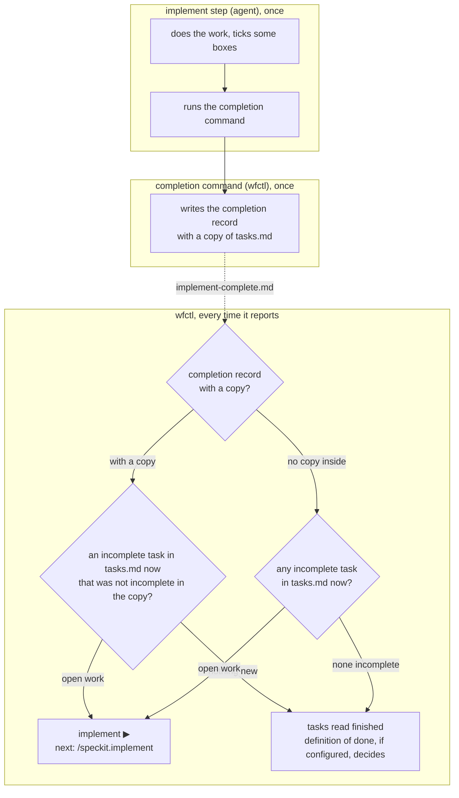

# A new task reopens the `implement` step

**What does this record decide?**
When the `implement` step finishes, wfctl saves a copy of the task list. If a
new incomplete task shows up later, wfctl reopens the `implement` step. wfctl
detects the new task by comparing the current task list against the copy, so
the agent is never asked to judge its own work.

## Context

The `implement` step can finish in one of two ways:

1. Every box in `tasks.md` is ticked.
2. The agent writes a completion record, `checklists/implement-complete.md`,
   which says the work is done even though some boxes are still unticked.

The completion record exists because checkboxes are unreliable. Work done
outside the implement skill leaves its boxes unticked, even when the work is
real.

wfctl only checks whether the completion record exists, and nothing ever
removes it. As a result, a story that finishes and later gains a new task
still reads as finished:

```
round 1   tasks.md: - [x] T001            implement finishes, writes the completion record
round 2   tasks.md: - [x] T001            scope grows, /speckit.tasks re-run
                    - [ ] T002 new work   the completion record is not touched
```

How this shows up depends on whether the repository configures a definition
of done, which is a verification command wfctl runs before it calls a story
complete:

1. With a definition of done, wfctl sends the agent to run verification
   instead of to T002. Verification fails while T002 is undone, so nothing
   unfinished is called complete, but the agent is pointed at the wrong next
   step.
2. Without one, wfctl reports the story complete while showing `1/2 done`
   beside it. A story with open work reads as finished.

The underlying problem is that wfctl can't tell two kinds of unticked box
apart: one whose work was done outside the skill, and one that was added after
the `implement` step finished. Both look the same in `tasks.md`. Telling them
apart requires knowing which tasks existed when the step finished, and nothing
records that today.

## Direct baseline

The simplest fix is to compare file timestamps. wfctl trusts the completion
record only while it is newer than `tasks.md`. Once `tasks.md` is newer, the
`implement` step reads as open and wfctl counts the boxes instead. This needs
no new file, no new format, and no new command.

In the code, `_tasks_open` would compare two `stat().st_mtime` values before
trusting the completion record.

## Decision

When the `implement` step finishes, it runs a wfctl command that writes the
completion record. The record holds a copy of `tasks.md` as it was at that
moment.

Each time wfctl reports status, it compares the current `tasks.md` against
that copy. An incomplete task that was not incomplete in the copy is new work.
When wfctl finds one, it reopens the `implement` step and gives
`/speckit.implement` as the next step, whether or not a definition of done is
configured.

wfctl matches a task to the copy by its description, word for word, and not
by its spec-kit ID such as T003. Spec-kit numbers tasks in execution order,
and a re-run of `/speckit.tasks` writes the file again from the top. A new
task inserted in the middle can therefore take the number an old task had,
and matching by ID would read it as old work.

For example, the copy holds T001 ticked and T002 unticked, because T002 was
done outside the implement skill. Later, T003 is added unticked. T002 was
already incomplete in the copy, so it is not new work. T003 was not in the
copy, so the `implement` step reopens.

Ticking a box or adding a note does not reopen the step, since neither adds a
new incomplete task. Rewording an incomplete task does reopen it, because
wfctl cannot tell a reworded task from a new one. That errs on the safe side:
the agent is sent back to look at the task again.

A completion record with no copy in it, such as every one written before this
change, cannot show which tasks are new. wfctl therefore treats any incomplete
task as open work. A task list with no tasks at all stays finished, since it
has no incomplete task to find, and the `tasks` step reads the same record the
same way.

## Owns truth

wfctl checks whether the completion record leaves any tasks incomplete in
tasks.md.

The agent shouldn’t answer the ownership question because it lacks visibility
into changes made to tasks.md—whether from rerunning /speckit.tasks or manual
edits. If the agent tries to answer afterward, it’s effectively grading its
own work, which increases the risk of hallucination.

Because the agent is the primary user of the wfctl CLI, allowing it to judge
its own output leaves no room for external oversight. That’s why wfctl’s
verification process ignores self-reported results.

When a feature folder is restored from specs-trunk, every file receives the
same timestamp, making them indistinguishable by modification time. As a
result, plan-edit-requires-new-review rejects timestamps.

The completion record captures the state of tasks.md at the exact moment
implementation finishes—the only point when this information is available.
Once tasks.md is modified, previous versions are not preserved.

## Boundary



The dotted line is the completion record, written once and read later. The
agent and the completion command run once, when the `implement` step
finishes. The wfctl group runs on every `wfctl status` and `wfctl next`,
whether or not anyone has edited `tasks.md` since. If nobody has, the
comparison finds no new task and nothing changes. wfctl never asks anyone
whether an edit mattered; it only checks which incomplete tasks exist.

## Considered

- **Compare file timestamps,** the direct baseline. It needs no new format and
  no new command. It was rejected because a checkout, a copy, or a restore
  from `specs-trunk` rewrites timestamps. A stale completion record can then
  look newer than `tasks.md`, and a current one can look older.
- **Fingerprint `tasks.md` and offer a sign-off,** the approach plan review
  uses. The completion record stores a hash of `tasks.md`, so any change to
  the file makes the record stale, and a command run with a reason confirms
  that the change did not matter. This approach is sound and is the usual
  answer in build tools, but it fits this problem poorly for two reasons:
  1. Every ticked box or fixed typo changes the hash, so the `implement` step
     reopens. For a story whose boxes were never ticked, reopening the step
     sends the agent to redo finished work.
  2. The sign-off asks the agent to judge whether its own edit mattered,
     which is the judgment this record takes away from it.
- **Match tasks by their spec-kit ID** instead of their description. A
  reworded task would then keep its place and not reopen the step. It was
  rejected because a re-run of `/speckit.tasks` renumbers tasks in execution
  order, so a new task can take an old task's ID and be read as old work. That
  failure hides new work, while matching by description can only reopen the
  step when it did not need to.

## Consequences

A new test covers a repository with no definition of done configured. That
case reported a story complete while it still had open work, and no existing
test covered it. The test sets up a completion record and then adds one
incomplete task after it. It fails if a later change goes back to trusting the
completion record just because it exists.

The implement instructions change: step 9b now runs the completion command
instead of writing the file directly. If an agent writes the file directly
anyway, the record has no copy inside, so any unticked box reads as open
work. That errs on the safe side,
since wfctl may send the agent back to finished work but won't call
unfinished work complete.

Completion records written before this change have no copy. A story that was
finished with unticked boxes before this change will therefore reopen the next
time wfctl reads it. A story whose task list holds no tasks stays finished. We accept that cost while
Andre is wfctl's only user. If wfctl gains a second user, this decision needs
revisiting.

A re-run of `/speckit.tasks` that rewords tasks reopens the `implement` step,
even when the work behind them was done outside the skill. The agent then
checks that work again. This costs time but never hides open work.

The copy lives in the spec folder, so anyone can edit it. This record keeps
the completion record in step with the task list; it does not protect the
record from tampering. Where a definition of done is configured, verification
still makes the final call.

This record covers only one link in the pipeline: changes to the task list
reopen the `implement` step. If someone edits the plan without re-running
`/speckit.tasks`, the task list falls behind the plan, and #502 handles that
gap separately.

This is the fourth place wfctl compares something it recorded earlier against
the current state of a file, after the install manifest, `wfctl verify`, and
plan review. Because it reuses the saved-copy approach plan review already
uses, the general answer #502 is working toward should be able to absorb it.

## Log

- 2026-10-09  proposed    — #264. A story that gained a task after the
  `implement` step finished still read as finished, and with no definition of
  done configured it was reported complete.
