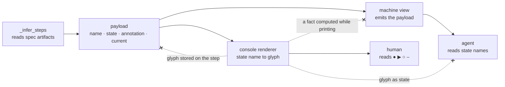

# Pipeline state is one payload; every view is a transformation of it

## Context

`wfctl status` renders each step as one of `● ▶ ○ –`, and the glyph is what
inference stores: `_PipelineStep` carries `symbol`, assigned across ten branches
of `_infer_steps` and handed through `steps_display` unchanged. The drawing is
not a view of the state, it is the state.

That was survivable while the console was the only reader. It stops being
survivable under `session-state-is-re-derived`, which deletes `current.md` and
makes this output the agent's only answer to "where is this feature". Two of the
four glyphs are distinctions nothing recovers from the drawing: `–` means the
step never ran and does not block, and the code is explicit that calling it `●`
"would hide that".

## Decision

Inference produces one payload — a step's name, its state as a name (`done`,
`in_progress`, `pending`, `skipped`), its annotation, and which step is current.
Every view is a transformation of that payload, and no view is the primary one.

The console renderer maps state names to `● ▶ ○ –` at the moment of printing.
The agent's read emits the same object. Both are consumers; neither computes
anything the other cannot see, and the glyph exists nowhere above the renderer.

## Owns truth

wfctl owns "what state is each pipeline step in?", and owns it as data — one
structure, computed once, from which every rendering is derived.

A view cannot own it, because a view is lossy by construction. The console
encodes four states in four glyphs chosen for a human eye, and `–` and `●` are
drawn differently while both meaning "does not block": a reader recovering state
from the drawing works from strictly less than wfctl had.

Nor can a consumer own the interpretation. If meaning lives in the rendering,
every change to the rendering is a change in behavior — a glyph swapped for
legibility alters what the next session believes, and nothing fails.

## Boundary

The three dashed edges are the decision: a view is a leaf. Nothing flows back
from one, and nothing is computed inside one.

## Considered

- Keep the console as the command and add a `--json` variant beside it — two
  paths over one question, and the second is the one nobody looks at, so a fact
  added to the printing branch reaches the human and silently not the agent.
- Emit the glyphs as JSON and let the agent map them — moves the legend into the
  reader, where it drifts from the code and is duplicated per agent.
- Document the legend in a skill so the agent can interpret the console — the
  same drift, in prose, which the test suite does not cover.
- Have the agent's view re-infer state independently — two inference paths over
  the same artifacts, which disagree the first time one is fixed.

## Consequences

`_PipelineStep.symbol` becomes a state name and `steps_display` returns the
payload; the glyph map moves to `cli`, the only place that prints. Tests
asserting on `●` keep asserting on `●`, at the console, which is now the only
place it exists.

`skipped` gets a name for the first time — it is currently readable only as "the
dash", and only by someone who has read the comment at `_pipeline.py:200`.

Annotations become payload fields rather than strings assembled while printing,
because a fact that exists only inside a view is the thing the dashed edges
forbid.

## Log

- 2026-08-30  proposed    — surfaced by #42's level-1 pass; the agent's only read once `current.md` goes
