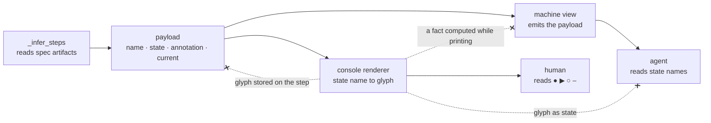

# Pipeline state is one payload; every view is a transformation of it

## Context

`wfctl status` renders each step as one of `● ▶ ○ –`, and the glyph is what
inference stores: `_PipelineStep` carries `symbol`, assigned across ten branches
of `_infer_steps` and handed through `steps_display` unchanged. The drawing is
not a view of the state, it is the state.

That was survivable while the console was the only reader. It stops being
survivable under `session-state-is-re-derived`, which deletes `current.md` and
makes this output the agent's only answer to "where is this feature".

The cost is not that the drawing is unreadable. An experiment run after this
record was accepted gave three readers the console output with no legend, and
all three named every state correctly. The cost is *how* they did it: they
reported decoding by "standard UI convention" — a mapping they arrive with, not
one this repo publishes. A fourth reader, given the same output with one
character corrupted to a symbol in no map, did not report an unknown glyph. It
assigned a state, called itself highly confident, and cited the step count as
corroboration.

So the console is legible and unverifiable at once. Nothing checks that a
reader's convention matches `_STATE_GLYPH`, and a reader that cannot recognise
disagreement cannot report it.

## Decision

Inference produces one payload — a step's name, its state as a name (`done`,
`in_progress`, `pending`, `skipped`), its annotation, and which step is current.
Every view is a transformation of that payload, and no view is the primary one.

The console renderer maps state names to `● ▶ ○ –` at the moment of printing.
The agent's read emits the same object. Both are consumers; neither computes
anything the other cannot see, and the glyph exists nowhere above the renderer.

## Owns truth

wfctl owns "what state is each pipeline step in?", and owns it as data — one
structure, computed once, from which every rendering is derived.

A view cannot own it, because a view is lossy by construction — though not
where this record first claimed. The four glyphs do survive the trip; what does
not is everything the drawing has no glyph for. `session_started` is not
rendered at all. A `next_command` of `null` is printed as an English sentence in
the slot a runnable command occupies, so "there is nothing to run" and "run
this" are one shape. A reader recovering state from the drawing works from
strictly less than wfctl had, and the missing part is the part with no
symbol.

Nor can a consumer own the interpretation. If meaning lives in the rendering,
every change to the rendering is a change in behavior — a glyph swapped for
legibility alters what the next session believes, and nothing fails.

## Boundary

The three dashed edges are the decision: a view is a leaf. Nothing flows back
from one, and nothing is computed inside one.

## Considered

- Compute the agent's output on a path of its own beside the console's — two
  branches over one question, and the second is the one nobody looks at, so a
  fact added to the printing branch reaches the human and silently not the
  agent. A flag on `status` is not this: what is rejected is a second inference,
  not a second format.
- Emit the glyphs as JSON and let the agent map them — moves the legend into the
  reader, where it drifts from the code and is duplicated per agent.
- Document the legend in a skill so the agent can interpret the console — the
  same drift, in prose, which the test suite does not cover.
- Have the agent's view re-infer state independently — two inference paths over
  the same artifacts, which disagree the first time one is fixed.

## Consequences

`_PipelineStep.symbol` becomes a state name and `steps_display` returns the
payload; the glyph map moves to `cli`, the only place that prints. Tests
asserting on `●` keep asserting on `●`, at the console, which is now the only
place it exists.

`status` gains a `--json` flag that serialises the payload; it is a second
format over one inference, not a second path, and the console branch keeps
rendering from the same object.

`skipped` gets a name for the first time — it is currently readable only as "the
dash", and only by someone who has read the comment at `_pipeline.py:200`.

Annotations become payload fields rather than strings assembled while printing,
because a fact that exists only inside a view is the thing the dashed edges
forbid.

## Log

- 2026-08-30  proposed    — surfaced by #42's level-1 pass; the agent's only read once `current.md` goes
- 2026-08-31  accepted    — `status --json` is the machine view; FR-009's deferral
  was removed once it was clear that deleting `current.json` without it left the
  agent scraping glyphs, which is the thing this record forbids
- 2026-08-31  amended     — the acceptance above argued from recoverability, and
  that argument is wrong: three agents read the glyphs with no legend and named
  every state correctly. The decision stands on the paragraph under **Owns
  truth** instead,
  which the acceptance did not lean on — meaning that lives in a rendering makes
  every restyle a behavior change. The same experiment supports it: the readers
  decoded by convention they brought, not by any map this repo controls.
  Context rewritten; no code changed
