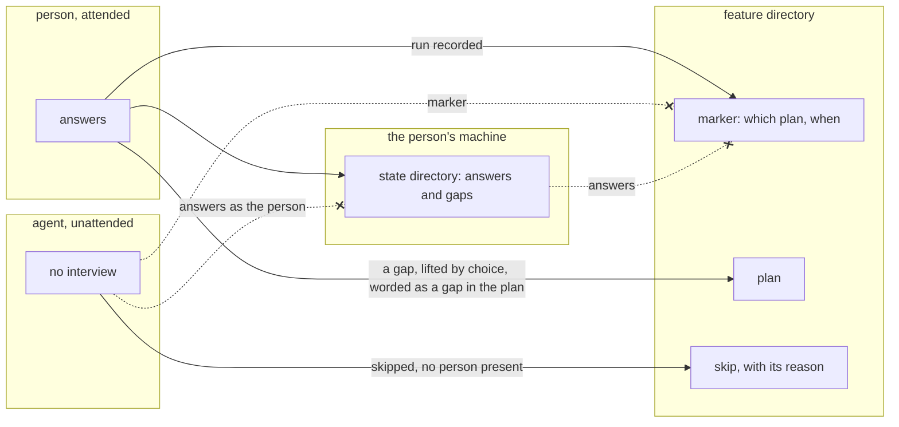

# Plan defense is the person's own check, and its answers stay private

## Context

Plan defense interviews the person responsible for a plan or a change. It asks
one material question at a time about what was written and records, per
challenge, whether the person could defend it. Its value is that it tests a
person's understanding of the work, which no other pass in wfctl does. A review
of the plan itself, where an agent reads the spec and plan and reports what does
not hold together, is a different pass (#501).

Two properties follow from that subject, and the skill as it arrived settles
neither of them.

1. Where the answers land. The skill's artifact contract writes
   `plan-defense.md` into the feature directory. In a repository that commits
   `specs/`, that file reaches the pull request. In this repository, feature
   directories are archived to `specs-trunk`, an orphan branch pushed to origin.
   Either way, a record of what a named person could not answer becomes public
   and permanent.
2. What happens with nobody present. Under `auto_approve` the agent is the only
   party at the prompt (`approval-mode-is-stored-intent`), and an agent can
   answer every question quickly. Its answers prove nothing about whether the
   person understood the work, which is the only thing the pass exists to find
   out.

## Direct baseline

Ship the skill as it is. `/plan-defense` writes `plan-defense.md` into the
feature directory with every challenge, answer, and disposition, and no rule
covers an unattended run. No field is added and no pass changes.

It fails on honesty, since a check of a person's understanding only works if the
person answers honestly, and people answer for the record once the record is
public. It also fails unattended, since the agent's answers land in the same file
in the same shape as a person's, and a later reader cannot tell a defended
challenge from a narrated one.

## Decision

Plan defense is an opt-in check that a person runs for their own accountability.
wfctl ships the skill and its command and no placement of its own; a repository
that wants it in the workflow declares it as a pass under any step in
`wfctl.json`, such as after `plan` or after `implement`. The answers are written
to the branch's state directory on the person's machine and never committed by
wfctl. The only file the
pass leaves in the feature directory is a marker naming the plan it was run
against and when, with no answers in it.

Under `auto_approve` the pass runs no interview and writes no marker. It records
that it was skipped because no person was present, so an unattended run never
carries answers that nobody gave.

A person may lift a gap into the plan. It is then worded as a gap in the plan,
such as "the plan does not say what step 3 does to `plan.md`", and never as a
gap in the person.

## Owns truth

The person owns "who gets to see how well I defended this work?".

wfctl cannot compute it. Publishing is a choice about a person's own
performance, and a check whose result is published by default changes how
honestly it is answered, so a default toward publishing defeats the check before
it runs. The agent cannot compute it either, since the agent is the party whose
explanation would replace the person's.

wfctl owns "has this check run against the current plan?". The marker answers it
from the feature directory without exposing any answer, and it is the same
question every other declared pass answers from its evidence file.

## Boundary

The refused edges are the decision. Answers never travel into the feature
directory, where they would be committed or archived; an agent never writes
answers in the person's place; and an unattended run never leaves a marker that
reads as a check someone ran.

## Considered

- **The direct baseline above.** It costs nothing and fails on honesty and on
  the unattended case, since the answers become public by default and an agent's
  answers are indistinguishable from a person's.
- **File the result as a scan in `docs/architecture/scans/`**, as #500 first
  proposed. The reviewer would see it at the pull request, which is where every
  other review pass's result goes. It loses on subject: a scan records findings
  about a change, and this result is a finding about a person, which the repo
  would keep permanently.
- **Unattended, the agent answers from evidence and defers comprehension to the
  reviewer.** This was the first version of this record. Evidence can settle
  claims about the plan, and that is #501's job. The part only this pass does is
  the part it deferred, so an unattended run would produce a plan review under the
  defense's name, plus a revise loop that needed its own stop condition.
- **A built-in sub-step under `plan` and under `implement`.** It puts the check
  in every repository's workflow at fixed points. It loses on fit, since the check
  blocks nothing and belongs where the person wants it, and a repository can
  already declare a pass anywhere in `wfctl.json`.
- **Hold `tasks` while any challenge is unanswered.** It turns a self-check into
  a gate, which then needs a bound on how many times the plan is sent back. It
  loses on purpose: a gate measures the plan, and this check measures the person.

## Consequences

The skill's artifact contract splits in two: the answers file in the state
directory, and the marker in the feature directory. What the marker carries to
name the plan (a content hash of `plan.md` is the candidate) is a level-3
decision.

How the unattended skip is recorded is also level 3. `wfctl step none` says a
pass does not apply to a change, and here it does not apply to one run; a later
attended session on the same branch may still run it.

The state directory survives sessions and is not backed up. How long a person's
answers should last, and whether they can be kept somewhere durable and private,
is open.

## Log

- 2026-09-26  proposed    — #500 level 2: plan defense needs a person to answer,
  and the one switch means nobody is there
- 2026-09-27  rewritten   — #500 level 1 reopened: the pass is a private,
  attended check; the unattended evidence mode moved to #501's territory
