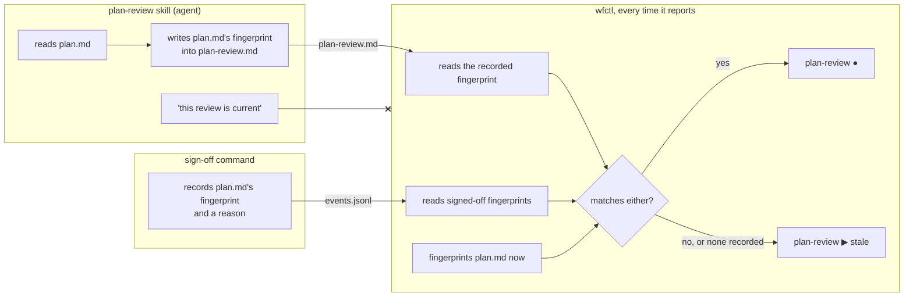

# A plan review counts only as evidence for the plan it read

**What does this record decide?**
A plan review only counts for the exact plan it read. When the plan owner or an autonomous agent edits the plan afterwards, wfctl sends it back for review, unless someone signs the edit off with a reason.

## Context

The `a-step-carries-sub-steps-one-level-deep` record lets a check sit under a
step, and a check a repository adds reads done once its evidence exists. Plan
review is one of those checks. It sits under `plan`, reads `spec.md` and
`plan.md`, and reports what doesn't hold together before `tasks` turns the plan
into work.

Plan review never says approved or rejected. It lists findings, and the plan
owner or the autonomous agent answers a finding by editing `plan.md`. This means
an edited plan is the normal way through this check, not an edge case.

That is where the existing rule breaks. The review's report still exists after
the plan is edited, so the check reads done. The report now describes a plan
that no longer exists:

```
plan.md v1  ─►  plan-review.md reviews v1   ─►  plan-review ●   true
plan.md v2  ─►  plan-review.md still exists ─►  plan-review ●   false
```

This means the check is wrong exactly when it is used as intended. Someone who
sees `plan-review ●` and runs `/speckit.tasks` breaks down a plan nobody
reviewed.

The reviewer already writes down a fingerprint of every file it read, in a
`Reviewed inputs` table at the top of the report. It does that so a reader can
spot a stale report by eye. Nothing reads that table automatically today.

Plan review ships with wfctl, so it is a built-in check. A built-in check can
compare anything it likes, and the limit on what `wfctl.json` can express does
not apply to it.

In the code, a repository's check gets `build_file_exists_reader`, and a
built-in `SubStep` takes any callable as its reader (`_pipeline.py`,
`SubStep.reads`). The fingerprint is `git hash-object`.

## Direct baseline

Plan review gets the same rule a repository's check gets. It reads done once
`plan-review.md` exists. The report keeps its fingerprints, and a reader who
opens it can compare them by hand. Keeping every check's evidence current is
then fixed once, in a separate change that decides what a check can be tied to.

It costs nothing now and adds no format anyone has to keep. It fails on every
edited plan, which is the case the check exists for. And nobody compares the
fingerprints unless they already know to.

In the code, that rule is `build_file_exists_reader("plan-review.md")`.

## Decision

wfctl decides whether a review is current, every time it reports. It reads the
fingerprint of `plan.md` that the reviewer recorded, takes the fingerprint of
`plan.md` as it is now, and reports the check done only when the two match.
When they differ, the check reads in progress with the reason "stale; plan.md
changed since the review". A report that records no fingerprint for `plan.md`
reads in progress too, and says so.

A stale review sends the workflow back to `plan`, however far it has gone,
`implement` included. Whether `tasks.md` exists makes no difference. If it did,
a plan edited and then broken down by a hand-run `/speckit.tasks` would slip
through.

The check also reads done when someone has signed off the plan as it is now.
The plan owner or the autonomous agent signs off with a wfctl command that
requires a reason. The sign-off covers only the one version of the plan it
recorded, so the next edit makes the check stale again. It exists because wfctl
can't tell a typo from a changed design, and without it every late edit would
cost a full review. A sign-off line typed into the scan file by hand does not
count.

wfctl reads two lines out of the report, the plan's fingerprint and the number
of open BLOCKER findings. Both are fixed in wfctl beside the reader, and a test
in wfctl's own suite checks them against the report format the skill ships.

In the code, the stale and missing cases read `in_progress`.

## Owns truth

wfctl owns "is this review about the plan that exists now?".

The reviewer can't answer that. It runs once, at review time, and the question
comes up later, whenever someone edits `plan.md`. The reviewer isn't running
then, and nothing calls it back. Anything it wrote about being current only
describes the moment it wrote it.

The autonomous agent can't answer it either. A report that says "current" is
the agent vouching for itself, and `wfctl-runs-the-verification` refuses that
for the same reason. Nothing tells a true self-report from a false one.

The report owns "which `plan.md` did this review read?". Only the reviewer knows
what it read, and only at the moment it read it. wfctl can't work that out
later. Once `plan.md` has changed, nothing on disk says what it held when the
review read it.

## Boundary



The crossed-out arrow is the decision. Whatever the reviewer says about being
current never reaches wfctl. wfctl compares the fingerprints itself, and reads a
sign-off only from `events.jsonl`, the event log it writes.

## Considered

- **wfctl records the fingerprint itself,** through a command the reviewer
  calls after writing its report. The format would then be wfctl's outright, and
  nothing the agent wrote would be parsed. It loses on scope, not on merit. It
  adds a command and a store, which is the general answer to keeping every
  check's evidence current. That answer should be designed once for every check,
  not first for this one.
- **Compare file timestamps,** reporting the check done when `plan-review.md` is
  newer than `plan.md`. It needs no format anyone has to keep. It loses because
  a checkout doesn't keep timestamps. The feature folder is archived on
  `specs-trunk`, and restoring it from there stamps both files with the same
  moment. This means a stale report reads as fresh.
- **Tie the review to `spec.md` as well.** `clarify` can rewrite `spec.md` after
  a review. It was left out to keep what wfctl reads from the report small. A spec change that
  changes what the plan must cover almost always forces a plan edit, which this
  check already catches.
- **A `binds:` setting on a repository's checks in `wfctl.json`.** That fixes
  every check a repository adds. It also changes what a repository's
  configuration can express, which `a-step-carries-sub-steps-one-level-deep`
  limited on purpose. It is the general fix, and it is not this decision.

## Consequences

This is the third place wfctl compares a recorded fingerprint against a live
one. `doctor` recomputes the fingerprints the install manifest recorded
(`drift-is-measured-against-the-recorded-source`), and `wfctl verify` ties its
verdict to a commit and whether the tree was clean. Each of the three picked its
own format. The general answer to keeping evidence current, which #502 owns for
the rest of the workflow, should be able to absorb this one without changing
what the report records.

The report format stops being the skill's alone. Changing how the
`Reviewed inputs` table writes its `plan.md` row is a change to a contract, and
the test beside the reader is what says so.

The sign-off is the one fingerprint wfctl writes itself. That is the shape the
first option under Considered set aside for scope, and it is narrower than that
option. It uses the event log wfctl already keeps, `events.jsonl`, rather than
a store of its own. wfctl writes a copy into the scan file, and whoever signed
off commits it. It records an acceptance the plan owner or the autonomous agent
chose to make, never a review. Whether an autonomous agent may sign off without
human review is the waiver-authority question #100 owns. The recorded reason
keeps it visible in the meantime.

wfctl reads a sign-off back from `events.jsonl`, never from the scan file. The
autonomous agent writes the scan file on every review, so a sign-off line it
typed there would look the same as one wfctl wrote. It would also slip past the
count that limits the agent. The section in the scan file is the pull request
reviewer's copy, and nothing reads it back.

wfctl also reads how many BLOCKER findings the review left open, checked only
once a sign-off has not already answered for the plan. A review of the current
plan with a BLOCKER open reads in progress, so the workflow doesn't reach
`tasks` over a finding the reviewer called blocking, unless a sign-off accepts
that plan first, which FR-026's own edge case names as one of the ways an open
BLOCKER is resolved. That count is the reviewer's grade of the plan, not a
statement about whether the review is current. This means reading it doesn't
bring back the self-report this record refuses. The reviewer grades the plan,
and wfctl decides whether the grade is still about the plan that exists.

The reviewer also keeps a copy of the `plan.md` it read, so the next review and
a sign-off can show what changed. The fingerprint only says that something did.
The copy never decides whether the review is stale. A copy edited by hand would
otherwise make a stale review read current, and the recorded fingerprint is what
the reviewer wrote at the moment it read.

A report missing its fingerprint is treated as promised evidence gone silent
(`promised-evidence-blocks-on-silence`). The skill promised to write it, so its
absence holds the check rather than passing it.

## Log

- 2026-09-26  proposed    — #501. A review pass whose expected response is a
  revised plan reported itself done against every revised plan.
- 2026-09-26  amended     #501. A stale review routes back past `tasks`, and a
  sign-off with a reason stands in for a review of a harmless edit.
- 2026-09-27  amended     #501. An open BLOCKER in a review of the current plan
  holds the pipeline before `tasks`.
- 2026-09-27  amended     #501. The plan review found a sign-off could be typed
  into the scan file by the agent it bounds. wfctl now reads it from its own
  event log.
- 2026-09-27  renamed     — from `wfctl-measures-a-review-against-the-plan-it-read`.
  Record names carry no `wfctl-` or issue-number prefix.
- 2026-09-28  rewritten   — plain language first, and an opening question
- 2026-09-28  amended     #501. The review panel found this record silent on
  a sign-off's power to clear an open BLOCKER. Named the exception explicitly,
  against FR-026's own edge case.
