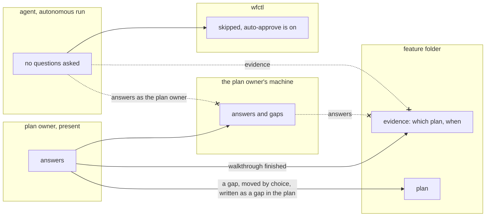

# Plan walkthrough is a personal check, and its answers remain private

## Context

The plan walkthrough asks the plan owner to explain the plan, one question at a
time, and records whether they could. Once code exists, the change walkthrough
does the same for the change. It's the first check in wfctl that tests a
person's understanding rather than the work. Whether the plan itself holds
together is a different check, the plan review in #501.

The skill as it arrived leaves two questions open:

1. Where do the answers go? The skill writes them into the feature folder. A
   repository that commits its specs puts them in the pull request, and this
   repository archives feature folders to a branch it pushes. This means a
   record of what a named person couldn't answer becomes public and permanent.
2. What happens on an autonomous run? With auto-approve on, the agent is the
   only one at the keyboard (`approval-mode-is-stored-intent`), and it can
   answer every question quickly. Its answers are invalid evidence, because they
   say nothing about whether the plan owner understood the plan.

## Direct baseline

This is the option this record rejects.

Ship the skill as it is. `/plan-walkthrough` writes every question, answer, and
verdict into `plan-walkthrough.md` in the feature folder, and nothing says what
happens on an autonomous run.

It fails on honesty, because people answer for the record once the record is
public. It fails on an autonomous run too. The agent's answers land in the same
file in the same shape as a person's, and nobody reading it later can tell which
is which.

## Decision

The plan walkthrough is a check the plan owner opts into, for their own
accountability. wfctl ships the skill and the `/plan-walkthrough` command but
doesn't put the check anywhere in the workflow. A repository that wants it adds
it to `wfctl.json` under whichever step fits, such as after `plan` or after
`implement`.

The answers stay on the plan owner's machine, and wfctl never commits them. The
skill writes one thing to the feature folder: evidence that the walkthrough
happened, naming which plan and when, with no answers in it.

When auto-approve is on, the skill asks nothing and writes nothing, and wfctl
shows the check as skipped (`autonomous-agent-skips-human-checks`). This means an
autonomous run never carries answers nobody gave.

The plan owner can move a gap they found into the plan. It's then written as a
gap in the plan, such as "the plan doesn't say what step 3 does to `plan.md`",
never as a gap in the person.

## Owns truth

The plan owner owns "who gets to see how well I explained this work?".

wfctl can't decide that. Whether to publish is a choice about a person's own
performance, and a check whose answers are public by default gets answered less
honestly. This means a public default defeats the check before it runs. The
agent can't decide it either, since the agent is the one whose explanation would
stand in for the plan owner's.

wfctl owns "has this check been run?". The evidence in the feature folder
answers that without exposing any answer, the same way every other check a
repository adds is answered by its evidence. The evidence records which plan
was walked through, and nothing compares that against the plan as it is now,
so a plan edited after its walkthrough still reads as walked through.

## Boundary

The crossed-out arrows are the decision. Answers never travel into the feature
folder, where they would be committed or archived. The agent never answers in the
plan owner's place. And an autonomous run never writes evidence for a
walkthrough nobody did.

## Considered

- **The baseline above.** It costs nothing. It loses because the answers go
  public by default, and an agent's answers look the same as a person's.
- **File the result as a scan in `docs/architecture/scans/`**, as #500 first
  proposed. The reviewer would see it in the pull request, where every other
  review's result goes. It loses because a scan is about the change, and this
  result is about a person, which the repository would then keep forever.
- **On an autonomous run, the agent answers from the evidence and leaves
  understanding to the reviewer.** This was the first version of this record.
  Evidence can settle questions about the plan, and that's the plan review's
  job (#501). The part only this check does is the part it would skip. This
  means an autonomous run would produce a plan review under this check's name.
- **A built-in step under `plan` and `implement`.** It puts the check in every
  repository at fixed points. It loses on fit: the check blocks nothing, belongs
  wherever the plan owner wants it, and a repository can already add a check
  anywhere in `wfctl.json`.
- **Hold `tasks` until every question is answered.** That turns a self-check into
  a gate, which then needs a limit on how many times the plan gets sent back. It
  loses on purpose: a gate measures the plan, and this check measures the person.

## Consequences

The skill's output splits in two: the answers, kept in the plan owner's state
folder, and the evidence in the feature folder. The evidence names the plan by a
hash of `plan.md`.

How an autonomous run skips the check is decided in
`autonomous-agent-skips-human-checks`. When the plan owner turns auto-approve
off, the check waits for them again.

The state folder survives between sessions but isn't backed up. How long the
answers should last, and whether they can be kept somewhere durable and private,
is still open.

## Log

- 2026-09-26  proposed    — #500 level 2: plan walkthrough needs a person to answer,
  and the one switch means nobody is there
- 2026-09-27  rewritten   — #500 level 1 reopened: the pass is a private,
  attended check; the unattended evidence mode moved to #501's territory
- 2026-09-27  revised     — the unattended skip is read from the approval mode,
  not written by the skill (`autonomous-agent-skips-human-checks`)
- 2026-09-27  renamed     — from `plan-defense-is-private`; plan defense is now
  the plan walkthrough, in plain language
