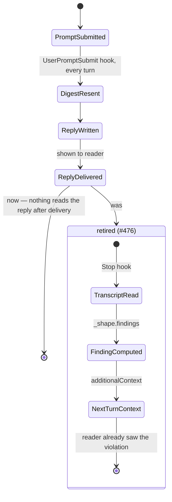

# Response-style compliance reverts from a check to a comment

## Context

`a-rule-is-expressed-as-a-check` (accepted, #222) sorts a shipped rule by one
test: is a violation of it visible in an artifact the work already produces? A
reply is such an artifact, so `conversation-response-shape`'s rules — no
markdown headers, no counted lead-in, no unrequested length — were sorted onto
the check side and given one: `wfctl hook response-shape`, firing on `Stop`,
reading the finished reply out of the transcript and reporting what it found
back to the model.

Firing after the reply is what the test asks for, and also what breaks the
delivery. The finding cannot reach the reader through the artifact it is
about — that copy is already on screen — so it rides
`hookSpecificOutput.additionalContext`, which the harness feeds to the *next*
turn. Twice, once the harness started also honouring `systemMessage`: the same
seven lines printed under `Stop hook feedback:` and reasserted in the model's
own context (#298). The message itself reopens the turn, so the reply reaches
the reader a second time (#276). The pointer inside it — "re-read
`.agents/skills/conversation-response-shape/SKILL.md`" — quoted the wrong
sentence in the session that surfaced #475, demanding a 5.5k-token re-read to
find what actually broke. It fired twice in the session that decided this.

## Direct baseline

Keep the checker and fix delivery instead: drop the redundant `systemMessage`
emission (#276's own recommended remedy), and correct the quoted pointer so a
re-read lands on the sentence that broke (#475). The mechanism — read the
transcript on `Stop`, run `_shape.findings`, report to the next turn — stays
exactly as `a-rule-is-expressed-as-a-check` sorted it: a check, over an
artifact the work already produces.

## Decision

The reply-shape checker (`wfctl hook response-shape`) is retired. Response
style is carried by the `UserPromptSubmit` digest and `SKILL.md` alone — prose,
re-sent every turn, with nothing reading the reply it governs afterward. This
is the comment branch of `a-rule-is-expressed-as-a-check`'s own test, taken
knowingly for a rule whose letter sorts onto the check side.

## Owns truth

The digest owns *"is the rule in front of the model for this reply"* —
answered by presence, computed once per turn at negligible cost, and true
unconditionally rather than as a verdict on anything already written.

Nothing owns *"did the last reply comply"* anymore, and that is the decision,
not a gap this record leaves open. The only mechanism that could compute it —
a `Stop` hook reading the finished transcript — is the kind of party
`a-rule-is-expressed-as-a-check` trusts with an unfalsifiable verdict precisely
*because* it runs after the fact. What that record did not weigh is that here
"after the fact" means after delivery: the hook can report to the next turn,
never correct the one it is about, so its output is a second reminder wearing
a verdict's authority — the same words the digest already sent, arriving late,
under a name that claims to have observed something the reader could not. The
reader was always the one who could act on a bad reply, immediately, by saying
so; the checker never shortened that path, only added a second, slower one
beside it.

## Boundary

## Considered

- **Fix the checker's delivery (#276's recommended remedy).** The direct
  baseline, and sound on its own terms — it removes the double print and the
  wrong quote, the two concrete bugs filed against it. Not chosen: both fixes
  repair *how* the verdict is delivered, not the fact that it is a verdict on
  an artifact nothing can still change, arriving through a channel (next-turn
  context) indistinguishable in effect from the reminder the digest already
  sends every turn. Fixing delivery keeps a mechanism Andre asked to be rid of
  as "big and intrusive," spent on catching slips small enough that a second
  turn was never worth it.
- **Keep both, cheapen the checker to a single pass/fail instead of prose
  findings.** Loses the same argument at smaller scale — a silent verdict
  still fires on every turn, still costs a hook invocation and a transcript
  read, and still cannot correct the reply it is about. The cost this record
  removes is not the length of the message.

## Log

- 2026-09-24  proposed    — #476: the checker fired twice in the session that
  decided this and had cost more than it returned twice already (#276, #475);
  response style now runs on the `UserPromptSubmit` digest alone.
- 2026-09-25  retired     — #485: wfctl no longer ships a response-style skill,
  digest, or check. Both style skills left the bundle for a personal skill
  outside any repository, so there is no shipped rule left for this record to
  sort onto either side.
