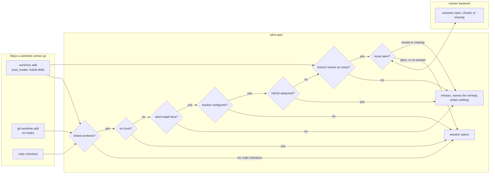

# `wfctl start` refuses a linked worktree whose branch names no open issue

## Context

Every worktree in a wfctl repository works against an issue. wfctl derives the
spec directory and the state directory from the issue key at the front of the
branch, and a branch without one leaves both unresolvable.

The rule was written as a workmux `pre_create` hook, in this repository's
`.workmux.yaml` and in the template wfctl ships. workmux has no hook by that
name. It implements `post_create`, `pre_merge`, and `pre_remove`, in 0.1.211 and
in 0.1.268, and it ignores an unknown key without a warning. So the gate has
never run, and a worktree named `zzztest-precreate-check` was created without
objection. Six places in the repository, including two records, still state
that it works.

A worktree also has more than one way in. `workmux add` runs the hooks; a bare
`git worktree add` runs none of them, and that route is how a worktree ends up
with no skills installed at all. A gate that lives in workmux holds only the
first route, even in a version of workmux that has the hook.

## Direct baseline

Move the check into the first `post_create` command, which workmux does run. A
failing `post_create` aborts `workmux add`, and nothing in wfctl changes.

It holds less than it appears to. With `--headless`, workmux rolls the worktree
back. In the default mode it does not, and the worktree and its branch stay on
disk with no tmux session, which is the `MUX -` state a bare `git worktree add`
already produces. A bare `git worktree add` still passes, since it runs no hook.
And the check can read only the branch name, since `post_create` runs before
wfctl can say whether the issue is open.

## Decision

`wfctl start` owns the rule. In a linked worktree, it refuses to open a session
when the worktree has no wfctl install, when HEAD is detached, when the branch
names no issue, or when the tracker reports the issue closed or missing. It
refuses on every run, not only the first, and it writes nothing when it refuses.

The questions are settled in one order, and the first that decides ends the
check:

1. The main checkout, and a linked worktree on the repository's trunk branch,
   proceed.
2. A worktree with no install refuses. This comes before the tracker question,
   since such a worktree has no tracker config of its own and would otherwise
   pass as a repository that never chose one.
3. A repository with no tracker configured proceeds.
4. A detached HEAD refuses. This comes before the key, since wfctl substitutes
   the short hash for a missing branch name, and an all-digit hash parses as an
   issue key.
5. A branch that names no issue refuses.
6. Only then is the tracker asked, and it refuses on closed or missing.

## Owns truth

`wfctl start` owns "may a session open in this worktree, given the issue its
branch names?".

workmux cannot compute it, for three reasons.

1. workmux sees only the worktrees it creates. A bare `git worktree add`, a
   person, and an agent all reach a session without passing through it, and
   all of them pass through `wfctl start` before pipeline work begins.
2. workmux has no hook that runs before creation, and none is asked for
   upstream. The hook it does run leaves a worktree behind when it refuses.
3. Whether the issue is open is a question for the tracker, and workmux has no
   tracker configuration. wfctl reads the repository's tracker, and the key
   shape comes from that tracker's `key_pattern` rather than from a regex
   written into a hook.

Trunk is outside the rule. A session on `main` in the main checkout is
legitimate, and `/start-session` has rows for it. A bare-repository layout has
no main checkout, so its `main` is a linked worktree like any other, and the
exemption covers a linked worktree on trunk for that reason. Trunk is read from
`origin/HEAD`, then a bare repository's own `HEAD`, then the first of `main`,
`master`, and `dev` that exists. A repository with no tracker configured is
outside the rule too, since such a repository creates no issues for a branch to
name.

## Boundary

The `--x` edge is the decision. workmux no longer answers whether a branch
names an issue; its hooks install skills and move the board, and nothing in
them refuses.

## Considered

- **Refuse `git worktree add` in the `PreToolUse` guard.** This was the first
  shape asked for, so that the bare route could not go around the proper one.
  It is lexical. It reads a command as text and cannot tell an agent taking the
  wrong path from a person doing something deliberate, and it has to guess at a
  path that does not exist yet. It also leaves every worktree workmux creates
  unchecked.
- **Ask workmux upstream for a `pre_create` hook.** It is the only option that
  refuses before anything is created, and it is the clean end state for the
  `workmux add` route. It depends on a release this project does not control,
  and it still holds only that route. It remains worth asking for, and it would
  sit in front of this decision rather than replace it.
- **Refuse in every command that reads a session.** `status`, `resume`, and
  `end` each check the branch. This spends a tracker call on every command
  instead of once per session, and it is not needed: a refused `start` writes no
  event, and `resume` and `end` already refuse a branch with no session on it.

## Consequences

`wfctl start` makes a tracker call on every run in a linked worktree. It is
bounded by the timeout every tracker read carries, and a tracker that gives no
answer (no network, an expired token, a rate limit) warns and lets the session
open. A session that cannot start without a network
is a worse failure than one that started on a branch whose issue went
unchecked, and the `post_create` hooks already take this stance with `|| true`.

The refusal is not an outward-action gate, and it does not conflict with
`wfctl-records-outward-actions-and-never-gates-them`. That record is about
actions that reach outside the repository. This one decides whether local work
may begin, and the remedy (rename the branch, reopen the issue, or install) is
one the developer takes.

`--force` does not bypass the refusal. It keeps its one meaning, which is to
reset a recorded session.

A worktree with no wfctl install is refused when the main checkout has one.
That is how the check tells a worktree `post_create` never ran in from a
repository that never installed wfctl at all. A bare layout has no main
checkout to compare against, so there a worktree with no install is refused
outright; a bare-layout repository that never installed wfctl is refused in
every worktree but trunk, and told to install.

Trunk detection is discovered, never declared, and a bare `HEAD` is as stale as
the clone. A repository whose trunk is named something other than `main`,
`master`, or `dev`, with nothing recording it, has its trunk worktree refused in
a bare layout as naming no issue. A declared trunk is #509.

## Log

- 2026-09-26  proposed    — the `pre_create` gate never ran; #497 moves the rule to session start
- 2026-09-27  proposed    — clarify's four answers: the check order, a detached
  HEAD, a bare layout's missing install, and trunk as the exemption the main
  checkout stood for
