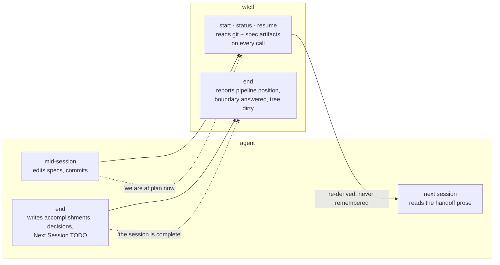

# Session state is re-derived from artifacts, never remembered

## Context

Two open defects sit in `_session.py` and turn on one unanswered question.
`current.md` is written once at `wfctl start` and never updated, so a branch's
context is right only if nothing happened after the session began. `wfctl end`
reports a completion it cannot observe, concluding a state rather than reporting
one.

Both are write-once state that goes stale or lies, and both are the same
question with different answers today: for each piece of session truth, which
side computes it and why the other side cannot.

## Decision

Every piece of session state that can be derived from artifacts on disk is
derived at read time, on every read. Nothing is carried forward from an earlier
write, and no session file is treated as authoritative for a value that can be
recomputed. What a session file holds is what re-derivation cannot reach — the
handoff prose a human or agent wrote deliberately.

`current.md` therefore stops existing rather than being kept fresh. Everything
on it but the prose is a field `wfctl status` computes from git and the spec
artifacts; the prose sections were never filled in, and the one that would have
been — active decisions and constraints — is a record's job, not a session
file's. A session reads `wfctl status` for where it is and `session-summary.md`
for what the last one meant.

## Owns truth

wfctl owns "where is this feature in the pipeline, and what does this branch
have on disk right now?", and answers it by reading the artifacts each time it
is asked. That covers the branch and issue as much as the step: read from git at
read time, not copied at `start`, because a worktree can be pointed at another
branch and the copy has no way to notice.

The agent cannot: its answer is a memory of an earlier turn in a conversation
that may have been cleared, in a worktree another session has since changed.
Even an agent that was correct when it wrote the value has no way to notice it
stopped being correct, because the thing that would notice is the re-read.

The agent owns "what did this session mean, and what should the next one do
first?" — accomplishments, decisions, the Next Session TODO. wfctl cannot
compute intent from artifacts: a diff shows what changed and never why it was
chosen, and no re-read recovers a rejected alternative.

Neither side owns "is this session complete". It is not observable, so `wfctl
end` reports what it can see — pipeline position, whether the boundary question
was answered, whether the tree is dirty — and claims nothing beyond that.

## Boundary

The two dashed edges are the decision. Everything else is a read.

## Considered

- Update `current.md` on every state change — makes each writer responsible for
  every reader's freshness, and a missed write is indistinguishable from an
  unchanged state.
- Keep `current.md` as a view re-rendered by every command that reads state —
  the freshness problem shrinks to three call sites instead of vanishing, and
  what it buys is a file that is a slightly older copy of a command's output.
- Keep the write-once file and add a staleness timestamp — the reader learns the
  value might be wrong but still has nothing better to use, so it either warns
  about correct data or proceeds on stale data.
- Let the agent report the pipeline step it believes it reached — the same
  self-certification shape rejected in `wfctl-runs-the-verification`, one
  level up.

## Consequences

`status` and `resume` stay cheap, because re-derivation reads spec files rather
than running anything. `status` gains the next command as a printed line — it
already computes the step, and it was the only field `current.md` carried that
no other read produced.

It also removes the `status` field from session state entirely: session status
has no reader, and work status is derivable from the pipeline.

## Log

- 2026-08-27  proposed    — seeded from #74, covering #42 and #70; level 2 open
- 2026-08-29  accepted    — level 2 answered; `current.md` deleted rather than refreshed
