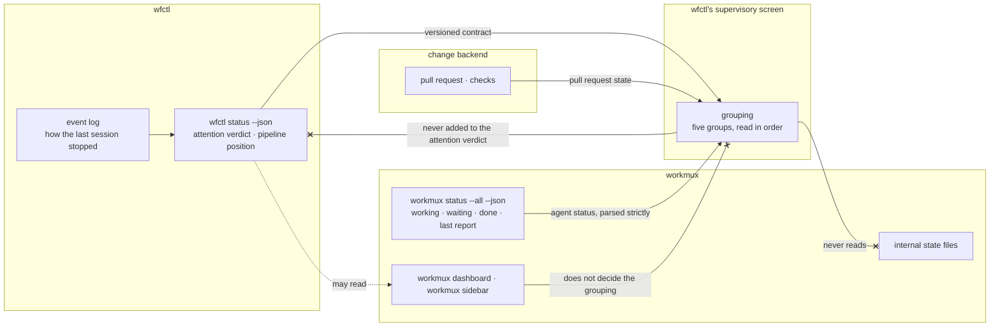

# wfctl decides how its supervisory screen groups worktrees, and any other screen may read the same status

## Context

A person running ten agents at once needs one screen that says which of them
needs a human, and why. Today they check each worktree one at a time. workmux's
dashboard shows whether each agent is working, and wfctl shows where each
feature sits in the pipeline, but nothing puts the two side by side.

The screen sorts every worktree into five groups, and the person reads them top
to bottom:

| Group | What puts a worktree there |
|---|---|
| Needs attention | the pipeline is blocked, waiting on a manual step, or stalled; the agent is waiting at a prompt or has gone silent; the worktree was orphaned; a pull request's checks are failing |
| In review | a pull request is open |
| Working | the agent is working, or the pipeline is advancing |
| Idle | the last session stopped on purpose, or nothing has started |
| Done | the pull request merged, or the issue closed |

Each group needs facts from three places, and none of them can place a worktree
on its own:

1. wfctl knows where the pipeline stands and how the last session stopped.
2. workmux knows whether the agent is working, waiting, or done, and when it
   last said so.
3. The change backend (GitHub here) knows about the pull request and its
   checks.

A silent agent shows why. The agent's hooks tell workmux when a prompt is sent,
when a tool call finishes, when a permission prompt opens, and when a turn ends.
Pressing Esc fires none of them, so an interrupted agent still reads as working,
and a hung agent does too. One agent on this machine read as working for 7.7
days. The screen treats an agent as silent when workmux marks it working and it
has not reported for longer than a threshold.

This record answers who decides the grouping. The test is whether a change to
it can ship without waiting on a workmux release. The grouping has already
changed once: on 2026-09-26, silent agents moved into Needs attention.

## Direct baseline

The baseline builds nothing. The person runs `wfctl status` in each worktree,
keeps `workmux dashboard` open beside it, and joins the two by eye.

This is not a credible option, and it is stated once rather than scored.
`wfctl status` answers only for the worktree it runs in, so eleven worktrees
mean eleven panes, and nothing groups them.

## Decision

wfctl decides how its supervisory screen groups worktrees: which group each one
belongs in, and the order the groups are read in. A change to either ships in a
wfctl release and never waits on workmux. How the screen lays the groups out is
left to the work that builds it.

`wfctl status --json` stays a public, versioned contract. workmux, an editor, or
any other tool may read it and draw its own view, and none of them decides how
this one groups.

The screen combines the three sources each time it refreshes, and that is all
it does. It keeps nothing between refreshes, writes nothing back, and reads each
source only through the interface that source documents for other tools.
wfctl's attention verdict (`attention` in the status payload) stays a verdict
over wfctl's own evidence. A waiting or silent agent reaches Needs attention
through the grouping and is never added to that verdict.

## Owns truth

**wfctl owns _"which group does this worktree belong in, and which group is read
first?"_.** workmux cannot compute it, for three reasons:

1. workmux has nowhere to show it. In workmux 0.1.268 the dashboard's columns
   and the sidebar's template tokens are fixed lists, and an unknown name is
   rejected. The sidebar groups only by project or by tmux session, and the
   dashboard only sorts. The lists are in `src/config.rs:238-313` and
   `src/command/sidebar/template/parser.rs:255`, and the grouping is in
   `src/config.rs:542-550`.
2. workmux has no hook that could feed it. Its three hooks run when a worktree
   is created, merged, or removed, and none of them reaches the screen
   (`src/config.rs:787-796`).
3. Half of the grouping rests on evidence only wfctl holds. Whether a worktree
   is Idle or Needs attention depends on how its last session stopped, and wfctl
   records that in its own event log outside the repository. workmux would have
   to reimplement wfctl's reader to know it, and a rule kept in two places
   drifts apart.

The first two reasons describe workmux today, and a later release could remove
them. The third does not depend on workmux at all. A more extensible workmux
makes the alternative cheaper, and it does not change who decides the grouping.

**workmux owns _"what is the agent doing, and when did it last say?"_.** wfctl
cannot compute it. tmux knows only whether a pane is alive; its activity
timestamp moves when a spinner redraws exactly as it does when the agent streams
output. The silent check does not take this question over. It reads workmux's
answer and how old that answer is, and it never claims to know what the agent is
doing.

**The change backend owns _"is there a pull request, and are its checks
passing?"_.** wfctl already reads it through that backend for `wfctl change`,
and the screen reads it the same way.

## Boundary

The three crossed edges are the decision:

1. The screen reads the attention verdict and never writes an agent or pull
   request fact into it, so the verdict stays about wfctl's evidence.
2. The screen never reads workmux's internal state files. Those files carry no
   promise about their path, name, or shape, so the screen stays on what
   workmux documents for other tools.
3. workmux's screens may read the same contract, and a change to the grouping
   never waits on them.

The dotted edge is optional. Nothing on wfctl's side depends on workmux drawing
anything.

## Considered

- **workmux draws the screen and reads wfctl's status.** This is the strongest
  alternative, and it wins on cost: wfctl writes no screen, no discovery, and no
  keyboard handling, and workmux already has navigation, jumping to a pane, and
  its own agent and pull request columns. It loses on the test. Even a generic
  column that printed wfctl's text would not let workmux group worktrees into
  the five groups, so the change made on 2026-09-26 would have waited on a
  workmux feature and then a release, and every change after it would too. Its
  strongest form has wfctl compute the group into the status and workmux group
  by that field. That turns into a loop, since two of the groups depend on
  workmux's own agent status: wfctl would read workmux to compute a value that
  workmux then reads back. It stays available as an adapter over the public
  contract.
- **wfctl draws the screen and keeps the cross-worktree status private.** This
  is the same screen with the contract withdrawn. It loses because the promise
  is already made: `wfctl/contracts/status-payload.json` is versioned at `1.0`,
  and other tools read it today. Keeping it public costs nothing the decision
  does not already pay.
- **Group by the attention verdict alone.** This is simpler, and it is what the
  first plan for the screen said. It loses because the verdict and the agent's
  state answer different questions. An agent waiting at a prompt has no
  verdict, and an agent that exited after reporting a block is idle with a
  verdict of blocked. A screen driven by one of them answers "which worktree
  needs me" wrongly in both cases.
- **Read workmux's own interrupted signal.** workmux's sidebar marks a working
  pane interrupted when its last five lines have not changed for 10 seconds, so
  it catches Esc in seconds rather than minutes. It loses because other tools
  can reach the signal only through a file workmux writes for its own
  dashboard. That file exists only while the sidebar runs, carries no promise
  about its path or shape, and `workmux status --json` does not report the
  signal at all.
- **wfctl watches the pane itself.** This matches workmux's 10 seconds without
  reading its files. It loses for two reasons:
  1. wfctl becomes a second owner of what the agent is doing, computed by a copy
     of workmux's logic that drifts from the original.
  2. It needs each pane's previous contents, so the screen would keep state
     between refreshes.

## Consequences

**Agent status comes from `workmux status --all --json`, read strictly.**
workmux documents this command for automation, and it covers every repository
on the machine. It carries no version field, so the screen requires the three
fields it reads (`workdir`, `status`, and `updated_ts`), accepts only the
statuses it knows, and shows the agent as unknown on any mismatch rather than
guessing. That catches a changed shape. It does not catch a value that keeps its
name and changes its meaning, and a version field would not catch that either.
The screen needs a workmux that supports `--all`; 0.1.268 does and 0.1.211 does
not.

**The silent threshold has to outlast the longest tool call.** A tool call
reports nothing until it finishes, so a threshold shorter than the slowest test
suite puts a healthy agent in Needs attention. The threshold is configurable
and starts at fifteen minutes. A request to workmux asks for its interrupted
signal in `workmux status --json`. Once workmux reports it there, the screen
reads it and the threshold becomes a fallback.

**wfctl fetches the pull request state itself.** workmux already fetches the
same state from GitHub every 30 seconds, but it keeps the result in one of its
internal state files. So wfctl asks GitHub again through its own change backend,
which is one more request per refresh, and that is the cost of the second
crossed edge.

**The status payload gains how the last session stopped.** The Idle and Needs
attention split depends on it, and the accepted record
`pipeline-state-is-one-payload` forbids a view that works a fact out while
drawing, so the screen cannot read wfctl's event log itself. The field joins
two others the screen already needs: task counts as numbers, and the file an
unfinished declared pass is waiting on.

**The keyboard is decided later.** The first version of the screen is read-only,
and rich already draws a refreshing full-screen layout, so the screen ships
without reading a keypress. Whether navigation costs a hand-written terminal
loop or a new dependency is the second version's question.

## Log

- 2026-09-26  proposed    — the supervisory screen needs one owner for its grouping, and workmux has no column, token, grouping, or hook that could carry a rule computed outside it
