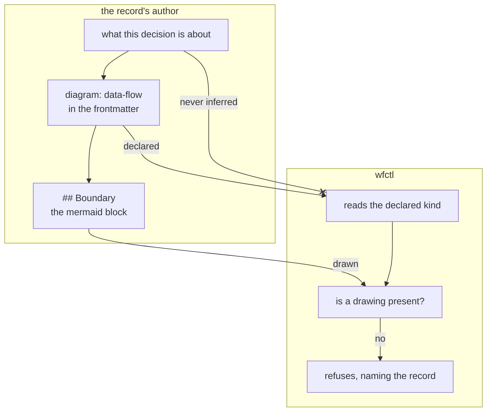

# The author declares which kind of diagram a record carries, and wfctl checks the declaration against the drawing

## Context

#109 asks that a record lead with a drawing whose kind is chosen by what the
decision is about — ownership gets a data-flow, a boundary gets a component
sketch, a lifecycle gets a state diagram. Naming three kinds is the easy half.
The half that has to be decided is who says which kind a given record needs.

Nothing in a record announces its kind today. `record-template.md` has one
optional `Boundary` section and no vocabulary for what goes in it, so the
twenty-two records that already draw picked their shape by feel. Read as a
corpus they are consistent in a way no rule produced: the ownership decisions
drew flows, and the ones about a thing moving between states drew states. The
practice is real and unstated.

The kind is a property of the decision, not of the file. `wfctl-runs-the-
verification` is about who may assert a verdict; `stop-kind-is-a-field-not-an-
event` is about what a payload carries. Both are three paragraphs of English
whose subject is never named as a noun a parser could find.

## Direct baseline

Name the three kinds in `architecture-decisions/SKILL.md`, give
`record-template.md` a sentence telling the author to pick the one that fits,
and check nothing. The mapping ships as guidance and the author follows it or
does not.

This is what the skill does today for `Owns truth`, and `Owns truth` is the
section the skill itself says gets dropped most often — its own verification
list carries a line for the half that goes missing. Guidance with no check is
the arrangement `a-rule-is-expressed-as-a-check` was accepted to end, and it
applies here by its own test: a missing drawing is visible in the record, which
is an artifact the work already produces.

## Decision

The record's frontmatter carries a `diagram` key naming one of `data-flow`,
`component` or `state`. The author writes it. wfctl reads it, and checks only
that the record carries a drawing — it never decides which kind the decision
needed.

The key sits in frontmatter beside `status` and `supersedes` rather than in the
body, because it is read by a parser and not by a reader: `_frontmatter` already
returns it, and `parse_record` lifts it onto `Record` the way it lifts the other
two.

## Owns truth

The author owns "what kind of diagram does this decision need?". The kind
follows from the decision's subject — whether the thing being settled is a value
moving between components, a line between them, or a sequence one thing passes
through — and that subject is stated in prose written for a human.

wfctl cannot compute it. It would have to classify English: decide that "who may
assert a verdict" is ownership and "what a payload carries" is not, across
thirty-eight records that share a vocabulary and differ only in what they are
about. Every mechanism available is a keyword heuristic, and a heuristic that is
wrong on one record in ten produces a refusal the author cannot argue with and
cannot fix except by writing prose that scores better. That is worse than no
check: it moves authority over the record's subject from the person who made the
decision to a string match.

What wfctl does own is "does this record carry the drawing it claims?" — a
question about the file, answerable from the file, and the half a declaration
makes checkable.

## Boundary

The crossed edge is the decision. Everything else is a read.

## Considered

- **wfctl infers the kind from the record's prose** — no key to write, nothing
  for an author to get wrong, and the mapping ships as one rule instead of two
  halves. Loses on what the inference would have to be: a keyword match over
  English written for a human. A rule that is wrong occasionally is worse here
  than no rule, because its refusal cannot be argued with.
- **The kind is a heading rather than a key** — `## Data flow` instead of
  `## Boundary` plus `diagram: data-flow`. Equally sound, and it loses on a
  narrow fact: `_arch` already parses frontmatter into a dict and already lifts
  two keys off it, so a third costs one line, while a variable heading means the
  section scanner learns three names and `arch context`'s projection has to
  agree about all of them.
- **No kinds at all — require a drawing and let the author draw what fits** —
  this is what the corpus already does, and it produced twenty-two records whose
  shapes agree. Genuinely tempting, and it loses to #109's third scope item:
  without a declared kind there is no name for what a drawing is *of*, and
  traceability has nothing to hang on.

## Consequences

`Record` gains a `diagram` field, and it is `""` for every record on disk today.
Absent must therefore read as "not declared", never as a default kind — the same
rule `status` already carries, for the same reason.

The three names are wfctl's and are held against the template by a test, the way
`required-sections-are-wfctls` holds the spec and plan section lists. A fourth
kind is a change to both.

## Log

- 2026-09-16  proposed    — the level-2 gate for #109, first of two
