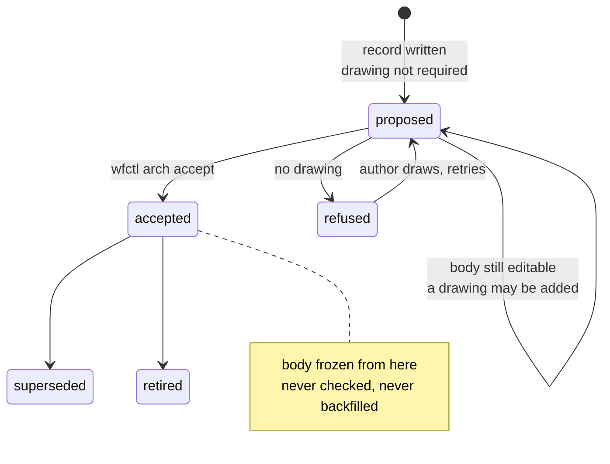

# The drawing is required to accept a record, not to write one

## Context

#109 wants the drawing required. Required *when* is the question the issue does
not ask, and the corpus answers it before any code is written.

Thirty-eight records sit under this repo's arch root. Counting a fenced block
anywhere in the file as a drawing:

|  | accepted | proposed | rejected |
|---|---|---|---|
| carries a drawing | 7 | 13 | 2 |
| carries none | **5** | 11 | 0 |

That is a looser measure than the gate below applies, and Consequences restates
the count under the strict one. It is kept here because the argument that
follows turns on the accepted column, which both measures agree is nonzero.

The five are the problem. `architecture-decisions` freezes an accepted record's
body — "exactly two things ever change", `status` and an appended `Log` line —
and states the consequence for this exact case in its own words: *"an accepted
record written before a section existed does not carry it, and is not
backfilled. A missing section in an accepted record is a date, not a defect."*

So a requirement that binds every record on disk contradicts an accepted rule in
the same skill that would carry it. A requirement that binds only new files
leaves the eleven proposed records — which are held deliberately, pending
end-to-end validation, not drifting — outside it forever, and they are the
records most likely to be accepted next.

## Direct baseline

Require the drawing at write time: `record-template.md` stops marking `Boundary`
optional, and the skill's verification list gains a line. Nothing checks it, and
nothing is said about the fifty-four records already written.

Rejected for what it does to the five. A rule stated with no scope reads as
applying to everything it can describe, so the next reader running the skill's
verification list over the corpus finds five failures and no way to fix them
that the same skill does not forbid. The rule and its exemption have to arrive
together or the exemption is not real.

## Decision

The drawing is checked at the `proposed` → `accepted` transition. `wfctl arch
accept` refuses a record that carries no drawing, and `acceptable` reports the
same answer so a listing never offers a record whose own suggested command then
fails.

No other command checks. Writing a record with no drawing succeeds; the record
simply cannot be accepted until it has one.

## Owns truth

wfctl owns "may this record be accepted?", and that ownership is not new — it
already answers it from two facts, that the status is `proposed` and that a
`## Log` section exists to append the transition to. This adds a third fact of
the same kind.

The skill cannot own it. A skill is prose delivered to whoever happens to read
it, and the reader here is frequently an agent running unattended under
`auto_approve`, where the whole point is that nobody is present to notice an
omission. `a-rule-is-expressed-as-a-check` settles which of the two carries a
rule like this: the violation is visible in the record, so it is a check.

The author cannot own it either, for a reason narrower than trust: the author is
the one whose omission the requirement exists to catch, and a record is written
at the moment its author is least able to see what is missing from it.

## Boundary

The gate sits on one edge. The five accepted records are already past it.

## Considered

- **Check every record, exempting accepted ones by a date or a list** — binds
  the corpus, and honours the frozen bodies. Loses on what the exemption would
  have to be: a list of five slugs in wfctl's source, or a cutoff date compared
  against a `Log` line. Both are the record's own history restated somewhere it
  can drift from, and `accepted` already carries the fact that matters.
- **Check at write time, in the skill's verification list only** — the baseline
  above, and it is where the requirement naturally reads. It loses to the reader:
  under `auto_approve` the list is read by the agent that just wrote the record,
  and a checklist is not evidence.
- **Check in `wfctl arch check`** — that command already asks a question about a
  record and a reviewer, so a format check reads as belonging there. Equally
  sound, and it loses on scope rather than fault: `arch check` asks whether the
  reviewer will *read* the record, which is a question about git, and a record
  that fails it is fixed by committing rather than by drawing.

## Consequences

Twenty-four proposed records must gain a drawing and a declared kind before they
can be accepted, and until they do they do not appear in `wfctl arch accept`'s
promotable listing. That is the cost of this decision stated plainly; it is real
work, and it lands on whoever accepts them rather than on this change.

Twenty-four rather than the eleven in Context, because the gate and that table
measure different things. The table counts a fenced block anywhere in the file;
the gate wants one under `## Boundary`, and a declared kind besides. Only the two
records this decision arrives with satisfy it.

`acceptable` and `accept` must agree, which is the reason `acceptable` was
exported in the first place — its docstring already names the failure a second
copy of the rule produces.

The accepted records with no drawing — five under the loose measure, ten under
the strict one — stay as they are, permanently, and `wfctl arch context` goes on
projecting them. A reader who counts drawings across the corpus will always find
some missing, and that is the correct outcome rather than a gap to close later.

## Log

- 2026-09-16  proposed    — the level-2 gate for #109, second of two
- 2026-09-17  proposed    — Consequences said eleven proposed records, counting
  files with no fenced block anywhere. The gate counts a fence under
  `## Boundary` plus a declared kind, which twenty-four fail. The decision is
  unchanged; its stated price was understated by more than half
