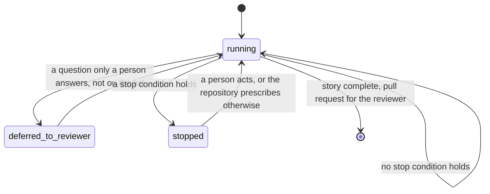

# An unattended run goes as far as it can and stops only on a named stop condition

## Context

`auto_approve` is one switch, and its intent is that a run performs the whole
workflow unattended, makes its own decisions, and records the trade-offs for a
reviewer at the pull request (`approval-mode-is-stored-intent`). What that
intent has never had is the other half: a stated list of the conditions under
which the run stops anyway, because only a person can move it.

The list exists in the code without being named as one. `attention` reports three
kinds (`wfctl-owns-whether-a-worktree-wants-a-human`), and each was added for its
own reason:

1. `blocked`, when the host refused an outward action and only a person can take
   it.
2. `manual`, when the outstanding pass is one a person performs.
3. `stalled`, when a step was repeated with its evidence unchanged.

A fourth condition added the same way would work. What it would not do is tell a
reader, or a repository deciding how much to trust an unattended run, what the
complete set of stops is and which of them they may change.

## Direct baseline

Leave the three kinds as they are and state no rule about the list. The next
condition is added as a fourth `attention` kind, with its own override under
whatever key its author picks. No new concept is introduced.

It works for each condition and leaves the question one level up where it is. A
repository wanting to know "when will an unattended run stop and wait for me?"
reads every record that added a kind, and the code, to find out.

## Decision

An unattended run proceeds until a stop condition holds, and then it stops and
reports that condition in `attention`. Stop conditions are a closed, named list
that wfctl owns. Nothing outside the list stops an unattended run, and a question
only a person can answer that is not on the list goes to the reviewer at the pull
request instead.

Each stop condition has a default handling, and the list says which of them a
repository may prescribe differently. None is prescribable today. When one
becomes so, a repository prescribes it in `wfctl.json` under `stop_conditions`,
keyed by the condition's name.

| Stop condition | Why the run stops | Default | Prescribable |
|---|---|---|---|
| `blocked` | the host refused an outward action | stop | no, the host's permission layer decides |
| `manual` | the outstanding pass is one a person performs | stop | by declaring the pass or not |
| `stalled` | a step repeated with its evidence unchanged | stop | not yet |

Merging, force-pushing, closing an issue, and deleting a branch are not on the
list, because wfctl never performs them in any mode. They are not stops a run
reaches; they are actions a run does not take.

## Owns truth

wfctl owns "must this unattended run stop now, and on which condition?".

The agent cannot compute it, for two reasons. The agent is the party with a
reason to keep going, so a stop it decides for itself is a self-report, which
`wfctl-runs-the-verification` removes from the agent's side for the same reason
here. And `stalled` is a count that has to outlive the agent's memory: a run long
enough to stall is one whose conversation is cleared or compacted partway, and an
agent's tally resets to zero at the moment the bound should fire
(`wfctl-counts-the-passes`). wfctl reads the count from disk on every report.

The repository owns "how should this condition be handled here?", for the
conditions the list marks prescribable. wfctl cannot compute it, because the
answer is a repository's tolerance for unattended work, and a default is only
the answer for a repository that has not said otherwise.

## Boundary

The edge into `stopped` is the decision. wfctl takes it from its own reading of
the list, and nothing the agent reports moves the run along that edge or keeps it
off it. The edge into `deferred_to_reviewer` is the other half: a question that
needs a person but is not a stop condition does not stop the run.

## Considered

- **The direct baseline above**, each kind added on its own with no rule about
  the list. It is the smallest change, and it leaves the set of stops
  discoverable only by reading every record that added one.
- **An agent that decides its own stops**, in `speckit-orchestrate`'s
  conversation. It is sound while the conversation lasts and loses any count when
  a run is long enough to need one, the argument `wfctl-counts-the-passes`
  already made.
- **Every condition prescribable now**, a stall bound and a way to turn any
  pass into a hard stop among them. It is where the list is heading, and no
  repository has asked for any of it yet. The list names which conditions are
  prescribable so that adding one is a row, not a redesign.
- **Rename `attention` to `stop_condition` in the payload.** The concept's name
  would match the field's, and the field is part of the versioned `status
  --json` contract, so every consumer breaks for a word. A stop condition is
  reported in `attention`, and this record is where that is said.

## Consequences

`wfctl-owns-whether-a-worktree-wants-a-human` is extended, not superseded. Its
three kinds are this list's three rows, and its rank of `blocked`, then
`manual`, then `stalled` still decides which condition `attention` shows when
two hold. A fourth condition takes a rank there, and that is a contract change
that moves the payload version.

`stop_conditions` is not added to `wfctl.json` until a condition is
prescribable. When it is, `wfctl check config` validates it the way it validates
`steps`: an unknown condition name, or a value for a condition the list does not
mark prescribable, is a finding rather than a silent drop.

## Log

- 2026-09-26  proposed    — #500 level 2: plan defense adds a stop to unattended
  runs, and the stops had no list a repository could read or prescribe against
- 2026-09-27  rewritten   — #500 became an attended-only check and no longer
  adds a stop; the list stands on the three conditions that already exist
