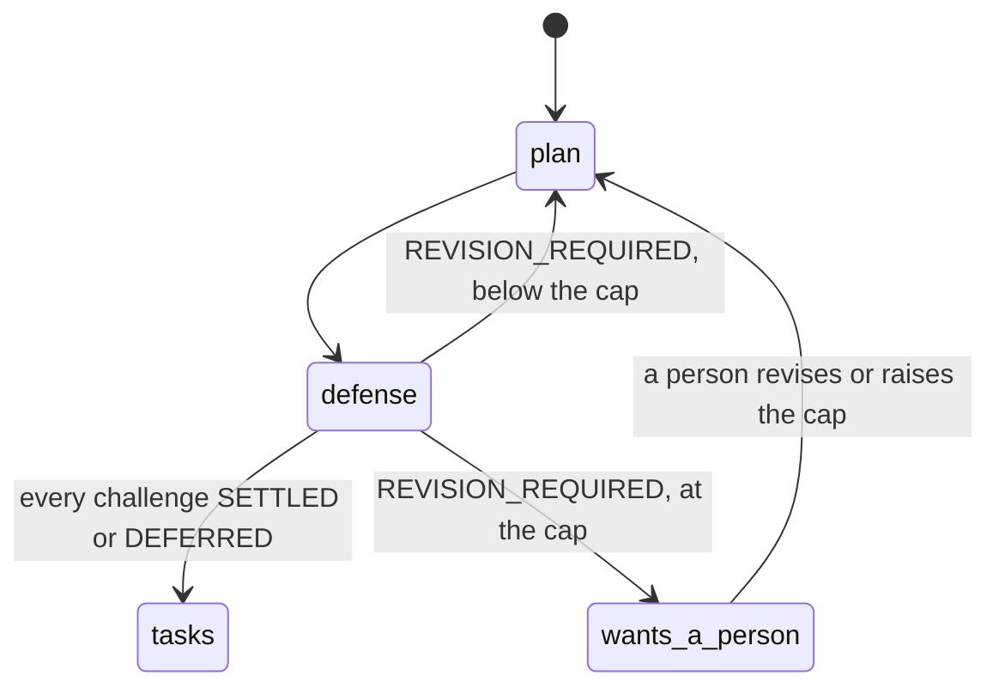

# wfctl counts the defense rounds and stops the run at the cap

## Context

Under `auto_approve`, a plan defense that finds a challenge `REVISION_REQUIRED`
sends the agent back to `plan`, and the defense runs again against the revised
plan (`an-unattended-defense-defers-what-evidence-cannot-settle`). Nothing ends
that loop. Each round rewrites `plan.md`, so the evidence differs every time and
stall detection, which fires on a step repeated with its evidence unchanged,
never sees it.

A run that revises the same plan without settling it is not making progress,
even though its files keep changing. The loop needs a bound, and the bound needs
something to hold the count.

## Direct baseline

Let `speckit-orchestrate` count in its own conversation: remember how many times
it has emitted `/speckit.plan` after a defense, and stop at the third. This is
prose in one skill and no wfctl change.

It loses the count in the case it exists for. A run long enough to revise its
plan three times is a run whose conversation is cleared or compacted partway, and
a session restart resets the tally to zero at the moment the bound should fire.
`wfctl-counts-the-passes` rejected the same baseline for the same reason.

## Decision

wfctl counts the defense rounds on a branch, and when a round returns
`REVISION_REQUIRED` at the cap, it reports that the run wants a person rather
than routing back to `plan`. The default cap is 3, and a repository can override
it.

The cap stops the run. It does not advance to `tasks` with the remaining
revisions deferred, because a plan the agent itself judged wrong three times is
the wrong foundation for tasks, and the stop is the same kind a stall already
produces.

## Owns truth

wfctl owns "how many times has this plan been revised under defense, and has it
reached the cap?".

The agent cannot compute it, because the count has to outlive the agent's memory
of it. wfctl reads it from what is on disk on every report, the same way on the
fourth round as on the first, while an agent's tally is gone after the first
`/clear`.

## Boundary

The edge into `wants_a_person` is the decision. wfctl takes it from its own
count, and nothing the agent reports about how many rounds it has run moves the
run along that edge or keeps it off it.

## Considered

- **The direct baseline above**, where orchestrate counts. It is sound while
  the conversation lasts and loses the count when a run is long enough to need
  one.
- **At the cap, defer the remaining revisions and advance to `tasks`.** It keeps
  the run fully unattended, and it builds tasks on a plan the agent has already
  said must change. Stopping costs one person's attention, and advancing costs
  every task written against the wrong plan.
- **Widen stall detection to catch this.** A stall means re-entering changed
  nothing, and here re-entering changes the plan every time. Stretching the
  stall's meaning to cover a loop that does change its files would make the
  stall mean two things, which `wfctl-owns-whether-a-worktree-wants-a-human`
  warns against for any field a consumer reads.
- **No cap, relying on the agent to converge.** It is the smallest design, and
  it leaves an unattended run able to spend a night revising one plan with
  nothing to say so the next morning.

## Consequences

Whether the stop surfaces as a new `attention` kind or as an existing one is a
level-3 decision, and either choice is a contract change to the payload that
`wfctl-owns-whether-a-worktree-wants-a-human` says moves the version.

What the count is read from, and where the override lives, are level-3
decisions. Both have to be readable by wfctl on every report without trusting a
number the agent wrote.

An attended run reaches the cap only if a person answered `REVISION_REQUIRED`
three times, since each attended revision routes to `/speckit.plan` with
`auto: false` and stops for them anyway. The count applies in both modes, and it
only bites unattended.

## Log

- 2026-09-26  proposed    — #500 level 2: the unattended revise loop changes its
  evidence every round, so nothing bounds it
