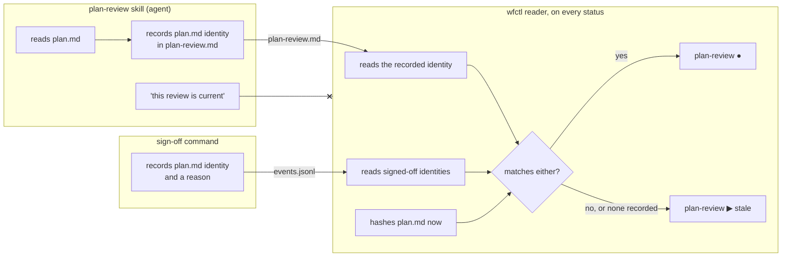

# wfctl measures a plan review against the plan it read, not the plan that exists now

## Context

`plan-review` is a pass under `plan` that critiques `spec.md` and `plan.md`
before `tasks` expands them into work. Its output is a report in the feature
directory, and the report never says approved or rejected. What it produces is
findings, and the expected response to a finding is a revised `plan.md`.

That makes the revised plan the ordinary path through this pass, not an edge
case. The reader a declared pass gets from `wfctl.json` is
`build_file_exists_reader`, which answers "does this path exist" and nothing
else. Under that reader the sequence below reports the pass done at its last
step, and the report it points at describes a plan that no longer exists:

```
plan.md v1  ─►  plan-review.md reviews v1   ─►  plan-review ●   true
plan.md v2  ─►  plan-review.md still exists ─►  plan-review ●   false
```

So the pass is wrong exactly when it is used as intended. A reader who sees
`plan-review ●` and runs `/speckit.tasks` decomposes a plan nobody reviewed.

The candidate skill already records a content identity for every artifact it
read, computed with `git hash-object`, in a `Reviewed inputs` table at the top
of the report. It does so to let a human spot a stale report. Nothing reads that
table mechanically today.

`plan-review` ships with wfctl, so it is a built-in sub-step rather than a
declared one, and a built-in `SubStep` takes any callable as its reader
(`_pipeline.py`, `SubStep.reads`). The limit on what `wfctl.json` can express
does not bind it.

## Direct baseline

Give the built-in pass the same reader a declared pass gets:
`build_file_exists_reader("plan-review.md")`. The skill keeps recording content
identities in the report, and a human who opens it can compare them by hand.
Freshness for every file-evidence pass is then fixed once, in a separate change
that decides what a declaration can bind to.

It costs nothing now and adds no format contract. It fails the case above on
every revised plan, which is the case the pass exists for, and it leaves the
comparison to a reader who has to know to make it.

## Decision

The `plan-review` pass reads the `plan.md` identity its report recorded, hashes
`plan.md` as it is now, and reports the pass done only when the two agree. A
mismatch reads `in_progress` with the reason `stale; plan.md changed since the
review`. A report that records no `plan.md` identity reads `in_progress` too,
with a reason saying so.

A stale pass moves the current step back to `plan` however far the pipeline has
gone, `implement` included. Whether `tasks.md` exists plays no part in it; that
would read a file's presence as the review's moment having passed, and a plan
edited and then expanded by a hand-run `/speckit.tasks` is the case it misses.

The pass also reads done when a sign-off records the `plan.md` identity as it
is now. A sign-off is written by a wfctl command that requires a reason, and it
covers the one identity it recorded, so the next edit makes the pass stale
again. It exists because wfctl cannot tell a typo from a changed design, and
without it every late edit costs a full review.

The line wfctl reads is a wfctl constant beside the reader, and a test in
wfctl's own suite holds it against the report format the skill ships.

## Owns truth

wfctl owns "is this review about the plan that exists now?".

The skill cannot answer it. It runs once, at review time, and the question
arises afterwards, whenever `plan.md` is edited; the skill is not running then,
and nothing calls it back. Anything it wrote about currency is a claim about the
moment it wrote it.

The agent cannot answer it either. A report that says "current" is a
self-report, and `wfctl-runs-the-verification` refuses those for the same
reason: nothing distinguishes a true one from a false one.

The report owns "which `plan.md` did this review read?". Only the reviewing
process knows what it read, and only at the moment it read it. wfctl cannot
reconstruct that later; once `plan.md` has changed, nothing on disk says what it
held when the review read it.

## Boundary



## Considered

- **wfctl records the identity itself,** through a verb the wrapper calls after
  the review writes its report. The format would then belong to wfctl outright,
  and nothing agent-written would be parsed. It loses on scope rather than on
  merit: it adds a verb and a store, which is the general answer to evidence
  freshness that every file-evidence pass needs, and that answer should be
  designed once for all of them rather than first for this one.
- **Compare modification times,** reporting the pass done when `plan-review.md`
  is newer than `plan.md`. It needs no format contract. It loses because a
  checkout does not preserve modification times: the feature directory reaches
  durable storage on `specs-trunk`, and a restore from there stamps both files
  with the same moment, so a stale report reads as fresh.
- **Bind `spec.md` as well.** `clarify` can rewrite `spec.md` after a review. It
  was left out to keep the contract to one line; a revised spec that changes
  what the plan must cover almost always forces a revised plan, which this
  reader already catches.
- **A `binds:` key on declared evidence in `wfctl.json`.** This fixes every
  declared pass, and it changes what a repository's configuration can express,
  which `a-step-carries-sub-steps-one-level-deep` bounded on purpose. It is
  the general fix, and it is not this decision.

## Consequences

This is the third place wfctl compares a recorded identity against a live one.
The install manifest records a `content_hash` that `doctor` recomputes
(`drift-is-measured-against-the-recorded-source`), and `wfctl verify` binds its
verdict to a commit and a dirty flag. Each of the three chose its own record
format. A general answer to evidence freshness, which #502 owns for the rest of
the pipeline, should be able to absorb this one without changing what the report
records.

The report format stops being the skill's alone. A change to how the `Reviewed
inputs` table spells its `plan.md` row is a change to a contract, and the test
beside the reader is what says so.

The sign-off is the one identity wfctl writes itself, which is the shape the
first option under Considered set aside for scope. It is narrower than that
option: it uses the event log wfctl already keeps, rather than a store of its
own, with a copy in the attestation the review already commits, and it records
an acceptance a person or agent chose to make, never a review. Whether an agent
may make it alone is the waiver-authority question #100 owns; the recorded reason is what keeps it visible meanwhile.

wfctl reads a sign-off back from its own event log, `events.jsonl`, never from
the attestation.
The agent writes the scan file on every review, so a sign-off line it typed there
would read the same as one wfctl wrote, and would escape the count that bounds
the agent. The section in the attestation is the pull request reviewer's copy.

wfctl also reads the report's open BLOCKER count. A review of the current plan
with a BLOCKER open reads `in_progress`, so the pipeline does not reach `tasks`
over a finding the review graded as blocking. That count is the review's claim
about the plan, not about its own currency, so reading it does not reopen the
self-report this record refuses: the reviewer grades the plan, and wfctl
decides whether the grade is still about the plan that exists.

The review also keeps a copy of the `plan.md` it read, so the next review and a
sign-off can see what changed; the identity says only that something did. The
copy never decides staleness. A copy edited by hand would otherwise make a stale
review read current, and the recorded identity is what the reviewing process
wrote at the moment it read.

A report missing its identity is treated as promised evidence gone silent
(`promised-evidence-blocks-on-silence`). The skill undertook to write it, so its
absence holds the pass rather than passing it.

## Log

- 2026-09-26  proposed    — #501. A review pass whose expected response is a
  revised plan reported itself done against every revised plan.
- 2026-09-26  amended     #501. A stale review routes back past `tasks`, and a
  sign-off with a reason stands in for a review of a harmless edit.
- 2026-09-27  amended     #501. An open BLOCKER in a review of the current plan
  holds the pipeline before `tasks`.
- 2026-09-27  amended     #501. The plan review found a sign-off could be typed
  into the scan file by the agent it bounds. wfctl now reads it from its own
  event log.
