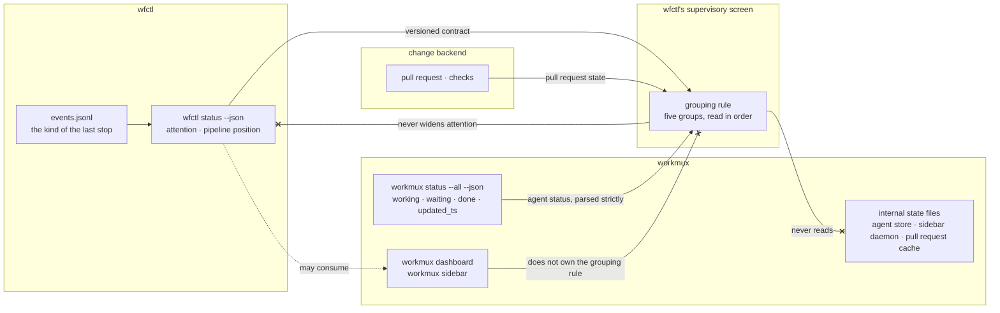

# wfctl owns how the supervisory screen groups worktrees, and its status payload stays a contract any other screen may read

## Context

A person running several agents in parallel wants one screen that answers which
worktree needs them, and why. Nothing answers it today. The screens that exist
carry runtime liveness without workflow meaning, and `wfctl status` answers for
one worktree at a time.

The screen sorts every worktree on the machine into five groups, read in this
order:

| Group | Cases |
|---|---|
| Needs attention | blocked, manual, stalled, agent waiting at a prompt, agent silent too long, orphaned, PR with failing CI |
| In review | PR open |
| Working | agent working, pipeline advancing |
| Idle | parked on purpose (last stop not continued), not started |
| Done | merged, issue closed |

An agent is silent too long when workmux still reports it as working and its
status has not been updated for longer than a threshold. The agent's hooks
update that status when a prompt is sent, when each tool call finishes, when a
permission prompt opens, and when a turn ends. Pressing Esc fires none of them,
so an interrupted agent reads as working until someone looks; a hung agent reads
the same way.

Each group joins facts from three owners. wfctl owns the evidence: `attention`,
the pipeline position, and the kind of the last stop. workmux owns the agent:
`working`, `waiting`, or `done`, and when that was last reported. The change
backend owns the pull request and its checks. No group is computable from one
of them alone, and the Needs attention group is wider than wfctl's `attention`
field, which covers `blocked`, `manual`, and `stalled` and nothing else.

workmux already ships two screens, `workmux dashboard` and `workmux sidebar`,
and both read agent state across every repository. What they lack is the
workflow column. So the question this record answers is not how to draw a
supervisory screen; it is who decides how its worktrees are grouped.

The question has a test that separates the options. On 2026-09-26 the grouping
rule changed in one conversation: an agent that stopped without saying so moved
into Needs attention. The test is whether a change like that can ship without
waiting for an upstream workmux release.

## Direct baseline

Build nothing. A person runs `wfctl status` inside each worktree and keeps
`workmux dashboard` open beside it, and joins the two by eye.

This is not a credible option, and it is stated once rather than scored. It
cannot produce one screen: `wfctl status` resolves its worktree from the working
directory, so eleven worktrees mean eleven panes, and nothing groups them. The
comparison that matters is between the decision and the first alternative under
Considered.

## Decision

wfctl owns the grouping on its supervisory screen: which group each worktree
belongs in, and the order the groups are read in. A change to either ships in a
wfctl release and never waits on workmux. How the screen lays that out is the
render work's to decide, not this record's.

`wfctl status --json` stays a public, versioned contract. workmux, an editor, or
any other tool may consume it and draw its own view, and none of them becomes
the owner of this one.

The screen owns the join and nothing else. It computes each group at render
time from the three owners' answers, holds nothing between refreshes, and
writes nothing back to any of them. It reads each owner only through a surface
that owner documents for other tools. In particular, the screen never widens
`attention`; that field stays a verdict over evidence, and a waiting or silent
agent reaches Needs attention through the grouping rule rather than through the
payload.

## Owns truth

**wfctl owns _"which group does this worktree belong in, and which group is read
first?"_.** workmux cannot compute it, for three reasons:

1. **It has nowhere to put the answer.** workmux 0.1.268's dashboard columns
   are closed Rust enums (`AgentColumn` and `WorktreeColumn`,
   `src/config.rs:238-313`), and an unknown name is rejected. The sidebar's
   template tokens are a fixed list, and any other name fails with
   `unknown token '…' at column …`
   (`src/command/sidebar/template/parser.rs:255`). Sidebar grouping is one of
   `off`, `project`, or `session` (`src/config.rs:542-550`), and the dashboard
   sorts rather than groups. No column, token, or grouping renders a value
   computed outside workmux.
2. **It has no hook that could supply one.** workmux runs three hooks,
   `post_create`, `pre_merge`, and `pre_remove` (`src/config.rs:787-796`), and
   all three are lifecycle hooks. None of them feeds a column, a status, or a
   group.
3. **Half the rule is evidence workmux cannot read.** Idle and Needs attention
   split on the kind of the last stop, which lives in wfctl's `events.jsonl`
   under the XDG state directory. `attention` rests on the same log. To group by
   either, workmux would have to reimplement wfctl's reader, and a rule held by
   two owners drifts; that is the argument
   `wfctl-owns-whether-a-worktree-wants-a-human` makes for the rank of
   `attention`, applied one level up.

The first two reasons are true of this release and could change upstream. The
third cannot, since it is about who holds the evidence rather than about what
workmux supports today. An extensible workmux would make the alternative
cheaper; it would not change who owns the rule.

**workmux keeps _"what is the agent in this pane doing, and when did it last
say?"_.** wfctl cannot compute it. tmux reports only whether a pane is alive:
`window_activity` advances on a spinner redraw exactly as it does on streamed
output, and `pane_current_command` reports the title the agent sets for itself
rather than a process name. The silent-too-long case does not take this question
over. It reads workmux's answer and its age, and applies a threshold to the age;
it never claims to know what the agent is doing.

**The change backend keeps _"is there a pull request, and are its checks
passing?"_.** wfctl reads it through its own change backend, as it already does
for `wfctl change`.

## Boundary

The three `--x` edges are the decision. The first keeps the join from leaking
into the evidence: the screen reads `attention` and never writes a runtime or
pull-request fact into it. The second keeps the screen on surfaces workmux
documents for other tools; its internal state files carry no promise about
their path, name, or shape. The third keeps workmux a consumer: its screens may
read the same contract, and a change to the grouping rule never waits on them.
The dotted edge is optional by design; nothing on wfctl's side depends on
workmux drawing anything.

## Considered

- **workmux owns presentation and consumes wfctl.** This is the strongest
  alternative, and it wins the counter-test outright: wfctl writes no render
  loop, no discovery, and no keyboard handling, and workmux already has
  navigation, jump-to-pane, and its own runtime and pull-request columns. It is
  not chosen because it fails the headline test on grouping rather than on
  displayed text. Even a generic column that printed wfctl's text would not let
  workmux group worktrees by the five groups, so the first change to the rule
  (the one made on 2026-09-26) would wait on a workmux feature, then on a
  release, and every change after it the same way. The strongest form of this
  option has wfctl compute the group into the payload and workmux group by that
  field. That makes the loop circular instead: two of the groups depend on
  workmux's own agent status, so wfctl would read workmux to compute a value
  workmux then reads back. It stays available as an adapter over the public
  contract.
- **wfctl owns the screen, and the cross-worktree status stays internal.** This
  is the same screen as the decision, with the contract kept private. It is not
  chosen because it withdraws a promise already made:
  `wfctl/contracts/status-payload.json` is versioned at `1.0` and consumed
  outside the package today. Keeping it public costs nothing the decision does
  not already pay.
- **Collapse runtime and workflow into one verdict, and group by `attention`
  alone.** It is simpler, and it is what the supervisory-view plan first said.
  It is not chosen because the two answer different questions: an agent waiting
  at a prompt has `attention: null`, and an agent that exited after reporting a
  block is idle with `attention: blocked`. A screen driven by one column answers
  "which worktree needs me" wrongly in both cases.
- **Read workmux's own interrupted signal.** workmux 0.1.268's sidebar daemon
  marks a working pane interrupted when its last five lines have not changed for
  10 seconds (`src/command/sidebar/daemon.rs:1788-1809`, `2127`), which catches
  Esc within seconds rather than minutes. It is not chosen because the signal
  reaches other processes only through a file workmux writes for its own
  dashboard (`~/.local/state/workmux/runtime/<backend>__<instance>.json`), which
  exists only while the daemon runs and carries no promise about its path or
  shape. `workmux status --json` does not report it.
- **Hash the pane in wfctl.** This matches workmux's 10 seconds without reading
  its files. It is not chosen for two reasons:
  1. It makes wfctl a second owner of "what is the agent doing", computed by a
     copy of workmux's logic that drifts from it.
  2. It needs each pane's previous hash, so the screen would hold state between
     refreshes.

## Consequences

**Agent status comes from `workmux status --all --json`, parsed strictly.** It
is workmux's documented surface for automation, with a section on reading it
safely, and it spans every repository. It carries no version field, so the
screen requires the fields it reads (`workdir`, `status`, `updated_ts`), accepts
only the status values it knows, and shows that worktree's runtime state as
unknown on any mismatch rather than guessing. That fails closed on a changed
shape. It does not catch a value that keeps its name and changes its meaning,
and neither would a version field. `--all` is present in 0.1.268 and absent in
0.1.211, so the screen states the workmux version it needs.

**The silent-too-long threshold has to outlast the longest silent tool call.**
A single tool call reports nothing until it finishes, so a threshold shorter
than the slowest test suite puts a healthy agent in Needs attention. The
threshold is configurable, and the render work picks its default; fifteen
minutes is the starting point. An upstream request asks workmux to report its
interrupted signal through `workmux status --json`. Once it does, the screen
reads it there and the threshold becomes a fallback.

**The pull request state is fetched by wfctl.** workmux already fetches the same
state through `gh` every 30 seconds (`src/command/sidebar/daemon.rs:907`) and
caches it, but the cache is one of its internal state files, so wfctl fetches
again through its own change backend. That is a second request per refresh
interval against GitHub, and it is the price of the second `--x` edge.

**The payload gains the kind of the last stop.** Grouping an orphaned worktree
depends on it, and `pipeline-state-is-one-payload` forbids a view that computes
a fact while printing, so the screen cannot open `events.jsonl` itself. The
field joins the two already owed to the payload (`tasks_done` and
`tasks_total` as numbers, and the unsatisfied pass's evidence path).

**The keyboard is not decided here.** The first milestone is read-only, and rich
supplies `Live` and `Layout`, so the screen ships without reading a keypress.
Whether navigation costs a hand-written `termios` loop or a runtime dependency is
the second milestone's question.

## Log

- 2026-09-26  proposed    — the supervisory screen needs one owner for its grouping rule, and workmux has no column, token, grouping, or hook that could carry a rule computed outside it
