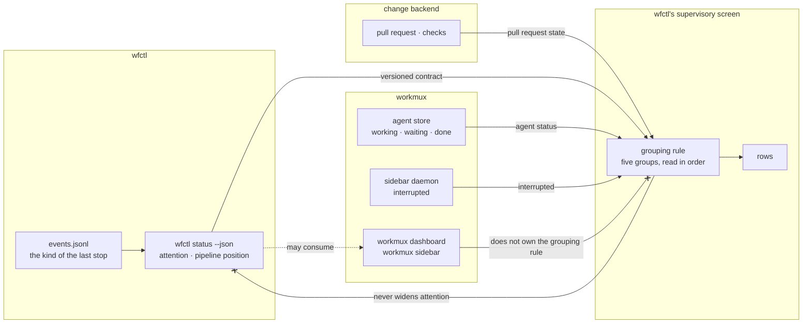

# wfctl draws the supervisory screen, and its status payload stays a contract any other screen may read

## Context

A person running several agents in parallel wants one screen that answers which
worktree needs them, and why. Nothing answers it today. The screens that exist
carry runtime liveness without workflow meaning, and `wfctl status` answers for
one worktree at a time.

The screen groups every worktree on the machine into five groups, read in this
order:

| Group | Cases |
|---|---|
| Needs attention | blocked, manual, stalled, agent waiting at a prompt, agent interrupted, orphaned, PR with failing CI |
| In review | PR open |
| Working | agent working, pipeline advancing |
| Idle | parked on purpose (last stop not continued), not started |
| Done | merged, issue closed |

Each group joins facts from three owners. wfctl owns the evidence: `attention`,
the pipeline position, and the kind of the last stop. workmux owns the agent:
`working`, `waiting`, `done`, and the derived `interrupted`. The change backend
owns the pull request and its checks. No group is computable from one of them
alone, and the Needs attention group is wider than wfctl's `attention` field,
which covers `blocked`, `manual`, and `stalled` and nothing else.

workmux already ships two screens, `workmux dashboard` and `workmux sidebar`,
and both read a per-pane agent store across every repository. What they lack is
the workflow column. So the question this record answers is not how to draw a
supervisory screen; it is who draws it.

The question has a test that separates the options. On 2026-09-26 the grouping
rule changed in one conversation: an interrupted agent, one still marked as
working whose pane has printed nothing for 10 seconds, moved into Needs
attention. The test is whether a change like that can ship without waiting for
an upstream workmux release.

## Direct baseline

Build nothing. A person runs `wfctl status` inside each worktree and keeps
`workmux dashboard` open beside it, and joins the two by eye.

This is not a credible option, and it is stated once rather than scored. It
cannot produce one screen: `wfctl status` resolves its worktree from the working
directory, so eleven worktrees mean eleven panes, and nothing groups them. The
comparison that matters is between the two options below.

## Decision

wfctl owns the canonical supervisory presentation. It draws its own screen, and
the grouping rule, the order of the groups, and what a row shows are wfctl's to
change on its own release cadence.

`wfctl status --json` stays a public, versioned contract. workmux, an editor, or
any other tool may consume it and draw its own view, and none of them becomes
the owner of this one.

The screen owns the join and nothing else. It holds no fact of its own: each
group is computed at render time from the three owners' answers, and no answer
is written back to any of them. In particular, the screen never widens
`attention`; that field stays a verdict over evidence, and a waiting or
interrupted agent reaches Needs attention through the grouping rule rather than
through the payload.

## Owns truth

**wfctl owns _"which group does this worktree belong in, and which group is read
first?"_.** workmux cannot compute it, for three reasons:

1. **It has nowhere to put the answer.** workmux 0.1.268's dashboard columns
   are closed Rust enums (`AgentColumn` and `WorktreeColumn`,
   `src/config.rs:238-313`), and an unknown name is rejected. The sidebar's
   template tokens are a fixed list, and any other name fails with
   `unknown token '…' at column …`
   (`src/command/sidebar/template/parser.rs:255`). Sidebar grouping is one of
   `off`, `project`, or `session` (`src/config.rs:542-550`), and the dashboard
   sorts rather than groups. No column, token, or grouping renders a value
   computed outside workmux.
2. **It has no hook that could supply one.** workmux runs three hooks,
   `post_create`, `pre_merge`, and `pre_remove` (`src/config.rs:787-796`), and
   all three are lifecycle hooks. None of them feeds a column, a status, or a
   group.
3. **Half the rule is evidence workmux cannot read.** Idle and Needs attention
   split on the kind of the last stop, which lives in wfctl's `events.jsonl`
   under the XDG state directory. `attention` rests on the same log. To group by
   either, workmux would have to reimplement wfctl's reader, and a rule held by
   two owners drifts; that is the argument
   `wfctl-owns-whether-a-worktree-wants-a-human` makes for the rank of
   `attention`, applied one level up.

The first two reasons are true of this release and could change upstream. The
third cannot, since it is about who holds the evidence rather than about what
workmux supports today.

**workmux keeps _"what is the agent in this pane doing?"_.** wfctl cannot
compute it. tmux reports only whether a pane is alive: `window_activity`
advances on a spinner redraw exactly as it does on streamed output, and
`pane_current_command` reports the title the agent sets for itself rather than
a process name. `interrupted` is workmux's too: its sidebar daemon hashes the
last lines of each working pane and marks the pane interrupted once the hash has
not changed for 10 seconds (`src/command/sidebar/daemon.rs:1788-1809`, `2127`).

**The change backend keeps _"is there a pull request, and are its checks
passing?"_.** Neither wfctl nor workmux owns it; both only fetch it.

## Boundary

The two `--x` edges are the decision. The first keeps the join from leaking into
the evidence: the screen reads `attention` and never writes a runtime or
pull-request fact into it. The second keeps workmux a consumer: its screens may
read the same contract, and a change to the grouping rule never waits on them.
The dotted edge is optional by design; nothing on wfctl's side depends on
workmux drawing anything.

## Considered

- **workmux owns presentation and consumes wfctl.** This is the strongest
  alternative, and it wins the counter-test outright: wfctl writes no render
  loop, no discovery, and no keyboard handling, and workmux already has
  navigation, jump-to-pane, and the runtime and pull-request columns. It also
  couples in the better direction, since workmux would read wfctl's versioned
  contract rather than wfctl reading workmux's unversioned files. It is not
  chosen because it fails the headline test on grouping rather than on row
  text. Even a generic column that printed wfctl's text would not let workmux
  group rows by the five groups, so the first change to the rule (the one made
  on 2026-09-26) would wait on a workmux feature, then on a release, and every
  change after it the same way. The strongest form of this option has wfctl
  compute the group into the payload and workmux group by that field. That
  makes the loop circular instead: two of the groups depend on workmux's own
  agent status, so wfctl would read workmux to compute a value workmux then
  reads back. It stays available as an adapter over the public contract.
- **wfctl owns the screen, and the cross-worktree status stays internal.** This
  is the same screen as the decision, with the contract kept private. It is not
  chosen because it withdraws a promise already made:
  `wfctl/contracts/status-payload.json` is versioned at `1.0` and consumed
  outside the package today. Keeping it public costs nothing the decision does
  not already pay.
- **Collapse runtime and workflow into one verdict, and group by `attention`
  alone.** It is simpler, and it is what the supervisory-view plan first said.
  It is not chosen because the two answer different questions: an agent waiting
  at a prompt has `attention: null`, and an agent that exited after reporting a
  block is idle with `attention: blocked`. A screen driven by one column answers
  "which worktree needs me" wrongly in both cases.

## Consequences

**wfctl reads three workmux files that carry no contract.** The agent store
(`~/.local/state/workmux/agents/*.json`), the daemon's runtime file
(`~/.local/state/workmux/runtime/<backend>__<instance>.json`, which carries
`interrupted_pane_ids`), and, if the screen reuses workmux's fetch, the pull
request cache (`$XDG_CACHE_HOME/workmux/pr_status_cache.json`). None is
versioned, so a workmux release can change their shape with no notice. This is
the price of the headline test, and it is a softer failure than the one it
avoids: a changed file degrades one column to an unknown glyph, while under the
alternative a changed rule cannot ship at all. The screen treats an absent or
unparseable file as unknown and never as a state.

**Interrupted is visible only while workmux's sidebar daemon runs.** The daemon
is what computes it, and the runtime file carries its own `updated_ts` so that a
reader can ignore a stale one. Without the daemon, an interrupted agent reads as
Working, and the screen says the signal is unavailable rather than that nothing
is wrong.

**The pull request state is fetched twice or read from a cache nobody
promised.** workmux's daemon already fetches it through `gh` every 30 seconds
(`src/command/sidebar/daemon.rs:907`). The screen either fetches it again
through wfctl's own change backend, or reads workmux's cache and inherits the
same daemon dependency as `interrupted`. That choice belongs to the render
item, not to this record.

**The payload gains the kind of the last stop.** Grouping an orphaned worktree
depends on it, and `pipeline-state-is-one-payload` forbids a view that computes
a fact while printing, so the screen cannot open `events.jsonl` itself. The
field joins the two already owed to the payload (`tasks_done` and
`tasks_total` as numbers, and the unsatisfied pass's evidence path).

**The keyboard is not decided here.** The first milestone is read-only, and rich
supplies `Live` and `Layout`, so the screen ships without reading a keypress.
Whether navigation costs a hand-written `termios` loop or a runtime dependency is
the second milestone's question.

## Log

- 2026-09-26  proposed    — the supervisory screen needs one owner for its grouping rule, and workmux has no column, token, grouping, or hook that could carry a rule computed outside it
