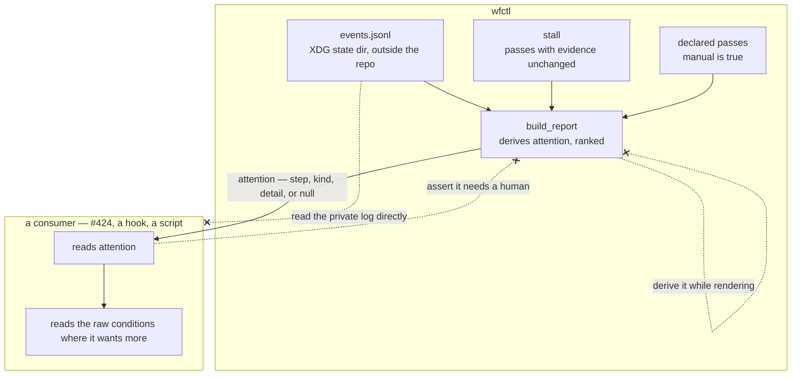

# wfctl derives whether a worktree wants a human; a consumer reads that answer rather than reconstructing it

## Context

`wfctl status --json` is about to acquire its first programmatic consumers —
#424's supervisory view, and whatever notification hook follows it. The question
each of them is built to answer is "which of these worktrees needs me", and the
payload has no field that says so.

Three conditions mean a person is wanted, and all three already exist inside
`build_report`:

- the host refused an outward action, so only a person can take it
  (`standing_blocks`, applied by `_apply_block_hold`);
- a declared pass is one a person performs — a sub-step carrying
  `manual: true`, which `next` already names with `MANUAL_PASS_WHY`;
- the loop repeated a step with the evidence unchanged (`_stall.find_stall`).

Two of the three are read from `events.jsonl` in the XDG state directory, which
is outside the repository and is wfctl's own log. What reaches a consumer today
is a rendering: `_apply_block_hold` writes `annotation` as
`f"blocked: host refused {block.action}"`, a sentence composed for a human. A
consumer answering the question for itself matches that prefix, and the sentence
is free to change for legibility — at which point the consumer is silently wrong
and nothing fails.

## Direct baseline

Add no field. A consumer answers the question with three reads: `stall` for the
third condition, a prefix match on `steps[].annotation` for the first, and a walk
of `steps[].sub_steps[]` for an entry that is `manual` and still `pending` for the
second.

This works today, in the sense that the information is recoverable. What it does
not survive is a second consumer: the condition set is a judgment, each consumer
makes it separately, and nothing brings a later-added condition to any of them.

## Decision

wfctl derives `attention` where the payload is built, as one answer or none: the
highest-ranked condition that currently wants a person, carrying the step it
applies to, its kind, and a detail. It is `null` when nothing wants a person.

The rank is `blocked`, then `manual`, then `stalled` — cause before symptom. A
worktree that is both blocked and stalled is usually stalled *because* it is
blocked: the loop retries a step the host is holding, and the evidence does not
move. Reporting the block reports what to do about it; reporting the stall
reports what the block is doing.

The raw conditions stay in the payload unchanged. `attention` is a verdict over
material a consumer can still read directly, not a replacement for it — which is
what keeps the single answer from being lossy in the way that matters: the
second condition is still there for a consumer that wants it.

## Owns truth

wfctl owns *"does this worktree want a human, and for what?"*.

A consumer cannot compute it. Two of the three conditions are held in
`events.jsonl` under the XDG state directory — a path outside the repository,
written and read only by wfctl, whose block-and-release semantics live in
`standing_blocks`. The only trace of a standing block that reaches a consumer
today is an English sentence wfctl assembled for a person to read, and matching
on that sentence makes every rewording of it a silent behaviour change in a
component wfctl cannot see. To answer for itself, a consumer would have to open
wfctl's private log and reimplement the reader.

The third condition, the stall, is computable by a consumer in principle —
it is already a field. It is derived here anyway, because a judgment split across
two owners is one that drifts: the whole defect being corrected is each consumer
maintaining its own idea of what counts.

wfctl owns the **rank** for the same reason it owns the condition set. A rank
held by each consumer is the same drift one field further down, and the ordering
rests on a causal claim about wfctl's own loop that a consumer is not positioned
to make.

## Boundary

The two `--x` edges into and out of the consumer are the decision: the private
log is not a consumer's to read, and a consumer's own judgment never travels back
as pipeline truth. The third is `pipeline-state-is-one-payload`'s, restated at
this boundary — a fact computed inside a view is one of the three edges that
record already forbids.

## Considered

- Leave the judgment to each consumer, adding no field — the baseline above.
  Not chosen because the block condition reaches a consumer only as prose, so
  the cheapest correct implementation of it is a prefix match on a sentence
  written to be reworded.
- Promote the raw conditions to structured fields and mint no judgment — give
  the block its own typed field, flag manual passes, leave `stall` as it is, and
  let each consumer decide what counts. Sound, and it loses on fit rather than
  on fault: this decision keeps those raw conditions in the payload too, so the
  freedom that option protects is not given up. What it does not deliver is one
  answer, and one answer is what #421's acceptance test is written against.
- Every applicable condition, as a list — the shape this record carried while it
  was being drafted. It loses to the causal relationship between the conditions
  rather than to any fault of its own: a blocked worktree that is also stalled is
  stalled because of the block, so the list's second entry is generally a
  consequence of its first, and a reader is invited to treat two views of one
  problem as two problems. Where the conditions are genuinely independent the
  list would have been the better shape, and the raw fields are what a consumer
  needing that reads instead.
- Derive it in `status` while rendering, where the annotation is already
  assembled — refused by `pipeline-state-is-one-payload`, whose boundary sketch
  draws "a fact computed while printing" as an edge the payload does not accept.

## Consequences

`attention` is part of the versioned surface, so a condition added later is a
contract change and moves the version. So is the rank: a reordering changes what
a consumer is shown without changing any key.

That makes `attention` the field where this contract stops being carried by keys.
A consumer written for three kinds meets a fourth and falls through every branch
it has; a `detail` that keeps its type and changes what it reports is read
confidently and wrongly; a reordering shows a different condition for the same
state. Each leaves every key path and every type identical, so the shape check in
`docs/architecture/design/423-the-promised-shape-is-a-shipped-data-file.md` is
silent and the version does not move — a consumer pinning one gets no signal at
all. The rank is the instance this record was written around; it is not the
only one, and a reader who takes it as the only one will assume the check covers
the rest.

The class is named here rather than closed. Closing it means encoding an
ordering, and a set of permitted values, in a file whose whole job is key paths
and types — which is a different mechanism rather than a wider version of that
one. What stands in its place is that all of it is derived in one place, so a
reviewer reading that place sees the change.

The three conditions and their order must be derived in one place. A fourth added
inside `cli` rather than beside the other three is how the console and the
machine view start disagreeing, which is the failure
`pipeline-state-is-one-payload` was accepted to prevent.

A worktree wanting a human for two reasons shows one. The second is still in the
payload, in the field it was always in, and a consumer that wants it reads there
— but a consumer reading only `attention` sees a partial picture by design, and
that is the price of the single answer.

The block condition's detail is derived from `StandingBlock.action`, not from the
rendered annotation. The annotation stays a rendering and becomes free to reword
again.

## Log

- 2026-09-20  proposed    — #423's level-2 gate; the first programmatic consumer (#424) is unstarted, so the contract is being written before anything is held to it
- 2026-09-20  revised     — `attention` carries one ranked condition rather than every applicable one; the list moves to `Considered` with the causal argument that displaced it. Still proposed, so the body was revised rather than superseded
- 2026-09-20  revised     — the rank was named as "the one contract change the shape check cannot see"; #423's clarify scan widened it to the class, a fourth kind and a re-meant `detail` being the same hole. Still proposed
