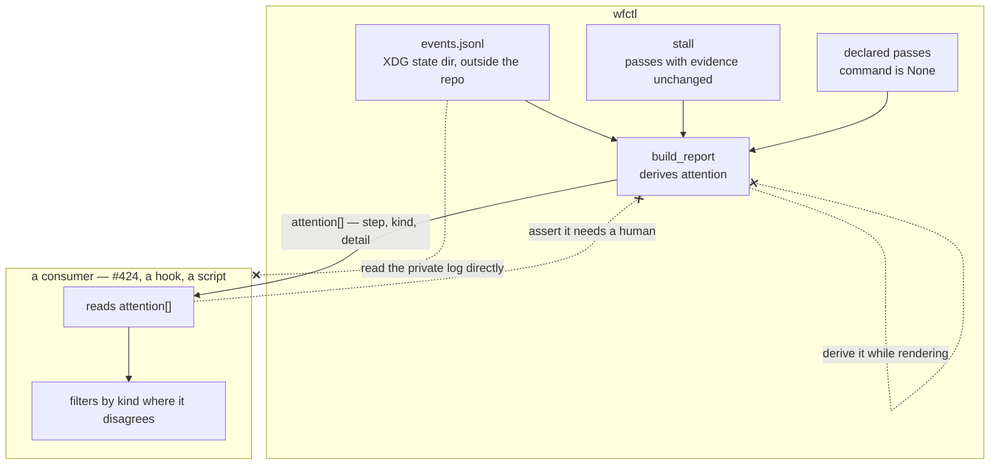

# wfctl derives whether a worktree wants a human; a consumer reads that answer rather than reconstructing it

## Context

`wfctl status --json` is about to acquire its first programmatic consumers —
#424's supervisory view, and whatever notification hook follows it. The question
each of them is built to answer is "which of these worktrees needs me", and the
payload has no field that says so.

Three conditions mean a person is wanted, and all three already exist inside
`build_report`:

- the host refused an outward action, so only a person can take it
  (`standing_blocks`, applied by `_apply_block_hold`);
- a declared pass is one a person performs — a sub-step whose `command` is
  `None`, which `next` already names with `MANUAL_PASS_WHY`;
- the loop repeated a step with the evidence unchanged (`_stall.find_stall`).

Two of the three are read from `events.jsonl` in the XDG state directory, which
is outside the repository and is wfctl's own log. What reaches a consumer today
is a rendering: `_apply_block_hold` writes `annotation` as
`f"blocked: host refused {block.action}"`, a sentence composed for a human. A
consumer answering the question for itself matches that prefix, and the sentence
is free to change for legibility — at which point the consumer is silently wrong
and nothing fails.

## Direct baseline

Add no field. A consumer answers the question with three reads: `stall` for the
third condition, a prefix match on `steps[].annotation` for the first, and a walk
of `steps[].sub_steps[]` looking for `state == "pending"` with `command == null`
for the second.

This works today, in the sense that the information is recoverable. What it does
not survive is a second consumer: the condition set is a judgment, each consumer
makes it separately, and nothing brings a later-added condition to any of them.

## Decision

wfctl derives `attention` where the payload is built, as a list — one entry per
condition that currently wants a person, each carrying the step it applies to,
its kind, and a detail. The list is empty when nothing wants a person; it is
never null.

The raw conditions stay in the payload unchanged. `attention` is a summary over
material a consumer can still read directly, not a replacement for it.

## Owns truth

wfctl owns *"does this worktree want a human, and for what?"*.

A consumer cannot compute it. Two of the three conditions are held in
`events.jsonl` under the XDG state directory — a path outside the repository,
written and read only by wfctl, whose block-and-release semantics live in
`standing_blocks`. The only trace of a standing block that reaches a consumer
today is an English sentence wfctl assembled for a person to read, and matching
on that sentence makes every rewording of it a silent behaviour change in a
component wfctl cannot see. To answer for itself, a consumer would have to open
wfctl's private log and reimplement the reader.

The third condition, the stall, is computable by a consumer in principle —
it is already a field. It is derived here anyway, because a judgment split across
two owners is one that drifts: the whole defect being corrected is each consumer
maintaining its own idea of what counts.

## Boundary

The two `--x` edges into and out of the consumer are the decision: the private
log is not a consumer's to read, and a consumer's own judgment never travels back
as pipeline truth. The third is `pipeline-state-is-one-payload`'s, restated at
this boundary — a fact computed inside a view is one of the three edges that
record already forbids.

## Considered

- Leave the judgment to each consumer, adding no field — the baseline above.
  Not chosen because the block condition reaches a consumer only as prose, so
  the cheapest correct implementation of it is a prefix match on a sentence
  written to be reworded.
- Promote the raw conditions to structured fields and mint no judgment — give
  the block its own typed field, flag manual passes, leave `stall` as it is, and
  let each consumer decide what counts. Sound, and it loses on fit rather than
  on fault: this decision keeps those raw conditions in the payload too, so the
  freedom that option protects is not given up. What it does not deliver is one
  answer, and one answer is what #421's acceptance test is written against.
- One ranked reason instead of a list — rejected because a worktree can be
  blocked and stalled at once, and a field that reports one of them moves the
  ranking into each consumer, which is the drift this record exists to stop. A
  dashboard tile shows a count and a top entry, so it never needed the field to
  pick.
- Derive it in `status` while rendering, where the annotation is already
  assembled — refused by `pipeline-state-is-one-payload`, whose boundary sketch
  draws "a fact computed while printing" as an edge the payload does not accept.

## Consequences

`attention` is part of the versioned surface, so a condition added later is a
contract change and moves the version.

The three conditions must be derived in one place. A fourth added inside `cli`
rather than beside the other three is how the console and the machine view start
disagreeing, which is the failure `pipeline-state-is-one-payload` was accepted to
prevent.

The block condition's detail is derived from `StandingBlock.action`, not from the
rendered annotation. The annotation stays a rendering and becomes free to reword
again.

## Log

- 2026-09-20  proposed    — #423's level-2 gate; the first programmatic consumer (#424) is unstarted, so the contract is being written before anything is held to it
