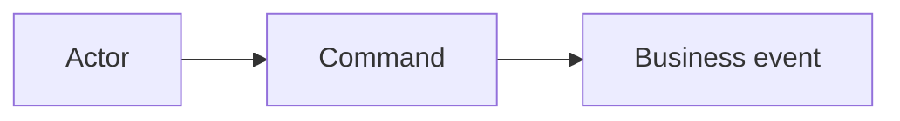
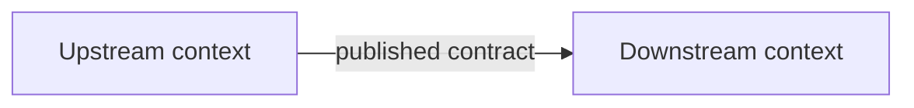
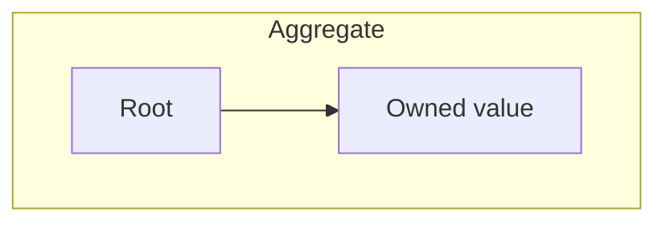

# <Capability> domain model

<!-- Lands at <arch-root>/domain/<capability>.md — ask `wfctl arch-root`.
     This document describes; the records under the arch root decide. Link to
     a record rather than restating it. Keep a `none — <reason>` row rather
     than deleting a section that does not apply. -->

State: exploratory | proposed | reflects accepted records
Person who knows the domain: <name or role>
Last checked against the code: <date and commit>
Records this model draws on: <slugs, or none>

## Domain vision statement

<About a page: what this capability does that a customer could not get
elsewhere, and the value it brings. Leave out what does not distinguish it —
qualities such as speed or availability belong in architecture records, not
here. Classify the capability as core, supporting or generic, and say which
answer put it there. Link the product's statement instead when one already
exists. Revise it as the model deepens.>

## Decision frame

Business outcome:
Decision this round supports:
In scope:
Out of scope:
Constraints:

## Evidence

| Row | Claim | Label | Source | Contradicts |
| --- | --- | --- | --- | --- |

Labels: `observed`, `stated`, `inferred`, `open`. A decided claim links to its
record instead of carrying a label.

## Scenarios

| Row | Actor intent | Command | Rules | Outcome and events | Alternatives and failures | Evidence rows |
| --- | --- | --- | --- | --- | --- | --- |

### Behavior

Question answered: <question>

What it shows: <the conclusion, or the tension it exposes>

## Ubiquitous Language

| Term | Context | Meaning | Example | Synonyms and forbidden meanings | Evidence |
| --- | --- | --- | --- | --- | --- |

## Subdomains

| Capability | Core, supporting or generic | Why | Owner | What changes it |
| --- | --- | --- | --- | --- |

## Bounded Contexts

| Context | Purpose | Owned language and facts | Includes | Excludes | Owner |
| --- | --- | --- | --- | --- | --- |

### Context Map

Question answered: where do meaning, authority and translation change?

| Relationship | Upstream | Downstream | Team relationship | Translation owner | Mechanism | Consistency and failure |
| --- | --- | --- | --- | --- | --- | --- |

## Invariants and Aggregates

| Row | Invariant, stated so it can be false | Decided when | Information needed | Enforced by | Concurrency and cost of violation |
| --- | --- | --- | --- | --- | --- |

| Aggregate | Root | Invariant rows | Transaction boundary | Other Aggregates, by identity | Events |
| --- | --- | --- | --- | --- | --- |

### Aggregate

Question answered: what must stay consistent together?

## Implementation feedback

| Scenario or invariant | Code, test or spike | What it means for the model | Status |
| --- | --- | --- | --- |

## Decisions

Records only — one line each, linked. The reasoning lives in the record.

- `<slug>` — <one line>

## Open questions

| Row | Question or conflict | Why it matters | Who can answer | Next evidence |
| --- | --- | --- | --- | --- |

## What reopens this model

- <evidence or event that should bring this model back>
